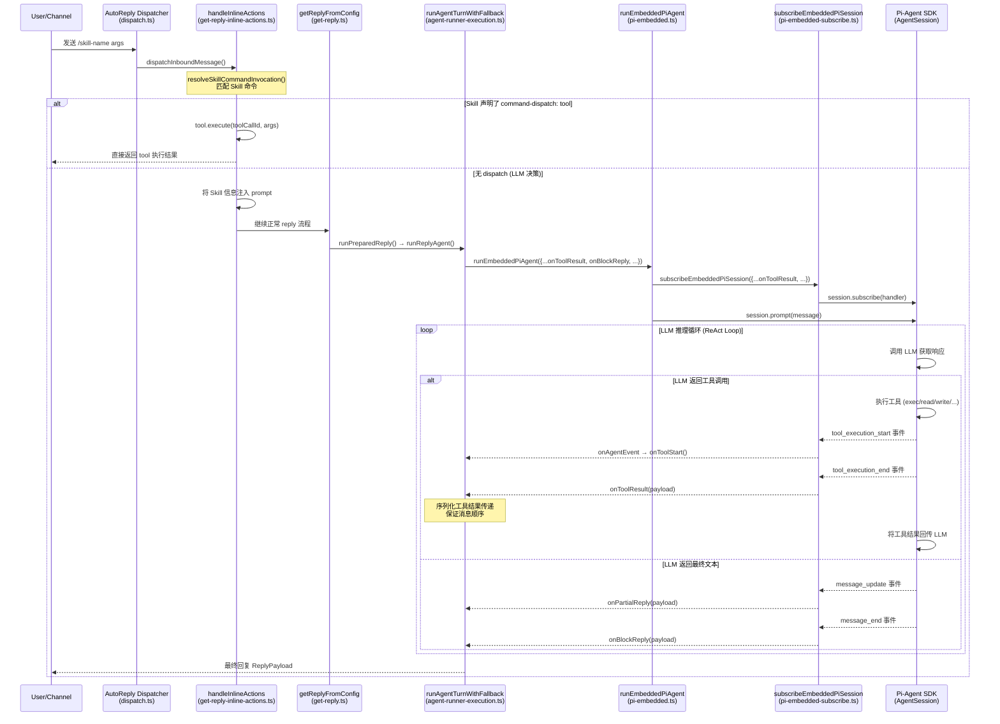

# Skill 回调通知 Agent 执行结果机制分析

## 结论：部分支持，回调机制在 Tool 层面而非 Skill 层面

本项目中的 **Skill（技能）不是直接可执行的实体**，而是一个 **Markdown 格式的说明书**（`SKILL.md`），用于教 LLM 模型如何使用工具。因此，并没有一个专门的 "Skill 完成回调"。但是，**Skill 触发的工具执行结果通过 `onToolResult` 等一系列回调通知给调用方（Agent/Channel）**。

---

## 一、核心概念澄清

| 概念 | 定义 | 文件 |
|------|------|------|
| **Skill** | 包含 YAML frontmatter 的 `SKILL.md` 文件，教 LLM 如何使用工具 | `skills/*/SKILL.md` |
| **SkillCommandSpec** | Skill 注册为斜杠命令后的规范描述 | [skills/types.ts#L51-L66](file:///d:/prj/openclaw_analyze/src/agents/skills/types.ts#L51-L66) |
| **SkillCommandDispatchSpec** | Skill 命令的 dispatch 配置（`command-dispatch: tool`） | [skills/types.ts#L51-L59](file:///d:/prj/openclaw_analyze/src/agents/skills/types.ts#L51-L59) |
| **SkillEntry** | Skill 加载后的条目，包含 Skill、frontmatter、metadata 等 | [skills/types.ts#L74-L78](file:///d:/prj/openclaw_analyze/src/agents/skills/types.ts#L74-L78) |
| **Tool** | 真正的可执行单元（如 `bash`、`read`、`message.send`） | [pi-tools.ts](file:///d:/prj/openclaw_analyze/src/agents/pi-tools.ts) |
| **AgentSession** | Pi-Agent 的会话对象，负责 LLM 推理循环+工具调用 | `@mariozechner/pi-coding-agent` |

---

## 二、Skill 执行的两种模式

### 模式 1：`command-dispatch: tool` — 确定性直接调度（有回调）

当 SKILL.md frontmatter 声明了 `command-dispatch: tool` 和 `command-tool: <toolName>`，用户通过 `/skill-name` 调用时，**直接调用指定 Tool，完全跳过 LLM 决策**。执行结果通过返回值直接返回。

**代码入口：** [get-reply-inline-actions.ts#L189-L245](file:///d:/prj/openclaw_analyze/src/auto-reply/reply/get-reply-inline-actions.ts#L189-L245)

```typescript
// 如果 skill 声明了 command-dispatch: tool，直接调用 tool
const dispatch = skillInvocation.command.dispatch;
if (dispatch?.kind === "tool") {
  const rawArgs = (skillInvocation.args ?? "").trim();
  const channel =
    resolveGatewayMessageChannel(ctx.Surface) ??
    resolveGatewayMessageChannel(ctx.Provider) ??
    undefined;

  const tools = createOpenClawTools({
    agentSessionKey: sessionKey,
    agentChannel: channel,
    agentAccountId: (ctx as { AccountId?: string }).AccountId,
    agentTo: ctx.OriginatingTo ?? ctx.To,
    agentThreadId: ctx.MessageThreadId ?? undefined,
    agentDir,
    workspaceDir,
    config: cfg,
  });
  const authorizedTools = applyOwnerOnlyToolPolicy(tools, command.senderIsOwner);

  const tool = authorizedTools.find((candidate) => candidate.name === dispatch.toolName);
  if (!tool) {
    typing.cleanup();
    return { kind: "reply", reply: { text: `❌ Tool not available: ${dispatch.toolName}` } };
  }

  const toolCallId = `cmd_${generateSecureToken(8)}`;
  try {
    const result = await tool.execute(toolCallId, {
      command: rawArgs,
      commandName: skillInvocation.command.name,
      skillName: skillInvocation.command.skillName,
    });
    const text = extractTextFromToolResult(result) ?? "✅ Done.";
    typing.cleanup();
    return { kind: "reply", reply: { text } };
  } catch (err) {
    const message = err instanceof Error ? err.message : String(err);
    typing.cleanup();
    return { kind: "reply", reply: { text: `❌ ${message}` } };
  }
}
```

**SKILL.md frontmatter 配置示例：**

```yaml
---
command-dispatch: tool
command-tool: message
command-arg-mode: raw
---
```

**解析 dispatch 配置的代码：** [skills/workspace.ts#L827-L880](file:///d:/prj/openclaw_analyze/src/agents/skills/workspace.ts#L827-L880)

```typescript
const dispatch = (() => {
  const kindRaw = (
    entry.frontmatter?.["command-dispatch"] ??
    entry.frontmatter?.["command_dispatch"] ??
    ""
  )
    .trim()
    .toLowerCase();
  if (!kindRaw) return undefined;
  if (kindRaw !== "tool") return undefined;

  const toolName = (
    entry.frontmatter?.["command-tool"] ??
    entry.frontmatter?.["command_tool"] ??
    ""
  ).trim();
  if (!toolName) return undefined;

  const argModeRaw = (
    entry.frontmatter?.["command-arg-mode"] ??
    entry.frontmatter?.["command_arg_mode"] ??
    ""
  ).trim().toLowerCase();
  const argMode = !argModeRaw || argModeRaw === "raw" ? "raw" : null;

  return { kind: "tool", toolName, argMode: "raw" } as const;
})();
```

### 模式 2：无 `dispatch` — LLM 自主决策（有回调）

当 Skill 没有声明 `dispatch`，系统将 Skill 信息注入到提示词中，LLM 自行读取 `SKILL.md` 并决定如何调用工具。每一步工具调用的结果都通过回调通知：

```typescript
// 将 Skill 信息注入 prompt，让模型决定如何执行
const promptParts = [
  `Use the "${skillInvocation.command.skillName}" skill for this request.`,
  skillInvocation.args ? `User input:\n${skillInvocation.args}` : null,
].filter((entry): entry is string => Boolean(entry));
const rewrittenBody = promptParts.join("\n\n");
ctx.Body = rewrittenBody;
ctx.BodyForAgent = rewrittenBody;
sessionCtx.Body = rewrittenBody;
sessionCtx.BodyForAgent = rewrittenBody;
sessionCtx.BodyStripped = rewrittenBody;
cleanedBody = rewrittenBody;
```

---

## 三、回调通知的完整流程

### 3.1 流程序列图



### 3.2 回调注册链（代码追踪）

回调从外层（Channel）→ 内层（Pi-Agent SDK 事件系统）的注册链路如下：

#### 第1步：Channel 层注册回调

各 Channel（Telegram/Slack/Discord 等）在调用 `dispatchReplyFromConfig` 时传入 `GetReplyOptions`：

```typescript
// 示例：Telegram bot-handlers.ts
const result = await dispatchReplyFromConfig({
  ctx: finalized,
  cfg: params.cfg,
  dispatcher: params.dispatcher,
  replyOptions: {
    onToolResult: async (payload) => {
      // Channel层处理工具结果，如发送到Telegram
    },
    onBlockReply: async (payload) => {
      // 流式块回复
    },
    onPartialReply: async (payload) => {
      // 流式部分回复
    },
    onToolStart: async (payload) => {
      // 工具开始执行
    },
  },
});
```

`GetReplyOptions` 定义在 [types.ts#L15-L80](file:///d:/prj/openclaw_analyze/src/auto-reply/types.ts#L15-L80)：

```typescript
export type GetReplyOptions = {
  onAgentRunStart?: (runId: string) => void;
  onReplyStart?: () => Promise<void> | void;
  onTypingCleanup?: () => void;
  onTypingController?: (typing: TypingController) => void;
  onPartialReply?: (payload: ReplyPayload) => Promise<void> | void;
  onReasoningStream?: (payload: ReplyPayload) => Promise<void> | void;
  onReasoningEnd?: () => Promise<void> | void;
  onAssistantMessageStart?: () => Promise<void> | void;
  onBlockReply?: (payload: ReplyPayload, context?: BlockReplyContext) => Promise<void> | void;
  onToolResult?: (payload: ReplyPayload) => Promise<void> | void;
  onToolStart?: (payload: { name?: string; phase?: string }) => Promise<void> | void;
  onCompactionStart?: () => Promise<void> | void;
  onCompactionEnd?: () => Promise<void> | void;
  onModelSelected?: (ctx: ModelSelectedContext) => void;
  // ...
};
```

#### 第2步：dispatchInboundMessage → getReplyFromConfig 透传

[dispatch.ts#L37-L54](file:///d:/prj/openclaw_analyze/src/auto-reply/dispatch.ts#L37-L54) 中 `dispatchInboundMessage` 调用 `dispatchReplyFromConfig`，将 `replyOptions` 透传。

[get-reply.ts#L68-L80](file:///d:/prj/openclaw_analyze/src/auto-reply/reply/get-reply.ts#L68-L80) 中 `getReplyFromConfig` 接收 `opts`，继续透传。

#### 第3步：handleInlineActions 处理 Skill 命令

[get-reply-inline-actions.ts#L95-L170](file:///d:/prj/openclaw_analyze/src/auto-reply/reply/get-reply-inline-actions.ts#L95-L170) 中 `handleInlineActions` 先尝试匹配 Skill 命令：

- 如果匹配到 `command-dispatch: tool` → 直接执行 tool 并返回结果（**同步回调**）
- 否则将 Skill 信息注入 prompt → 继续走正常 LLM 推理流程

#### 第4步：runAgentTurnWithFallback 注册回调到 runEmbeddedPiAgent

[agent-runner-execution.ts#L214-L240](file:///d:/prj/openclaw_analyze/src/auto-reply/reply/agent-runner-execution.ts#L214-L240) 中：

```typescript
const onToolResult = params.opts?.onToolResult;
const blockReplyPipeline = params.blockReplyPipeline;

const result = await runEmbeddedPiAgent({
  // ...
  onPartialReply: async (payload) => {
    const textForTyping = await handlePartialForTyping(payload);
    if (!params.opts?.onPartialReply || textForTyping === undefined) return;
    await params.opts.onPartialReply({ text: textForTyping, mediaUrls: payload.mediaUrls });
  },
  onAssistantMessageStart: async () => {
    await params.typingSignals.signalMessageStart();
    await params.opts?.onAssistantMessageStart?.();
  },
  onReasoningStream: params.typingSignals.shouldStartOnReasoning || params.opts?.onReasoningStream
    ? async (payload) => {
        await params.typingSignals.signalReasoningDelta();
        await params.opts?.onReasoningStream?.({ text: payload.text, mediaUrls: payload.mediaUrls });
      }
    : undefined,
  onReasoningEnd: params.opts?.onReasoningEnd,
  onAgentEvent: async (evt) => {
    const hasLifecyclePhase = evt.stream === "lifecycle" && typeof evt.data.phase === "string";
    if (evt.stream !== "lifecycle" || hasLifecyclePhase) {
      notifyAgentRunStart();
    }
    if (evt.stream === "tool") {
      const phase = typeof evt.data.phase === "string" ? evt.data.phase : "";
      const name = typeof evt.data.name === "string" ? evt.data.name : undefined;
      if (phase === "start" || phase === "update") {
        await params.typingSignals.signalToolStart();
        await params.opts?.onToolStart?.({ name, phase });
      }
    }
    if (evt.stream === "compaction") {
      const phase = typeof evt.data.phase === "string" ? evt.data.phase : "";
      if (phase === "start") await params.opts?.onCompactionStart?.();
      const completed = evt.data?.completed === true;
      if (phase === "end" && completed) {
        attemptCompactionCount += 1;
        await params.opts?.onCompactionEnd?.();
      }
    }
  },
  onBlockReply: params.opts?.onBlockReply
    ? createBlockReplyDeliveryHandler({...})
    : undefined,
  onBlockReplyFlush: params.blockStreamingEnabled && blockReplyPipeline
    ? async () => { await blockReplyPipeline.flush({ force: true }); }
    : undefined,
  onToolResult: onToolResult
    ? (() => {
        // Serialize tool result delivery to preserve message ordering.
        // See: https://github.com/openclaw/openclaw/issues/11044
        let toolResultChain: Promise<void> = Promise.resolve();
        return (payload: ReplyPayload) => {
          toolResultChain = toolResultChain
            .then(async () => {
              const { text, skip } = normalizeStreamingText(payload);
              if (skip) return;
              await params.typingSignals.signalTextDelta(text);
              await onToolResult({ ...payload, text });
            })
            .catch((err) => {
              logVerbose(`tool result delivery failed: ${String(err)}`);
            });
          const task = toolResultChain.finally(() => {
            params.pendingToolTasks.delete(task);
          });
          params.pendingToolTasks.add(task);
        };
      })()
    : undefined,
});
```

关键设计：`onToolResult` 使用 Promise chain 序列化工具结果传递，确保并发工具调用的结果按序输出到用户。

#### 第5步：subscribeEmbeddedPiSession 订阅 SDK 事件

[pi-embedded-subscribe.ts#L30-L60](file:///d:/prj/openclaw_analyze/src/agents/pi-embedded-subscribe.ts#L30-L60) 中定义了 `subscribeEmbeddedPiSession`，它订阅 `AgentSession` 的事件并桥接到 OpenClaw 的回调。

事件处理器在 [pi-embedded-subscribe.handlers.ts#L26-L66](file:///d:/prj/openclaw_analyze/src/agents/pi-embedded-subscribe.handlers.ts#L26-L66)：

```typescript
export function createEmbeddedPiSessionEventHandler(ctx: EmbeddedPiSubscribeContext) {
  return (evt: EmbeddedPiSubscribeEvent) => {
    switch (evt.type) {
      case "message_start":
        handleMessageStart(ctx, evt as never);
        return;
      case "message_update":
        handleMessageUpdate(ctx, evt as never);     // → onPartialReply
        return;
      case "message_end":
        handleMessageEnd(ctx, evt as never);        // → onBlockReply
        return;
      case "tool_execution_start":
        handleToolExecutionStart(ctx, evt as never)  // → onToolStart
          .catch((err) => { ctx.log.debug(`tool_execution_start handler failed: ${String(err)}`); });
        return;
      case "tool_execution_update":
        handleToolExecutionUpdate(ctx, evt as never);
        return;
      case "tool_execution_end":
        handleToolExecutionEnd(ctx, evt as never)   // → onToolResult
          .catch((err) => { ctx.log.debug(`tool_execution_end handler failed: ${String(err)}`); });
        return;
      case "agent_start":
        handleAgentStart(ctx);
        return;
      case "auto_compaction_start":
        handleAutoCompactionStart(ctx);
        return;
      case "auto_compaction_end":
        handleAutoCompactionEnd(ctx, evt as never);
        return;
      case "agent_end":
        handleAgentEnd(ctx);
        return;
    }
  };
}
```

#### 第6步：事件订阅参数类型

[pi-embedded-subscribe.types.ts#L10-L41](file:///d:/prj/openclaw_analyze/src/agents/pi-embedded-subscribe.types.ts#L10-L41)：

```typescript
export type SubscribeEmbeddedPiSessionParams = {
  session: AgentSession;
  runId: string;
  hookRunner?: HookRunner;
  verboseLevel?: VerboseLevel;
  reasoningMode?: ReasoningLevel;
  toolResultFormat?: ToolResultFormat;
  shouldEmitToolResult?: () => boolean;
  shouldEmitToolOutput?: () => boolean;
  onToolResult?: (payload: ReplyPayload) => void | Promise<void>;
  onReasoningStream?: (payload: { text?: string; mediaUrls?: string[] }) => void | Promise<void>;
  onReasoningEnd?: () => void | Promise<void>;
  onBlockReply?: (payload: BlockReplyPayload) => void | Promise<void>;
  onBlockReplyFlush?: () => void | Promise<void>;
  blockReplyBreak?: "text_end" | "message_end";
  blockReplyChunking?: BlockReplyChunking;
  onPartialReply?: (payload: { text?: string; mediaUrls?: string[] }) => void | Promise<void>;
  onAssistantMessageStart?: () => void | Promise<void>;
  onAgentEvent?: (evt: { stream: string; data: Record<string, unknown> }) => void | Promise<void>;
  // ...
};
```

---

## 四、涉及的类/接口/函数汇总

| 层级 | 文件 | 关键类/函数 | 作用 |
|------|------|------------|------|
| **Skill 类型定义** | [skills/types.ts](file:///d:/prj/openclaw_analyze/src/agents/skills/types.ts) | `SkillCommandSpec`, `SkillCommandDispatchSpec`, `SkillEntry`, `SkillSnapshot` | 定义 Skill 命令规范、dispatch 配置及快照类型 |
| **Skill 命令构建** | [skills/workspace.ts#L775](file:///d:/prj/openclaw_analyze/src/agents/skills/workspace.ts#L775) | `buildWorkspaceSkillCommandSpecs()` | 遍历 Skill entries，解析 `command-dispatch: tool` frontmatter |
| **Skill frontmatter 解析** | [skills/frontmatter.ts#L209](file:///d:/prj/openclaw_analyze/src/agents/skills/frontmatter.ts#L209) | `resolveSkillInvocationPolicy()` | 解析 `user-invocable` 和 `disable-model-invocation` |
| **Skill 命令匹配** | [skill-commands.ts#L158](file:///d:/prj/openclaw_analyze/src/auto-reply/skill-commands.ts#L158) | `resolveSkillCommandInvocation()` | 将 `/skill-name args` 匹配到 `SkillCommandSpec` |
| **Skill 内联调度** | [get-reply-inline-actions.ts#L189](file:///d:/prj/openclaw_analyze/src/auto-reply/reply/get-reply-inline-actions.ts#L189) | `handleInlineActions()` | `dispatch.kind === "tool"` → 直接执行；否则注入 prompt |
| **回调类型定义** | [types.ts](file:///d:/prj/openclaw_analyze/src/auto-reply/types.ts) | `GetReplyOptions`, `ReplyPayload` | 定义 `onToolResult`, `onToolStart`, `onBlockReply` 等回调 |
| **消息分发** | [dispatch.ts](file:///d:/prj/openclaw_analyze/src/auto-reply/dispatch.ts) | `dispatchInboundMessage()` | 入口，调用 dispatchReplyFromConfig |
| **回复入口** | [get-reply.ts](file:///d:/prj/openclaw_analyze/src/auto-reply/reply/get-reply.ts) | `getReplyFromConfig()` | 解析配置，创建 typing 控制器，处理指令 |
| **回复执行** | [get-reply-run.ts](file:///d:/prj/openclaw_analyze/src/auto-reply/reply/get-reply-run.ts) | `runPreparedReply()` | 组装上下文，调用 runReplyAgent |
| **Agent 运行** | [agent-runner.ts](file:///d:/prj/openclaw_analyze/src/auto-reply/reply/agent-runner.ts) | `runReplyAgent()` | 管理队列、pipeline、session，调用 runAgentTurnWithFallback |
| **Agent 执行核心** | [agent-runner-execution.ts](file:///d:/prj/openclaw_analyze/src/auto-reply/reply/agent-runner-execution.ts) | `runAgentTurnWithFallback()` | 将 `onToolResult` 等回调透传给 `runEmbeddedPiAgent`，处理 fallback/retry |
| **SDK 事件订阅** | [pi-embedded-subscribe.ts](file:///d:/prj/openclaw_analyze/src/agents/pi-embedded-subscribe.ts) | `subscribeEmbeddedPiSession()` | 订阅 SDK 事件，触发 `onToolResult`/`onBlockReply` 等回调 |
| **事件类型定义** | [pi-embedded-subscribe.types.ts](file:///d:/prj/openclaw_analyze/src/agents/pi-embedded-subscribe.types.ts) | `SubscribeEmbeddedPiSessionParams` | 定义 `onToolResult`, `onReasoningStream`, `onBlockReply` 等参数 |
| **事件处理分发** | [pi-embedded-subscribe.handlers.ts](file:///d:/prj/openclaw_analyze/src/agents/pi-embedded-subscribe.handlers.ts) | `createEmbeddedPiSessionEventHandler()` | 根据事件类型分发给对应 handler |
| **工具事件处理** | [pi-embedded-subscribe.handlers.tools.ts](file:///d:/prj/openclaw_analyze/src/agents/pi-embedded-subscribe.handlers.tools.ts) | `handleToolExecutionStart()`, `handleToolExecutionEnd()` | 处理 tool execution 生命周期，触发 `onToolStart`/`onToolResult` |
| **消息事件处理** | `pi-embedded-subscribe.handlers.messages.ts` | `handleMessageStart()`, `handleMessageUpdate()`, `handleMessageEnd()` | 处理 streaming message 事件 |
| **生命周期事件** | `pi-embedded-subscribe.handlers.lifecycle.ts` | `handleAgentStart()`, `handleAgentEnd()`, `handleAutoCompactionStart()`, `handleAutoCompactionEnd()` | 处理 agent/compaction 生命周期事件 |
| **Agent 事件广播** | [agent-events.ts](file:///d:/prj/openclaw_analyze/src/infra/agent-events.ts) | `emitAgentEvent()`, `registerAgentRunContext()` | 发送 `tool`/`assistant`/`lifecycle` 流事件到 WebSocket |
| **回复投递** | [reply-delivery.ts](file:///d:/prj/openclaw_analyze/src/auto-reply/reply/reply-delivery.ts) | `createBlockReplyDeliveryHandler()` | 块回复投递处理器 |

---

## 五、完整调用链路图

```
User/Channel 发送消息
    │
    ▼
dispatch.ts: dispatchInboundMessage()
    │
    ▼
reply/dispatch-from-config.ts: dispatchReplyFromConfig()
    │
    ▼
reply/get-reply.ts: getReplyFromConfig(opts: GetReplyOptions)
    │  ├── resolveReplyDirectives() → 处理内联指令
    │  ├── initSessionState() → 初始化/恢复会话
    │  └── handleInlineActions() → 处理 Skill 命令
    │         │
    │         ├── [Skill 有 dispatch: tool]
    │         │     └── tool.execute() → 直接返回结果 ✓
    │         │
    │         └── [Skill 无 dispatch]
    │               └── 注入 prompt → 继续正常流程
    │
    ▼
reply/get-reply-run.ts: runPreparedReply()
    │
    ▼
reply/agent-runner.ts: runReplyAgent()
    │
    ▼
reply/agent-runner-execution.ts: runAgentTurnWithFallback()
    │  ├── 注册 onToolResult 回调 (带 Promise chain 序列化)
    │  ├── 注册 onAgentEvent 回调 (tool/lifecycle/compaction)
    │  ├── 注册 onBlockReply 回调 (block streaming)
    │  └── 调用 runEmbeddedPiAgent({...callbacks})
    │
    ▼
agents/pi-embedded.ts: runEmbeddedPiAgent()
    │  └── subscribeEmbeddedPiSession({ onToolResult, onBlockReply, ... })
    │
    ▼
agents/pi-embedded-subscribe.ts: subscribeEmbeddedPiSession()
    │  └── session.subscribe(createEmbeddedPiSessionEventHandler(ctx))
    │
    ▼
agents/pi-embedded-subscribe.handlers.ts: 
    │
    ├── tool_execution_start  → handleToolExecutionStart()  → onToolStart()
    ├── tool_execution_update → handleToolExecutionUpdate()
    ├── tool_execution_end    → handleToolExecutionEnd()    → onToolResult(payload) ★
    ├── message_start         → handleMessageStart()
    ├── message_update        → handleMessageUpdate()       → onPartialReply()
    ├── message_end           → handleMessageEnd()          → onBlockReply()
    ├── agent_start           → handleAgentStart()
    ├── agent_end             → handleAgentEnd()
    ├── auto_compaction_start → handleAutoCompactionStart() → onCompactionStart()
    └── auto_compaction_end   → handleAutoCompactionEnd()   → onCompactionEnd()
```

---

## 六、插件级 Hook 回调

除了 Agent 层面的 `onToolResult` 回调，OpenClaw 还提供了插件级的 Hook 机制来拦截工具执行生命周期：

| Hook | 时机 | 作用 |
|------|------|------|
| `before_tool_call` | 工具执行前 | 可修改参数或阻止执行 |
| `after_tool_call` | 工具执行后 | 获取工具执行结果，可用于审计/触发后续操作 |
| `tool_result_persist` | 工具结果持久化前 | 同步转换工具结果 |

这些 Hook 通过 `getGlobalHookRunner()` 获取并执行，在 [pi-embedded-subscribe.handlers.tools.ts#L1-L20](file:///d:/prj/openclaw_analyze/src/agents/pi-embedded-subscribe.handlers.tools.ts#L1-L20) 中：

```typescript
import { getGlobalHookRunner } from "../plugins/hook-runner-global.js";
import type { PluginHookAfterToolCallEvent } from "../plugins/types.js";
```

相关代码在 [wrapToolWithBeforeToolCallHook](file:///d:/prj/openclaw_analyze/src/agents/pi-tools.before-tool-call.ts) 中：

```typescript
export function wrapToolWithBeforeToolCallHook(
  tool: AnyAgentTool,
  ctx?: HookContext,
): AnyAgentTool {
  const execute = tool.execute;
  return {
    ...tool,
    execute: async (toolCallId, params, stream, extCtx) => {
      // 1. 运行 before_tool_call 钩子
      const hookResult = await runBeforeToolCallHook({
        toolName: tool.name,
        params,
        toolCallId,
        ctx,
      });
      // 2. 如果被阻止，直接返回阻止原因
      if (hookResult.blocked) {
        return { content: [], error: hookResult.reason };
      }
      // 3. 使用钩子可能修改过的参数执行Tool
      return execute(toolCallId, hookResult.params, stream, extCtx);
    },
  };
}
```

---

## 七、总结

1. **Skill 本身不产生回调** — Skill 是说明书（`SKILL.md`），不是执行实体。当 Skill 触发工具执行时，**工具执行结果通过回调通知 Agent**。

2. **核心回调机制**是 `GetReplyOptions.onToolResult`，它在每个工具执行完成时被触发，携带工具执行结果 `ReplyPayload`。这个回调从 `subscribeEmbeddedPiSession` 的 `tool_execution_end` 事件驱动。

3. **工具结果顺序保证**：`onToolResult` 使用 Promise chain 序列化传递，确保并发工具调用的结果不会乱序到达用户。

4. **两种执行路径**：
   - **`command-dispatch: tool`** — 工具直接被调用（通过 frontmatter 中的 `command-dispatch: tool` + `command-tool: <toolName>` 声明），结果同步返回（无 LLM 参与）
   - **无 dispatch** — Skill 信息注入 prompt，LLM 自主决策调用工具，通过 `onToolResult` 异步回调通知每步结果

5. **Agent 事件流**：通过 `emitAgentEvent` 将 `tool`/`assistant`/`lifecycle` 事件广播到 WebSocket 客户端（如 TUI、WebChat），这是一个观察者模式的回调实现。

6. **插件级 Hook**：`before_tool_call`、`after_tool_call`、`tool_result_persist` 提供了另一种拦截机制，允许插件在工具执行前后或持久化前执行自定义逻辑。