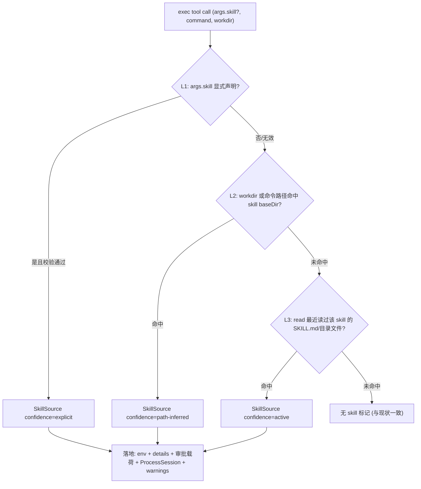

# Skill 脚本来源追踪实现方案

> 需求：让 OpenClaw 在执行脚本（exec 工具调用）时，知道这段脚本来自哪个 skill。
> 结论先行：当前 skill 是纯 prompt 驱动的，exec 全链路（参数 → 审批 → spawn）均无 skill 来源信息。本方案采用 **「声明优先、路径推断兜底、会话态补充」三层解析**，在 exec 执行时合成唯一来源并落地到 env / details / 审批载荷 / 进程注册表。

---

## 1. 现状调研

### 1.1 Skill 系统如何工作

| 事实                                                                                                                                                                | 位置                                                                           |
| ------------------------------------------------------------------------------------------------------------------------------------------------------------------- | ------------------------------------------------------------------------------ |
| 入口为门面模块，实现在 `src/agents/skills/` 子目录；核心函数 `loadSkillEntries` 完成目录扫描与解析                                                                  | `src/agents/skills/workspace.ts:325-579`                                       |
| 加载来源优先级：`extra < bundled < managed(~/.openclaw/skills) < ~/.agents/skills < <workspace>/.agents/skills < <workspace>/skills`（按 name 合并去重）            | `src/agents/skills/workspace.ts:486-560`                                       |
| 每个 skill 是一个含 `SKILL.md` 的目录；frontmatter 解析出 `OpenClawSkillMetadata`（requires/install/skillKey/primaryEnv 等）与调用策略                              | `src/agents/skills/frontmatter.ts:186-218`、`src/agents/skills/types.ts:19-33` |
| `SkillEntry = { skill, frontmatter, metadata?, invocation? }`；`skill.baseDir` 即 skill 目录、`skill.filePath` 即 SKILL.md 路径                                     | `src/agents/skills/types.ts:66-71`                                             |
| run 启动时解析 skillEntries（早于工具创建）                                                                                                                         | `src/agents/pi-embedded-runner/run/attempt.ts:1772`                            |
| skill 注入 system prompt：`<available_skills>` XML（name / description / **location**），并指示模型 "read its SKILL.md at `<location>` with `read`, then follow it" | `src/agents/system-prompt.ts:20-33`                                            |
| skill 目录内脚本无强制约定，由 SKILL.md 正文通过 `{baseDir}` 相对引用；prompt 中路径被 `~/` 压缩（`compactSkillPaths`）                                             | `src/agents/skills/workspace.ts:51-61`                                         |
| 沙箱模式下 skills 整目录同步复制到 `<workspace>/skills/<name>/`（`syncSkillsToWorkspace`）                                                                          | `src/agents/skills/workspace.ts:790-852`                                       |

### 1.2 exec 工具调用链

```
模型 tool call: exec {command, workdir?, env?, ...}
 → wrapToolWithBeforeToolCallHook（loop 检测 + 插件 before_tool_call 钩子）
 → bash-tools.exec.ts execute(toolCallId, args, signal, onUpdate)   ← toolCallId 被忽略，args 无 skill 字段
    ├─ host 解析：sandbox / gateway / node（elevated 强制 gateway）
    ├─ env 净化：sanitizeHostBaseEnv + validateHostEnv（禁危险 env 键、禁自定义 PATH）
    ├─ host=gateway 需审批 → ExecApprovalRequestPayload（无 skill 字段）→ JSONL over unix socket
    └─ runExecProcess
         ├─ env 注入先例：OPENCLAW_SHELL=exec
         ├─ spawnSpec：docker exec argv | pty(+child 回退) | [shell ...args command]
         ├─ ProcessSupervisor.spawn {runId, sessionId=sessionKey, backendId, cwd, env, ...}
         └─ ProcessSession 注册到 bash-process-registry；onUpdate 推送 details{status,pid,cwd,tail}
```

关键代码位置：

- exec schema（无 skill 字段）：`src/agents/bash-tools.exec-runtime.ts:160-218`
- execute 入口：`src/agents/bash-tools.exec.ts:302-316`
- env 注入点（`OPENCLAW_SHELL` 先例）：`src/agents/bash-tools.exec-runtime.ts:458-461`
- 审批载荷：`src/infra/exec-approvals.ts:143-181`
- 工具创建（exec defaults 闭包）：`src/agents/pi-tools.ts:538-572`
- read 工具包装（与 exec 同一工厂闭包创建）：`src/agents/pi-tools.ts:495-501`、`src/agents/pi-tools.read.ts:909`
- 已有"从命令文本提取脚本目标"逻辑可复用：`src/agents/bash-tools.exec.ts:67-184`（`extractScriptTargetFromCommand`）

### 1.3 现有机制缺口

1. **无结构化传递**：exec args、`ExecApprovalRequestPayload`、`ProcessSupervisor.spawn` 参数均无 skill 字段。
2. **env 注入是全局并集**：`applySkillEnvOverrides` 在 run 开始把**所有**合格 skill 的 env 写入 `process.env`，子进程可继承，但无法反推单个脚本归属。
3. **skill-scanner 是安装/审计期静态扫描**，不参与 exec 期拦截。
4. **hooks 系统无 shell 命令执行钩子**；最接近的是插件级 `before_tool_call` 工具钩子（可 block/改写 params），但载荷同样不含 skill 信息。
5. `ExecApprovalsDefaults.autoAllowSkills` 只是"是否自动放行技能类命令"的配置开关，不携带运行时 skill 上下文。

### 1.4 方案可利用的两个既有事实

- **skillEntries 在工具创建前已解析**：`attempt.ts:1772` 解析 → `attempt.ts:1868` 创建工具，数据已在手，仅需透传。
- **read 与 exec 在同一个工厂闭包内创建**（`createOpenClawCodingTools`）：可共享一个闭包级 tracker，无需全局状态。

---

## 2. 总体设计：三层来源解析

单一机制都不可靠（模型声明不可信、纯路径推断有漏网、会话态有时效），采用三层解析、优先级合成唯一来源：



```typescript
type SkillSource = {
  name: string;
  baseDir?: string;
  confidence: "explicit" | "path-inferred" | "active";
};

function resolveSkillSource(
  input: { declaredSkill?: string; command: string; workdir?: string },
  dirMaps: SkillDirMaps, // name → baseDir（原始）+ name → 同步目录（沙箱）
  tracker: SkillSourceTracker, // 闭包级会话态
): SkillSource | undefined;
```

### Layer 1 — 显式声明（模型侧，最可靠）

- `execSchema` 新增可选参数 `skill?: string`（`Type.Optional(Type.String())`，符合工具 schema 护栏：不用 Union/anyOf）。
- `## Skills (mandatory)` 指令补充一句：_当执行某个 skill 目录下的脚本时，在 exec 调用中传 `skill: "<name>"`_。
- 执行时校验 `skill` 是否在当前 run 的 skillEntries 中；不存在则写入 warnings 并降级到 L2/L3。

### Layer 2 — 路径推断（代码侧，确定性兜底）

- 工具创建期把 skillEntries 传入 exec 工具闭包，构建两张映射：
  - `name → skill.baseDir`（原始路径，加载层已做 realpath 防逃逸）；
  - `name → 沙箱同步后目录`（`syncSkillsToWorkspace` 的目标 `<workspace>/skills/<name>/`）。
- execute 内解析：resolve `workdir`；复用/扩展 `extractScriptTargetFromCommand` 提取命令中的路径 token；处理 `~/` 前缀还原（prompt 中路径被 `compactSkillPaths` 压缩）、相对路径基于 workdir 展开；任一路径命中 `<baseDir>/` 前缀即命中。
- Windows 注意：路径匹配统一大小写与分隔符。

### Layer 3 — 活跃 skill 跟踪（会话态，覆盖间接执行）

- 模型被 prompt 强制"先 read SKILL.md"。包装 read 工具的 execute（在 `createOpenClawReadTool` 外再包一层或注入回调）：目标路径命中某 skill 的 `SKILL.md` 或目录内文件时，更新 tracker 的 `activeSkill`。
- exec 走到 L3 时取 `activeSkill`。覆盖路径推断失效的场景：脚本被复制到 /tmp、`curl … | bash`、`eval` 动态执行等。
- prompt 指令为"一次只读一个 skill"，时效性问题小；每次 exec 调用独立解析，不污染后续无关命令。

---

## 3. 具体改动点

| #   | 文件                                            | 改动                                                                                                                                                                                                                         |
| --- | ----------------------------------------------- | ---------------------------------------------------------------------------------------------------------------------------------------------------------------------------------------------------------------------------- |
| 1   | `src/agents/skills/exec-context.ts`（新建）     | `SkillSourceTracker`（`recordRead(path)` / `activeSkill`）、`resolveSkillSource`、`SkillDirMaps` 构建；附 `exec-context.test.ts`                                                                                             |
| 2   | `src/agents/bash-tools.exec-runtime.ts`         | ① `execSchema` 增加 `skill` 参数；② `runExecProcess` 透传 `skillSource`：env 注入 `OPENCLAW_SKILL=<name>`、`OPENCLAW_SKILL_DIR=<baseDir>`（与 `OPENCLAW_SHELL` 同点注入）；③ `ProcessSession` 增加 `skill?` 字段随注册表落盘 |
| 3   | `src/agents/bash-tools.exec.ts`                 | `execute` 开头调用 `resolveSkillSource`，结果传给审批与 `runExecProcess`；result `warnings` 附来源说明（如 `Script origin: skill "github" (path-inferred)`）                                                                 |
| 4   | `src/agents/bash-tools.exec-types.ts`           | `ExecToolDetails` 的 running/completed 分支增加 `skill?: string`（UI/事件流可见）                                                                                                                                            |
| 5   | `src/infra/exec-approvals.ts`                   | `ExecApprovalRequestPayload` 增加 `skill?`、`skillConfidence?`；审批 UI 显示"该命令来自 skill X"，可结合 `autoAllowSkills` 实现**按 skill 自动放行**                                                                         |
| 6   | `src/agents/pi-tools.ts`                        | options 新增 `skillEntries?: SkillEntry[]`；函数内创建闭包级 `SkillSourceTracker`，同时注入 read 包装（recordRead）与 `createExecTool`（dirMaps + tracker）；`wrapToolWithBeforeToolCallHook` 上下文透出 `skill` 供插件感知  |
| 7   | `src/agents/pi-embedded-runner/run/attempt.ts`  | 工具创建调用处把已解析的 `skillEntries` 传入（仅透传）；tracker 随工具闭包自然结束生命周期，无需显式清理                                                                                                                     |
| 8   | `src/agents/skills/workspace.ts`                | `syncSkillsToWorkspace` 返回/记录 `name → 同步后目录` 映射，供 Layer 2 使用                                                                                                                                                  |
| 9   | `src/agents/system-prompt.ts`                   | Skills 指令补充 `skill` 参数声明要求                                                                                                                                                                                         |
| 10  | `src/agents/bash-tools.exec-runtime.ts`（安全） | `validateHostEnv` 禁止键列表补充 `OPENCLAW_SKILL`/`OPENCLAW_SKILL_DIR`，防止模型通过 args.env 伪造来源                                                                                                                       |

### 生命周期与并发

- tracker 为 `createOpenClawCodingTools` 闭包级实例，每次 run 一份，run 结束随闭包回收；与 `restoreSkillEnv` 的 run 级生命周期模式一致。
- 多 skill 混合管道（`a.py | b.sh` 分属两个 skill）：以首个命中为准并在 warnings 标注歧义，不做多归属。
- host=node 远程执行与沙箱 docker 执行：env 随 spawnSpec 传递，天然覆盖两条路径。

---

## 4. 边界与取舍

| 取舍           | 理由                                                                                                        |
| -------------- | ----------------------------------------------------------------------------------------------------------- |
| 不只靠模型声明 | prompt-only 无强制，模型可能漏传或编造名字；必须代码校验 + 推断兜底                                         |
| 不只靠路径推断 | 脚本复制到临时目录、`curl … \| bash`、`eval` 动态执行会漏；L3 以"读 SKILL.md"这一 prompt 强制行为为锚点补漏 |
| L3 有时效性    | 模型指令为一次一个 skill，且每次 exec 独立解析；跨 run 不共享                                               |
| 向后兼容       | `skill` 参数可选；未命中任何层时行为与现状完全一致（无 skill 标记）                                         |
| 不做拦截/阻断  | 本需求是"知道来源"（可观测性），不是安全门禁；审批按 skill 放行作为后续可选增强                             |

## 5. 测试要点

1. `exec-context.test.ts`：三层优先级合成、无效 skill 名降级、`~/` 还原、Windows 大小写/分隔符、沙箱同步路径命中。
2. exec 集成：args.skill 声明命中 → env 含 `OPENCLAW_SKILL`、details 含 skill、伪造 `env.OPENCLAW_SKILL` 被 `validateHostEnv` 阻断。
3. read → exec 链路：读 SKILL.md 后执行目录外脚本命中 active-skill；未读 SKILL.md 不误标。
4. 审批载荷含 `skill` / `skillConfidence` 字段。
5. 回归：无 skill 场景 env/details 与现状一致；host=node 与沙箱路径 env 携带正确。
