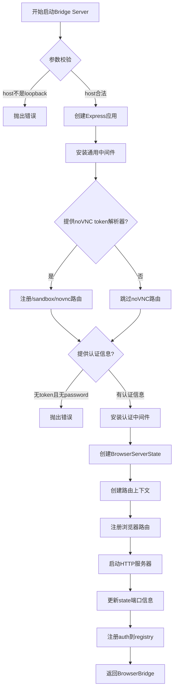

# bridge-server.ts 浏览器桥接服务器模块分析报告

## 文件概述

[bridge-server.ts](file:///d:/prj/openclaw_analyze/src/browser/bridge-server.ts) 是OpenClaw浏览器控制服务层的核心组件，负责启动和管理浏览器桥接服务器（Browser Bridge Server）。

---

## 核心架构

### 架构位置

```
CLI/API → Gateway → Bridge Server → Browser CDP
```

桥接服务器是一个Express HTTP服务器，只能绑定到127.0.0.1（loopback）地址，提供浏览器控制REST API端点，用于在沙箱环境和宿主机之间路由浏览器控制请求。

---

## 核心概念

| 概念 | 说明 |
|------|------|
| **Bridge Server** | 浏览器桥接服务器，运行在127.0.0.1上，提供REST API |
| **Auth** | 基于token和password的认证机制 |
| **noVNC Observer** | 用于在沙箱中观察浏览器的VNC观察器 |
| **Profile** | 浏览器配置，不同profile对应不同的浏览器实例 |

---

## 类型定义

### BrowserBridge

```typescript
/**
 * 浏览器桥接服务器实例类型
 * 包含服务器信息、端口、基础URL和状态
 */
export type BrowserBridge = {
  server: Server;    // HTTP服务器实例
  port: number;      // 监听端口
  baseUrl: string;   // 基础URL（http://127.0.0.1:port）
  state: BrowserServerState; // 服务器状态
};
```

### ResolvedNoVncObserver

```typescript
/**
 * noVNC观察器解析结果类型
 * 用于在沙箱中通过noVNC观察浏览器的VNC连接信息
 */
type ResolvedNoVncObserver = {
  noVncPort: number;    // noVNC端口号
  password?: string;    // VNC密码（可选）
};
```

---

## 核心函数

### 1. buildNoVncBootstrapHtml

```typescript
/**
 * 生成noVNC引导HTML页面
 *
 * 功能说明：
 * 生成一个自动跳转到noVNC观察器的HTML页面。
 * 用于在沙箱环境中通过浏览器观察远程VNC会话。
 */
function buildNoVncBootstrapHtml(params: ResolvedNoVncObserver): string {
  // 构建URL参数
  const hash = new URLSearchParams({
    autoconnect: "1",
    resize: "remote",
  });
  if (params.password?.trim()) {
    hash.set("password", params.password);
  }
  // 目标URL：http://127.0.0.1:{noVncPort}/vnc.html#{hash}
  const targetUrl = `http://127.0.0.1:${params.noVncPort}/vnc.html#${hash.toString()}`;
  // 返回自动跳转HTML
  return `<!doctype html>
<html lang="en">
<head>
  <meta charset="utf-8" />
  <meta name="viewport" content="width=device-width, initial-scale=1" />
  <meta name="referrer" content="no-referrer" />
  <title>OpenClaw noVNC Observer</title>
</head>
<body>
  <p>Opening sandbox observer...</p>
  <script>
    const target = ${JSON.stringify(targetUrl)};
    window.location.replace(target);
  </script>
</body>
</html>`;
}
```

**工作流程**：
1. 接收noVNC端口和可选密码
2. 构建URL参数（autoconnect=1, resize=remote, 可选password）
3. 生成目标URL：`http://127.0.0.1:{port}/vnc.html#{params}`
4. 返回自动跳转HTML页面

---

### 2. startBrowserBridgeServer

```typescript
/**
 * 启动浏览器桥接服务器
 *
 * 功能说明：
 * 创建并启动一个Express HTTP服务器，作为浏览器控制的桥接层。
 */
export async function startBrowserBridgeServer(params: {
  resolved: ResolvedBrowserConfig;
  host?: string;
  port?: number;
  authToken?: string;
  authPassword?: string;
  onEnsureAttachTarget?: (profile: ProfileContext["profile"]) => Promise<void>;
  resolveSandboxNoVncToken?: (token: string) => ResolvedNoVncObserver | null;
}): Promise<BrowserBridge>
```

**启动流程图**：



**15步启动流程**：

| 步骤 | 说明 |
|------|------|
| 1 | 参数校验：host必须为loopback地址 |
| 2 | 端口：0表示让系统自动分配端口 |
| 3 | 创建Express应用 |
| 4 | 安装通用中间件（如日志、CORS等） |
| 5 | 可选：注册noVNC引导路由（`/sandbox/novnc`） |
| 6 | 认证配置：必须提供token或password |
| 7 | 安装认证中间件 |
| 8 | 创建服务器状态对象 |
| 9 | 创建路由上下文（包含状态访问和回调） |
| 10 | 注册所有浏览器控制路由 |
| 11 | 启动HTTP服务器 |
| 12 | 获取实际分配的端口 |
| 13 | 更新state和resolved.controlPort |
| 14 | 注册认证信息到bridge-auth-registry |
| 15 | 构建并返回BrowserBridge对象 |

---

### 3. stopBrowserBridgeServer

```typescript
/**
 * 停止浏览器桥接服务器
 *
 * 功能说明：
 * 优雅地关闭浏览器桥接服务器。
 */
export async function stopBrowserBridgeServer(server: Server): Promise<void>
```

**关闭流程**：


| 步骤 | 说明 |
|------|------|
| 1 | 从bridge-auth-registry删除认证信息 |
| 2 | 关闭HTTP服务器 |

---

## 安全设计

### 1. Loopback绑定
```typescript
// 必须绑定到127.0.0.1，防止外部访问
if (!isLoopbackHost(host)) {
  throw new Error(`bridge server must bind to loopback host (got ${host})`);
}
```

### 2. 认证机制
```typescript
// 必须提供token或password才能启动
if (!authToken && !authPassword) {
  throw new Error("bridge server requires auth (authToken/authPassword missing)");
}
```

### 3. 认证中间件
所有浏览器路由都需要通过`installBrowserAuthMiddleware`安装的认证中间件进行保护。

---

## 关键依赖

| 依赖 | 说明 |
|------|------|
| `express` | HTTP服务器框架 |
| `isLoopbackHost` | 验证host是否为loopback地址 |
| `bridge-auth-registry` | 跨进程认证信息存储 |
| `registerBrowserRoutes` | 注册浏览器控制路由 |
| `server-middleware` | 认证和通用中间件 |
| `server-context` | 路由上下文状态管理 |

---

## 与browser-tool.ts的区别

| 对比项 | bridge-server.ts | browser-tool.ts |
|--------|------------------|-----------------|
| **位置** | `src/browser/` | `src/agents/tools/` |
| **层级** | 浏览器控制服务层 | 智能体工具层 |
| **职责** | HTTP服务器管理、路由注册 | 解析参数、路由决策、action执行 |
| **调用方** | Gateway | AI智能体 |
| **核心函数** | `startBrowserBridgeServer()` | `createBrowserTool()` |
