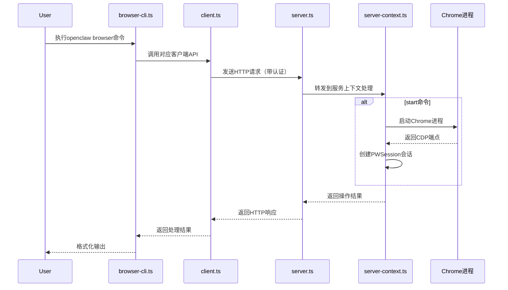
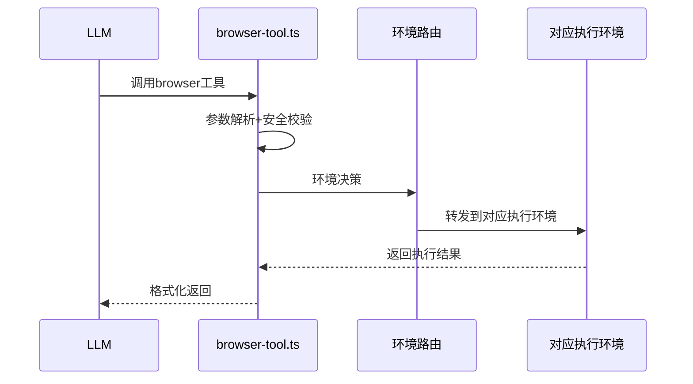
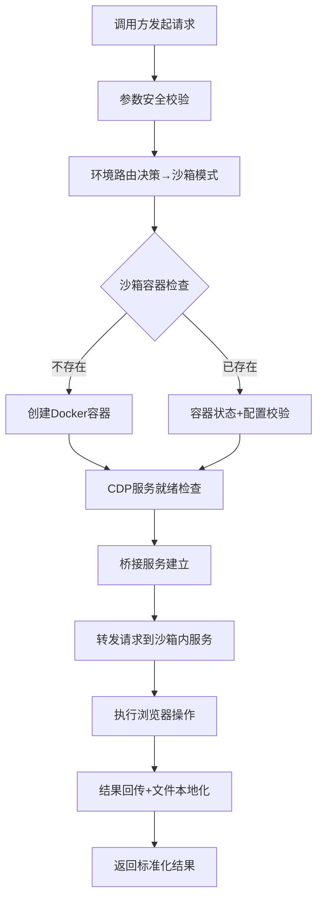
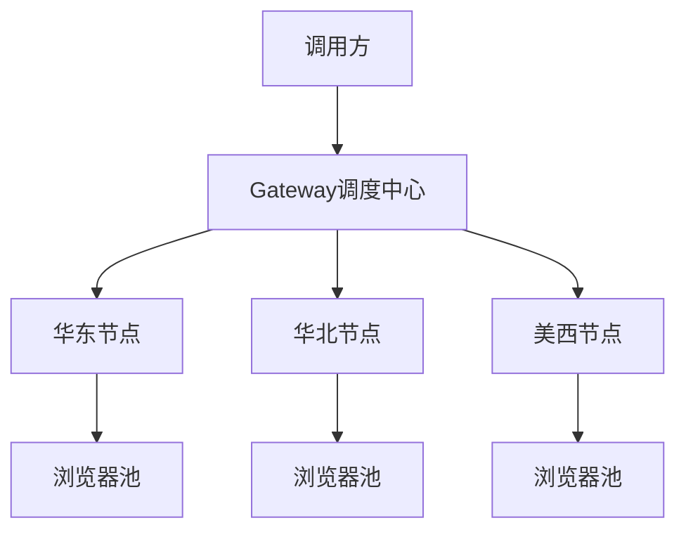
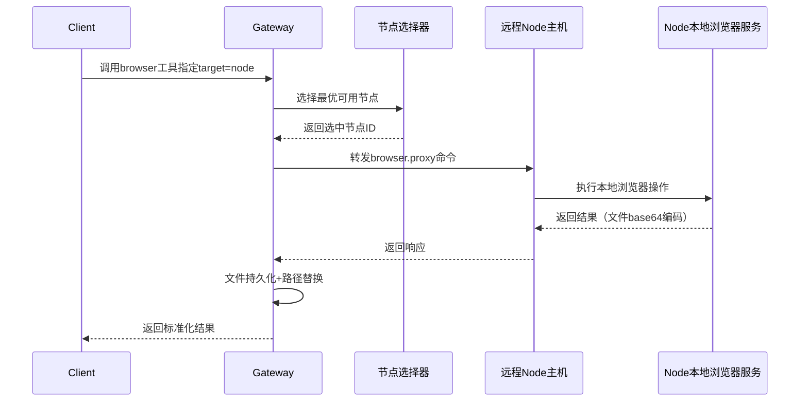
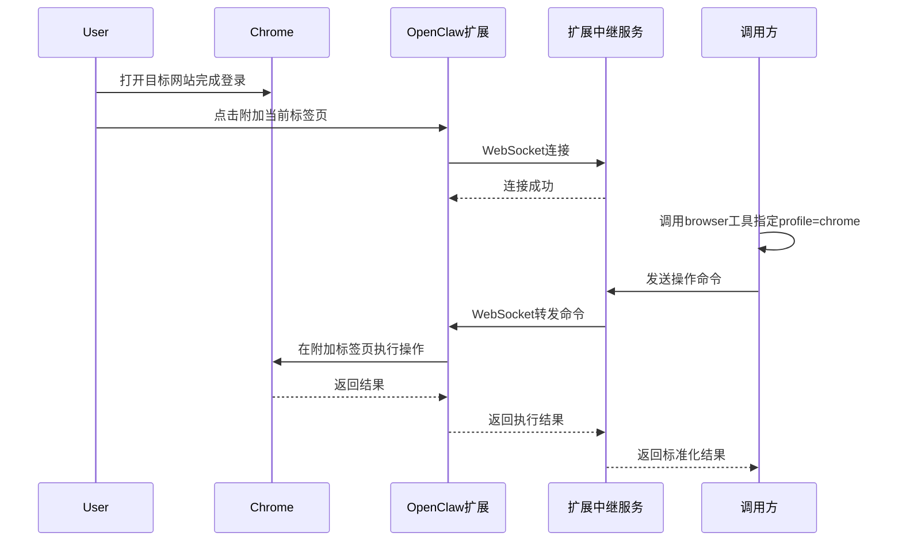

# Browser 全场景深度分析报告

## 一、概述
本文档全面分析OpenClaw浏览器系统的所有核心应用场景，包含CLI命令行、LLM工具入口、HTTP接口、沙箱隔离、分布式远程节点、扩展中继6大类核心场景，每个场景包含适用范围、执行流程、涉及类文件、关键代码片段，是浏览器模块开发、运维、二次开发的完整参考手册。

---

## 二、场景总览
| 场景分类 | 核心用途 | 典型使用者 | 安全等级 |
|---------|----------|------------|----------|
| [CLI命令行场景](#三cli命令行场景) | 浏览器管理、手动自动化、调试 | 开发人员、运维 | ⭐⭐⭐ |
| [browser-tool入口场景](#四browser-tool入口场景) | LLM智能体网页自动化 | 大语言模型、智能体 | ⭐⭐⭐⭐ |
| [HTTP接口场景](#五http接口层场景) | 第三方系统集成、服务化调用 | 外部系统、开发者 | ⭐⭐⭐⭐ |
| [沙箱隔离场景](#六沙箱浏览器操控场景) | 不可信任务、高安全要求场景 | 爬虫、未知网站访问 | ⭐⭐⭐⭐⭐ |
| [远程节点场景](#七远程节点分布式场景) | 大规模集群、跨地域部署 | 企业级自动化、分布式爬虫 | ⭐⭐⭐⭐ |
| [扩展中继场景](#八扩展中继控制场景) | 复用用户登录态、交互式辅助 | 个人生产力、敏感操作辅助 | ⭐⭐⭐ |

---

## 三、CLI命令行场景
### 典型使用
```bash
# 浏览器生命周期管理
openclaw browser start/stop/status
# 标签页操作
openclaw browser open https://example.com
# 页面信息获取
openclaw browser snapshot/screenshot
# 页面交互
openclaw browser click ref-e10
# 配置管理
openclaw browser extension install
```

### 执行流程图


### 涉及核心类/文件
| 角色 | 文件 | 核心函数 |
|------|------|----------|
| CLI入口 | `src/cli/browser-cli.ts` | `registerBrowserCli()` |
| 命令组 | `src/cli/browser-cli-*.ts` | 各子命令注册 |
| 客户端 | `src/browser/client.ts` | `browserStart()`/`browserStop()`等 |
| 服务端 | `src/browser/server.ts` | 路由处理器 |
| 上下文 | `src/browser/server-context.ts` | `ensureBrowserAvailable()` |

### 关键代码片段
**命令注册（browser-cli-manage.ts）**
```typescript
browser.command("status")
  .description("Get browser status")
  .action(async () => {
    const status = await browserStatus(undefined, { profile: opts().browserProfile });
    console.log(JSON.stringify(status, null, 2));
  });
```

---

## 四、browser-tool入口场景
browser-tool是LLM调用浏览器的统一入口，支持4种执行环境自动路由。

### 执行流程图（通用）


### 子场景分类
#### 1. 本地主机执行
默认模式，直接操作本机浏览器，性能最高。
#### 2. 沙箱隔离执行
Docker容器隔离，适用于不可信任务。
#### 3. 远程节点执行
分布式集群部署，支持大规模自动化。
#### 4. 扩展中继执行
控制用户本地已打开的标签页，复用登录态。

### 关键代码片段
**环境路由决策（browser-tool.ts）**
```typescript
// 远程节点模式
const nodeTarget = await resolveBrowserNodeTarget(params);
if (nodeTarget) {
  // 创建代理执行器
  const proxyRequest = async (opts) => callBrowserProxy({ nodeId: nodeTarget.nodeId, ...opts });
}

// 沙箱模式
const baseUrl = resolveBrowserBaseUrl({
  target: resolvedTarget,
  sandboxBridgeUrl: opts?.sandboxBridgeUrl,
});
```

---

## 五、HTTP接口层场景
提供RESTful API，支持第三方系统集成。

### 接口分类
| 接口类别 | 典型接口 |
|---------|----------|
| 基础管理 | `GET /` `POST /start` `POST /stop` |
| 标签页管理 | `GET /tabs` `POST /tabs/open` `DELETE /tabs/:targetId` |
| 信息获取 | `POST /snapshot` `POST /screenshot` `POST /pdf` |
| 交互动作 | `POST /navigate` `POST /act` |
| 状态配置 | `GET /cookies` `POST /set/device` |

### 执行流程图
```mermaid
flowchart TD
    A[客户端请求] --> B[认证中间件]
    B --> C[参数校验]
    C --> D[安全校验(SSRF/权限)]
    D --> E[路由处理器]
    E --> F[业务逻辑执行]
    F --> G[结果序列化]
    G --> H[返回HTTP响应]
```

### 涉及核心类/文件
| 角色 | 文件 | 核心职责 |
|------|------|----------|
| 服务入口 | `src/browser/server.ts` | Fastify服务启动 |
| 路由定义 | `src/browser/routes/**/*.ts` | 各模块路由 |
| 安全中间件 | `src/browser/server-middleware.ts` | 认证、CORS处理 |
| 业务逻辑 | `src/browser/server-context*.ts` | 核心业务实现 |

### 关键代码片段
**认证中间件**
```typescript
fastify.addHook("preHandler", async (request, reply) => {
  const auth = resolveBrowserControlAuth(config);
  const token = request.headers.authorization?.replace(/^Bearer\s+/i, "");
  
  if (auth.token && token !== auth.token) {
    return reply.status(401).send({ error: "Unauthorized" });
  }
});
```

---

## 六、沙箱浏览器操控场景
最高安全等级，浏览器运行在Docker容器中，完全隔离主机环境。

### 执行流程图


### 涉及核心类/文件
| 角色 | 文件 | 职责 |
|------|------|------|
| 沙箱管理 | `src/agents/sandbox/browser.ts` | 容器生命周期管理 |
| Docker操作 | `src/agents/sandbox/docker.ts` | Docker API封装 |
| 桥接服务 | `src/browser/bridge-server.ts` | 主机与沙箱通信桥接 |
| 安全校验 | `src/browser/navigation-guard.ts` | SSRF防护 |

### 关键代码片段
**沙箱容器创建（sandbox/browser.ts）**
```typescript
export async function ensureSandboxBrowser(params: SandboxParams) {
  const containerName = `${cfg.browser.containerPrefix}${slugifySessionKey(params.scopeKey)}`;
  const state = await dockerContainerState(containerName);
  
  // 配置变更则重建容器
  const expectedHash = computeSandboxBrowserConfigHash(cfg);
  const currentHash = await readDockerContainerLabel(containerName, "openclaw.configHash");
  
  if (state.exists && currentHash !== expectedHash) {
    await execDocker(["rm", "-f", containerName]);
  }

  // 启动新容器
  if (!state.exists) {
    const createArgs = buildSandboxCreateArgs(cfg);
    await execDocker(["run", "-d", ...createArgs, cfg.browser.image]);
  }

  // 等待CDP就绪
  await waitForSandboxCdp({ cdpPort: cfg.browser.cdpPort, timeoutMs: 10000 });
  
  return { bridgeUrl: await startBrowserBridgeServer(cfg) };
}
```

---

## 七、远程节点分布式场景
支持多机器、跨地域的浏览器集群调度，适合大规模自动化场景。

### 部署架构


### 执行流程图


### 涉及核心类/文件
| 角色 | 文件 | 职责 |
|------|------|------|
| 节点选择 | `src/agents/tools/nodes-utils.ts` | 节点发现、负载均衡 |
| 代理调用 | `src/agents/tools/browser-tool.ts` | `callBrowserProxy()`远程调用 |
| Node执行 | `src/node-host/invoke-browser.ts` | Node侧命令处理 |
| 文件处理 | `src/browser/proxy-files.ts` | 远程文件本地化 |

### 关键代码片段
**远程代理调用**
```typescript
async function callBrowserProxy(params: ProxyParams) {
  // 调用网关node.invoke接口
  const payload = await callGatewayTool("node.invoke", {
    nodeId: params.nodeId,
    command: "browser.proxy",
    params: { method: params.method, path: params.path, body: params.body },
    idempotencyKey: crypto.randomUUID(), // 幂等键
  });

  // 持久化远程返回的文件
  const mapping = await persistBrowserProxyFiles(payload.files);
  applyProxyPaths(payload.result, mapping);
  
  return payload.result;
}
```

---

## 八、扩展中继控制场景
控制用户本地Chrome中已打开的标签页，直接复用用户已登录会话。

### 核心优势
✅ 零登录成本，直接复用用户已有的登录状态  
✅ 用户完全可控，随时可以终止控制  
✅ 零侵入，不影响浏览器其他使用  

### 执行流程图


### 涉及核心类/文件
| 角色 | 文件 | 职责 |
|------|------|----------|
| 中继服务 | `src/browser/extension-relay.ts` | WebSocket服务、命令转发 |
| 扩展认证 | `src/browser/extension-relay-auth.ts` | 扩展身份认证 |
| 协议适配 | `src/browser/chrome-mcp.ts` | 统一扩展操作接口 |
| 能力检测 | `src/browser/profile-capabilities.ts` | 识别扩展类型profile |

### 关键代码片段
**扩展命令转发（extension-relay.ts）**
```typescript
// WebSocket处理扩展连接
server.get("/ws", { websocket: true }, (connection) => {
  const socket = connection.socket;
  
  socket.on("message", async (data) => {
    const message = JSON.parse(data.toString());
    switch (message.type) {
      case "register-tab":
        // 验证扩展令牌，保存标签页会话
        activeTabs.set(message.payload.tabId, { socket, tabId: message.payload.tabId });
        break;
      case "action-result":
        // 处理操作结果，唤醒等待的请求
        const pending = pendingRequests.get(message.payload.requestId);
        pending?.resolve(message.payload.result);
        break;
    }
  });
});

// 接收内部命令转发到扩展
server.post("/proxy/:tabId", async (request, reply) => {
  const tab = activeTabs.get(request.params.tabId);
  const requestId = crypto.randomUUID();
  
  // 发送命令到扩展
  tab.socket.send(JSON.stringify({
    type: "execute-action",
    payload: { requestId, action: request.body }
  }));

  // 等待扩展返回结果
  const result = await waitForResult(requestId);
  return reply.send(result);
});
```

---

## 九、核心模块快速索引
| 模块 | 入口文件 | 核心功能 |
|------|----------|----------|
| 客户端API | `src/browser/client.ts` | 浏览器控制客户端接口 |
| 服务端 | `src/browser/server.ts` | 浏览器控制服务端 |
| 会话管理 | `src/browser/pw-session.ts` | Playwright会话封装 |
| 安全防护 | `src/browser/navigation-guard.ts` | SSRF防护、导航安全 |
| 路径安全 | `src/browser/paths.ts` | 路径遍历攻击防护 |
| 认证管理 | `src/browser/control-auth.ts` | 控制服务身份认证 |
| 沙箱管理 | `src/agents/sandbox/browser.ts` | 沙箱浏览器生命周期 |
| 节点管理 | `src/node-host/host.ts` | 远程节点主机 |
| 扩展中继 | `src/browser/extension-relay.ts` | Chrome扩展控制 |
