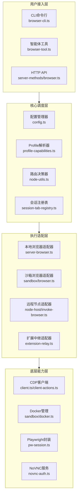
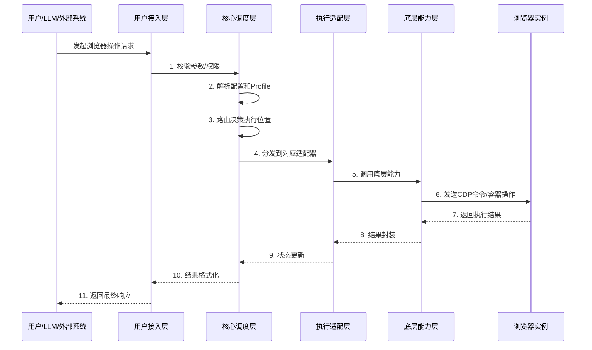
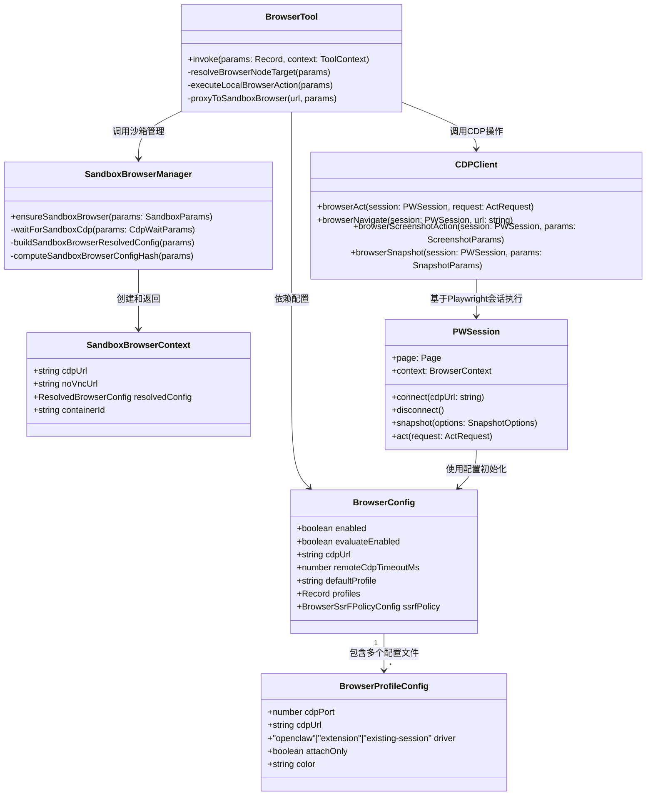

# Browser系统组件架构分析报告

## 一、核心组件分层架构

## 二、各组件职责说明

### 1. 用户接入层组件
| 组件 | 职责 | 对外接口 | 对应文件 |
|------|------|----------|----------|
| **CLI命令行** | 提供用户直接操作浏览器的命令行入口，支持profiles管理、标签页操作、快照、截图、自动化动作等 | `openclaw browser <command>` | [browser-cli.ts](file:///d:/prj/openclaw_analyze/src/cli/browser-cli.ts) 及相关子命令模块 |
| **智能体工具** | 封装为LLM可调用的工具，支持参数校验、权限检查、结果格式化 | `browser.goto()`/`click()`/`snapshot()`等 | [browser-tool.ts](file:///d:/prj/openclaw_analyze/src/agents/tools/browser-tool.ts) |
| **HTTP API** | 暴露RESTful API供外部系统集成，支持浏览器状态查询、操作执行、快照获取等 | `/start`/`/tabs`/`/snapshot`/`/act` | [server-methods/browser.ts](file:///d:/prj/openclaw_analyze/src/gateway/server-methods/browser.ts) |

### 2. 核心调度层组件
| 组件 | 职责 | 对外接口 | 对应文件 |
|------|------|----------|----------|
| **配置管理器** | 加载、合并、校验浏览器配置，处理默认值、配置继承、多Profile合并 | `loadConfig()`/`resolveBrowserConfig()` | [config.ts](file:///d:/prj/openclaw_analyze/src/browser/config.ts) |
| **Profile解析器** | 解析Profile配置，检测浏览器能力，判断支持的操作类型 | `resolveProfile()`/`getBrowserProfileCapabilities()` | [profile-capabilities.ts](file:///d:/prj/openclaw_analyze/src/browser/profile-capabilities.ts) |
| **路由决策器** | 根据配置和当前环境决定浏览器执行位置（本地/沙箱/远程节点），支持负载均衡 | `resolveBrowserNodeTarget()`/`selectDefaultNodeFromList()` | [node-utils.ts](file:///d:/prj/openclaw_analyze/src/agents/tools/node-utils.ts) |
| **会话注册表** | 跟踪会话与浏览器标签页的关联关系，实现会话级资源隔离和生命周期管理 | `trackSessionBrowserTab()`/`untrackSessionBrowserTab()` | [session-tab-registry.ts](file:///d:/prj/openclaw_analyze/src/browser/session-tab-registry.ts) |

### 3. 执行适配层组件
| 组件 | 职责 | 对外接口 | 对应文件 |
|------|------|----------|----------|
| **本地浏览器适配器** | 管理本地主机上的浏览器进程，处理启动、停止、CDP连接建立 | `browserStart()`/`browserStop()`/`browserStatus()` | [server-browser.ts](file:///d:/prj/openclaw_analyze/src/gateway/server-browser.ts) |
| **沙箱浏览器适配器** | 管理Docker容器化的隔离浏览器环境，处理容器创建、销毁、网络配置、NoVNC访问 | `ensureSandboxBrowser()`/`stopBrowserBridgeServer()` | [sandbox/browser.ts](file:///d:/prj/openclaw_analyze/src/agents/sandbox/browser.ts) |
| **远程节点适配器** | 处理跨机器浏览器调用的代理转发，实现分布式浏览器调度 | `invokeBrowserAction()` | [node-host/invoke-browser.ts](file:///d:/prj/openclaw_analyze/src/node-host/invoke-browser.ts) |
| **扩展中继适配器** | 通过Chrome扩展实现对用户现有浏览器标签页的控制 | `extensionRelay()` | extension-relay.ts |

### 4. 底层能力层组件
| 组件 | 职责 | 对外接口 | 对应文件 |
|------|------|----------|----------|
| **CDP客户端** | 封装Chrome DevTools Protocol通信，实现所有浏览器操作的底层调用 | `browserAct()`/`browserNavigate()`/`browserScreenshotAction()` | [client.ts](file:///d:/prj/openclaw_analyze/src/browser/client.ts) / [client-actions.ts](file:///d:/prj/openclaw_analyze/src/browser/client-actions.ts) |
| **Docker管理** | 封装Docker API调用，处理容器的创建、销毁、状态查询、端口映射 | `execDocker()`/`dockerContainerState()`/`readDockerPort()` | [sandbox/docker.ts](file:///d:/prj/openclaw_analyze/src/agents/sandbox/docker.ts) |
| **Playwright封装** | 基于Playwright实现高级浏览器操作，包括快照生成、元素定位、复杂交互 | `PWSession`类 | pw-session.ts |
| **NoVNC服务** | 提供浏览器可视化访问能力，处理认证授权、令牌生成、URL构建 | `issueNoVncObserverToken()`/`buildNoVncObserverTokenUrl()` | [novnc-auth.ts](file:///d:/prj/openclaw_analyze/src/agents/sandbox/novnc-auth.ts) |

## 三、组件调用关系

## 四、核心类图

## 五、设计特点
1. **分层解耦**：各层职责清晰，接入层、调度层、执行层、能力层完全分离，易于扩展
2. **多环境适配**：通过适配器模式统一不同运行环境的接口，上层无需关心底层实现差异
3. **分布式友好**：路由决策层支持动态调度到不同节点，天然支持分布式部署
4. **安全隔离**：沙箱层提供完整的隔离能力，SSRF策略、权限校验贯穿整个调用链路
5. **可扩展性**：新增浏览器类型或运行模式只需添加新的适配器，无需修改上层逻辑
