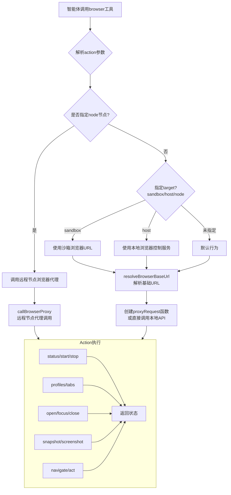

# browser-tool.ts 工具模块分析报告

## 文件概述

[browser-tool.ts](file:///d:/prj/openclaw_analyze/src/agents/tools/browser-tool.ts) 是OpenClaw智能体调用浏览器控制能力的统一工具入口。它封装了所有浏览器操作，为AI代理提供一致的浏览器控制接口，是智能体层与浏览器控制服务之间的桥梁。

---

## 核心架构流程图



---

## 全文注释

```typescript
// ============================================================
// 导入依赖
// ============================================================

import crypto from "node:crypto"; // 用于生成幂等性密钥

// 浏览器客户端操作函数（底层CDP操作封装）
import {
  browserAct,              // 执行浏览器操作（点击、输入等）
  browserArmDialog,       // 处理浏览器对话框
  browserArmFileChooser,  // 处理文件选择器
  browserNavigate,        // 导航到指定URL
  browserPdfSave,          // 保存页面为PDF
  browserScreenshotAction, // 截图
} from "../../browser/client-actions.js";

// 浏览器客户端API函数（浏览器生命周期管理）
import {
  browserCloseTab,   // 关闭标签页
  browserFocusTab,   // 聚焦标签页
  browserOpenTab,    // 打开新标签页
  browserProfiles,   // 获取浏览器配置文件列表
  browserStart,      // 启动浏览器
  browserStatus,     // 获取浏览器状态
  browserStop,       // 停止浏览器
} from "../../browser/client.js";

// 浏览器配置解析
import { resolveBrowserConfig, resolveProfile } from "../../browser/config.js";

// 路径处理
import { DEFAULT_UPLOAD_DIR, resolveExistingPathsWithinRoot } from "../../browser/paths.js";

// Profile能力检测
import { getBrowserProfileCapabilities } from "../../browser/profile-capabilities.js";

// 代理文件处理（远程节点场景）
import { applyBrowserProxyPaths, persistBrowserProxyFiles } from "../../browser/proxy-files.js";

// 会话标签页追踪
import { trackSessionBrowserTab, untrackSessionBrowserTab } from "../../browser/session-tab-registry.js";

// 配置加载
import { loadConfig } from "../../config/config.js";

// 浏览器工具操作执行器
import {
  executeActAction,       // 执行UI自动化操作
  executeConsoleAction,   // 执行控制台操作
  executeSnapshotAction,  // 执行页面快照
  executeTabsAction,      // 执行标签页操作
} from "./browser-tool.actions.js";

// 工具Schema定义
import { BrowserToolSchema } from "./browser-tool.schema.js";

// 通用工具类型和辅助函数
import { type AnyAgentTool, imageResultFromFile, jsonResult, readStringParam } from "./common.js";

// Gateway工具调用
import { callGatewayTool } from "./gateway.js";

// 节点工具函数
import {
  listNodes,                     // 列出所有节点
  resolveNodeIdFromList,         // 从列表中解析节点ID
  selectDefaultNodeFromList,     // 选择默认节点
  type NodeListNode,
} from "./nodes-utils.js";

// ============================================================
// 工具函数：解析可选参数
// ============================================================

/**
 * 解析targetId和timeoutMs可选参数
 * 用于需要目标标签页ID和超时的操作
 */
function readOptionalTargetAndTimeout(params: Record<string, unknown>) {
  const targetId = typeof params.targetId === "string" ? params.targetId.trim() : undefined;
  const timeoutMs =
    typeof params.timeoutMs === "number" && Number.isFinite(params.timeoutMs)
      ? params.timeoutMs
      : undefined;
  return { targetId, timeoutMs };
}

/**
 * 解析目标URL参数
 * 支持targetUrl和url两个参数名，url为必需
 */
function readTargetUrlParam(params: Record<string, unknown>) {
  return (
    readStringParam(params, "targetUrl") ??
    readStringParam(params, "url", { required: true, label: "targetUrl" })
  );
}

// ============================================================
// 遗留兼容：旧版act请求参数处理
// ============================================================

/**
 * 旧版浏览器act请求的参数key列表
 * 用于兼容旧的API调用方式
 */
const LEGACY_BROWSER_ACT_REQUEST_KEYS = [
  "targetId", "ref", "doubleClick", "button", "modifiers", "text", "submit", "slowly",
  "key", "delayMs", "startRef", "endRef", "values", "fields", "width", "height",
  "timeMs", "textGone", "selector", "url", "loadState", "fn", "timeoutMs",
] as const;

/**
 * 解析act请求参数
 * 支持两种格式：
 * 1. 新版：request对象直接传递
 * 2. 旧版：各参数平铺在顶层
 */
function readActRequestParam(params: Record<string, unknown>) {
  // 新版格式：request参数直接传递对象
  const requestParam = params.request;
  if (requestParam && typeof requestParam === "object") {
    return requestParam as Parameters<typeof browserAct>[1];
  }

  // 旧版格式：各参数平铺
  const kind = readStringParam(params, "kind");
  if (!kind) {
    return undefined;
  }

  const request: Record<string, unknown> = { kind };
  for (const key of LEGACY_BROWSER_ACT_REQUEST_KEYS) {
    if (!Object.hasOwn(params, key)) {
      continue;
    }
    request[key] = params[key];
  }
  return request as Parameters<typeof browserAct>[1];
}

// ============================================================
// 代理类型定义（用于远程节点场景）
// ============================================================

/**
 * 代理文件类型：远程节点返回的文件需要以base64形式传输到本地
 */
type BrowserProxyFile = {
  path: string;      // 文件路径
  base64: string;   // 文件内容的base64编码
  mimeType?: string; // MIME类型（可选）
};

/**
 * 代理结果类型：远程节点返回的完整响应
 */
type BrowserProxyResult = {
  result: unknown;          // 操作结果
  files?: BrowserProxyFile[]; // 附带文件（如果有，如截图）
};

// ============================================================
// 常量定义
// ============================================================

/**
 * 浏览器代理默认超时时间：20秒
 */
const DEFAULT_BROWSER_PROXY_TIMEOUT_MS = 20_000;

/**
 * Gateway超时缓冲时间：5秒
 * 代理超时 = 请求超时 + 缓冲时间
 */
const BROWSER_PROXY_GATEWAY_TIMEOUT_SLACK_MS = 5_000;

/**
 * 浏览器节点目标类型
 */
type BrowserNodeTarget = {
  nodeId: string;  // 节点ID
  label?: string; // 显示名称
};

// ============================================================
// 节点判断与解析
// ============================================================

/**
 * 判断一个节点是否为浏览器节点
 * 条件：具有browser capability 或 支持 browser.proxy 命令
 */
function isBrowserNode(node: NodeListNode) {
  const caps = Array.isArray(node.caps) ? node.caps : [];
  const commands = Array.isArray(node.commands) ? node.commands : [];
  return caps.includes("browser") || commands.includes("browser.proxy");
}

/**
 * 解析目标浏览器节点
 *
 * 模式（mode）说明：
 * - "off": 完全禁用节点代理
 * - "manual": 需要手动指定节点
 * - "auto": 自动选择单节点，多节点需配置
 *
 * target参数说明：
 * - "sandbox": 使用沙箱浏览器
 * - "host": 使用宿主机浏览器
 * - "node": 强制使用远程节点
 */
async function resolveBrowserNodeTarget(params: {
  requestedNode?: string;    // 请求中指定的节点
  target?: "sandbox" | "host" | "node"; // 目标类型
  sandboxBridgeUrl?: string; // 沙箱桥接URL
}): Promise<BrowserNodeTarget | null> {
  const cfg = loadConfig();
  const policy = cfg.gateway?.nodes?.browser;
  const mode = policy?.mode ?? "auto";

  // off模式：禁用节点代理
  if (mode === "off") {
    if (params.target === "node" || params.requestedNode) {
      throw new Error("Node browser proxy is disabled (gateway.nodes.browser.mode=off).");
    }
    return null;
  }

  // 有沙箱URL时使用沙箱
  if (params.sandboxBridgeUrl?.trim() && params.target !== "node" && !params.requestedNode) {
    return null;
  }

  // 仅当明确指定为node时才使用节点
  if (params.target && params.target !== "node") {
    return null;
  }

  // manual模式需要显式指定
  if (mode === "manual" && params.target !== "node" && !params.requestedNode) {
    return null;
  }

  // 获取所有已连接的浏览器节点
  const nodes = await listNodes({});
  const browserNodes = nodes.filter((node) => node.connected && isBrowserNode(node));

  // 没有可用节点
  if (browserNodes.length === 0) {
    if (params.target === "node" || params.requestedNode) {
      throw new Error("No connected browser-capable nodes.");
    }
    return null;
  }

  // 显式指定了节点
  const requested = params.requestedNode?.trim() || policy?.node?.trim();
  if (requested) {
    const nodeId = resolveNodeIdFromList(browserNodes, requested, false);
    const node = browserNodes.find((entry) => entry.nodeId === nodeId);
    return { nodeId, label: node?.displayName ?? node?.remoteIp ?? nodeId };
  }

  // 自动选择默认节点
  const selected = selectDefaultNodeFromList(browserNodes, {
    preferLocalMac: false,
    fallback: "none",
  });

  // 强制使用节点模式
  if (params.target === "node") {
    if (selected) {
      return {
        nodeId: selected.nodeId,
        label: selected.displayName ?? selected.remoteIp ?? selected.nodeId,
      };
    }
    throw new Error(
      `Multiple browser-capable nodes connected (${browserNodes.length}). Set gateway.nodes.browser.node or pass node=<id|name>.`,
    );
  }

  // manual模式
  if (mode === "manual") {
    return null;
  }

  // 有单个节点时自动使用
  if (selected) {
    return {
      nodeId: selected.nodeId,
      label: selected.displayName ?? selected.remoteIp ?? selected.nodeId,
    };
  }
  return null;
}

// ============================================================
// 远程节点代理调用
// ============================================================

/**
 * 调用远程节点浏览器代理
 * 将请求转发到远程节点执行，并处理返回结果
 */
async function callBrowserProxy(params: {
  nodeId: string;
  method: string;
  path: string;
  query?: Record<string, string | number | boolean | undefined>;
  body?: unknown;
  timeoutMs?: number;
  profile?: string;
}): Promise<BrowserProxyResult> {
  // 计算超时时间
  const proxyTimeoutMs =
    typeof params.timeoutMs === "number" && Number.isFinite(params.timeoutMs)
      ? Math.max(1, Math.floor(params.timeoutMs))
      : DEFAULT_BROWSER_PROXY_TIMEOUT_MS;
  const gatewayTimeoutMs = proxyTimeoutMs + BROWSER_PROXY_GATEWAY_TIMEOUT_SLACK_MS;

  // 调用Gateway的node.invoke接口
  const payload = await callGatewayTool<{ payloadJSON?: string; payload?: string }>(
    "node.invoke",
    { timeoutMs: gatewayTimeoutMs },
    {
      nodeId: params.nodeId,
      command: "browser.proxy",
      params: {
        method: params.method,
        path: params.path,
        query: params.query,
        body: params.body,
        timeoutMs: proxyTimeoutMs,
        profile: params.profile,
      },
      idempotencyKey: crypto.randomUUID(), // 生成幂等性密钥
    },
  );

  // 解析响应
  const parsed =
    payload?.payload ??
    (typeof payload?.payloadJSON === "string" && payload.payloadJSON
      ? (JSON.parse(payload.payloadJSON) as BrowserProxyResult)
      : null);

  if (!parsed || typeof parsed !== "object" || !("result" in parsed)) {
    throw new Error("browser proxy failed");
  }
  return parsed;
}

/**
 * 将远程节点返回的代理文件持久化到本地
 */
async function persistProxyFiles(files: BrowserProxyFile[] | undefined) {
  return await persistBrowserProxyFiles(files);
}

/**
 * 应用代理文件路径映射到结果中
 */
function applyProxyPaths(result: unknown, mapping: Map<string, string>) {
  applyBrowserProxyPaths(result, mapping);
}

// ============================================================
// 浏览器基础URL解析
// ============================================================

/**
 * 解析浏览器基础URL
 * 根据target参数决定使用沙箱浏览器还是宿主机浏览器
 *
 * @param target - 目标类型：sandbox/host
 * @param sandboxBridgeUrl - 沙箱桥接URL
 * @param allowHostControl - 是否允许控制宿主机浏览器
 * @returns 浏览器基础URL，undefined表示使用默认本地服务
 */
function resolveBrowserBaseUrl(params: {
  target?: "sandbox" | "host";
  sandboxBridgeUrl?: string;
  allowHostControl?: boolean;
}): string | undefined {
  const cfg = loadConfig();
  const resolved = resolveBrowserConfig(cfg.browser, cfg);
  const normalizedSandbox = params.sandboxBridgeUrl?.trim() ?? "";
  const target = params.target ?? (normalizedSandbox ? "sandbox" : "host");

  // 使用沙箱浏览器
  if (target === "sandbox") {
    if (!normalizedSandbox) {
      throw new Error(
        'Sandbox browser is unavailable. Enable agents.defaults.sandbox.browser.enabled or use target="host" if allowed.',
      );
    }
    return normalizedSandbox.replace(/\/$/, ""); // 去除末尾斜杠
  }

  // 检查是否允许控制宿主机
  if (params.allowHostControl === false) {
    throw new Error("Host browser control is disabled by sandbox policy.");
  }

  // 检查浏览器控制是否启用
  if (!resolved.enabled) {
    throw new Error(
      "Browser control is disabled. Set browser.enabled=true in ~/.openclaw/openclaw.json.",
    );
  }

  return undefined; // 返回undefined表示使用本地服务
}

// ============================================================
// Profile判断：是否应该使用用户浏览器
// ============================================================

/**
 * 判断是否为用户浏览器Profile
 * 用户浏览器Profile（existing-session、extension relay）只能在宿主机使用
 */
function shouldPreferHostForProfile(profileName: string | undefined) {
  if (!profileName) {
    return false;
  }
  const cfg = loadConfig();
  const resolved = resolveBrowserConfig(cfg.browser, cfg);
  const profile = resolveProfile(resolved, profileName);
  if (!profile) {
    return false;
  }
  const capabilities = getBrowserProfileCapabilities(profile);
  return capabilities.requiresRelay || capabilities.usesChromeMcp;
}

// ============================================================
// 核心：创建浏览器工具
// ============================================================

/**
 * 创建浏览器工具
 * 这是对外暴露的核心工厂函数
 *
 * @param opts - 可选配置
 * @param opts.sandboxBridgeUrl - 沙箱桥接URL
 * @param opts.allowHostControl - 是否允许控制宿主机浏览器
 * @param opts.agentSessionKey - 智能体会话Key（用于追踪标签页）
 */
export function createBrowserTool(opts?: {
  sandboxBridgeUrl?: string;
  allowHostControl?: boolean;
  agentSessionKey?: string;
}): AnyAgentTool {
  // 确定默认target
  const targetDefault = opts?.sandboxBridgeUrl ? "sandbox" : "host";

  // 生成host提示信息
  const hostHint =
    opts?.allowHostControl === false ? "Host target blocked by policy." : "Host target allowed.";

  return {
    // ---- 工具元信息 ----
    label: "Browser",
    name: "browser",
    description: [
      "Control the browser via OpenClaw's browser control server (status/start/stop/profiles/tabs/open/snapshot/screenshot/actions).",
      "Browser choice: omit profile by default for the isolated OpenClaw-managed browser (`openclaw`).",
      'For the logged-in user browser on the local host, use profile="user". Chrome (v146+) must be running. Use only when existing logins/cookies matter and the user is present.',
      'When a node-hosted browser proxy is available, the tool may auto-route to it. Pin a node with node=<id|name> or target="node".',
      "When using refs from snapshot (e.g. e12), keep the same tab: prefer passing targetId from the snapshot response into subsequent actions (act/click/type/etc).",
      'For stable, self-resolving refs across calls, use snapshot with refs="aria" (Playwright aria-ref ids). Default refs="role" are role+name-based.',
      "Use snapshot+act for UI automation. Avoid act:wait by default; use only in exceptional cases when no reliable UI state exists.",
      `target selects browser location (sandbox|host|node). Default: ${targetDefault}.`,
      hostHint,
    ].join(" "),
    parameters: BrowserToolSchema,

    // ---- 核心执行函数 ----
    execute: async (_toolCallId, args) => {
      const params = args as Record<string, unknown>;

      // ---- 1. 解析基础参数 ----
      const action = readStringParam(params, "action", { required: true });
      const profile = readStringParam(params, "profile");
      const requestedNode = readStringParam(params, "node");
      let target = readStringParam(params, "target") as "sandbox" | "host" | "node" | undefined;

      // ---- 2. 参数校验 ----
      // node参数只能与target="node"一起使用
      if (requestedNode && target && target !== "node") {
        throw new Error('node is only supported with target="node".');
      }

      // 用户浏览器Profile只能在宿主机使用
      const isUserBrowserProfile = shouldPreferHostForProfile(profile);
      if (isUserBrowserProfile) {
        if (requestedNode || target === "node") {
          throw new Error(`profile="${profile}" only supports the local host browser.`);
        }
        if (target === "sandbox") {
          throw new Error(
            `profile="${profile}" cannot use the sandbox browser; use target="host" or omit target.`,
          );
        }
        if (!target && !requestedNode) {
          target = "host"; // 自动切换到host
        }
      }

      // ---- 3. 解析目标节点 ----
      const nodeTarget = await resolveBrowserNodeTarget({
        requestedNode: requestedNode ?? undefined,
        target,
        sandboxBridgeUrl: opts?.sandboxBridgeUrl,
      });

      // ---- 4. 解析基础URL ----
      const resolvedTarget = target === "node" ? undefined : target;
      const baseUrl = nodeTarget
        ? undefined
        : resolveBrowserBaseUrl({
            target: resolvedTarget,
            sandboxBridgeUrl: opts?.sandboxBridgeUrl,
            allowHostControl: opts?.allowHostControl,
          });

      // ---- 5. 创建代理请求函数 ----
      // 如果有远程节点目标，创建代理请求函数
      // 否则为null，直接调用本地API
      const proxyRequest = nodeTarget
        ? async (opts: {
            method: string;
            path: string;
            query?: Record<string, string | number | boolean | undefined>;
            body?: unknown;
            timeoutMs?: number;
            profile?: string;
          }) => {
            const proxy = await callBrowserProxy({
              nodeId: nodeTarget.nodeId,
              method: opts.method,
              path: opts.path,
              query: opts.query,
              body: opts.body,
              timeoutMs: opts.timeoutMs,
              profile: opts.profile,
            });
            const mapping = await persistProxyFiles(proxy.files);
            applyProxyPaths(proxy.result, mapping);
            return proxy.result;
          }
        : null;

      // ---- 6. 执行具体action ----
      switch (action) {
        // ---------- 状态操作 ----------
        case "status":
          if (proxyRequest) {
            return jsonResult(
              await proxyRequest({
                method: "GET",
                path: "/",
                profile,
              }),
            );
          }
          return jsonResult(await browserStatus(baseUrl, { profile }));

        case "start":
          if (proxyRequest) {
            await proxyRequest({
              method: "POST",
              path: "/start",
              profile,
            });
            return jsonResult(
              await proxyRequest({
                method: "GET",
                path: "/",
                profile,
              }),
            );
          }
          await browserStart(baseUrl, { profile });
          return jsonResult(await browserStatus(baseUrl, { profile }));

        case "stop":
          if (proxyRequest) {
            await proxyRequest({
              method: "POST",
              path: "/stop",
              profile,
            });
            return jsonResult(
              await proxyRequest({
                method: "GET",
                path: "/",
                profile,
              }),
            );
          }
          await browserStop(baseUrl, { profile });
          return jsonResult(await browserStatus(baseUrl, { profile }));

        case "profiles":
          if (proxyRequest) {
            const result = await proxyRequest({
              method: "GET",
              path: "/profiles",
            });
            return jsonResult(result);
          }
          return jsonResult({ profiles: await browserProfiles(baseUrl) });

        // ---------- 标签页操作 ----------
        case "tabs":
          return await executeTabsAction({ baseUrl, profile, proxyRequest });

        case "open": {
          const targetUrl = readTargetUrlParam(params);
          if (proxyRequest) {
            const result = await proxyRequest({
              method: "POST",
              path: "/tabs/open",
              profile,
              body: { url: targetUrl },
            });
            return jsonResult(result);
          }
          const opened = await browserOpenTab(baseUrl, targetUrl, { profile });
          // 追踪新打开的标签页
          trackSessionBrowserTab({
            sessionKey: opts?.agentSessionKey,
            targetId: opened.targetId,
            baseUrl,
            profile,
          });
          return jsonResult(opened);
        }

        case "focus": {
          const targetId = readStringParam(params, "targetId", { required: true });
          if (proxyRequest) {
            const result = await proxyRequest({
              method: "POST",
              path: "/tabs/focus",
              profile,
              body: { targetId },
            });
            return jsonResult(result);
          }
          await browserFocusTab(baseUrl, targetId, { profile });
          return jsonResult({ ok: true });
        }

        case "close": {
          const targetId = readStringParam(params, "targetId");
          if (proxyRequest) {
            const result = targetId
              ? await proxyRequest({
                  method: "DELETE",
                  path: `/tabs/${encodeURIComponent(targetId)}`,
                  profile,
                })
              : await proxyRequest({
                  method: "POST",
                  path: "/act",
                  profile,
                  body: { kind: "close" },
                });
            return jsonResult(result);
          }
          if (targetId) {
            await browserCloseTab(baseUrl, targetId, { profile });
            // 取消追踪已关闭的标签页
            untrackSessionBrowserTab({
              sessionKey: opts?.agentSessionKey,
              targetId,
              baseUrl,
              profile,
            });
          } else {
            await browserAct(baseUrl, { kind: "close" }, { profile });
          }
          return jsonResult({ ok: true });
        }

        // ---------- 页面操作 ----------
        case "snapshot":
          return await executeSnapshotAction({
            input: params,
            baseUrl,
            profile,
            proxyRequest,
          });

        case "screenshot": {
          const targetId = readStringParam(params, "targetId");
          const fullPage = Boolean(params.fullPage);
          const ref = readStringParam(params, "ref");
          const element = readStringParam(params, "element");
          const type = params.type === "jpeg" ? "jpeg" : "png";
          const result = proxyRequest
            ? ((await proxyRequest({
                method: "POST",
                path: "/screenshot",
                profile,
                body: {
                  targetId,
                  fullPage,
                  ref,
                  element,
                  type,
                },
              })) as Awaited<ReturnType<typeof browserScreenshotAction>>)
            : await browserScreenshotAction(baseUrl, {
                targetId,
                fullPage,
                ref,
                element,
                type,
                profile,
              });
          return await imageResultFromFile({
            label: "browser:screenshot",
            path: result.path,
            details: result,
          });
        }

        case "navigate": {
          const targetUrl = readTargetUrlParam(params);
          const targetId = readStringParam(params, "targetId");
          if (proxyRequest) {
            const result = await proxyRequest({
              method: "POST",
              path: "/navigate",
              profile,
              body: {
                url: targetUrl,
                targetId,
              },
            });
            return jsonResult(result);
          }
          return jsonResult(
            await browserNavigate(baseUrl, {
              url: targetUrl,
              targetId,
              profile,
            }),
          );
        }

        case "console":
          return await executeConsoleAction({
            input: params,
            baseUrl,
            profile,
            proxyRequest,
          });

        case "pdf": {
          const targetId = typeof params.targetId === "string" ? params.targetId.trim() : undefined;
          const result = proxyRequest
            ? ((await proxyRequest({
                method: "POST",
                path: "/pdf",
                profile,
                body: { targetId },
              })) as Awaited<ReturnType<typeof browserPdfSave>>)
            : await browserPdfSave(baseUrl, { targetId, profile });
          return {
            content: [{ type: "text" as const, text: `FILE:${result.path}` }],
            details: result,
          };
        }

        // ---------- 文件上传 ----------
        case "upload": {
          const paths = Array.isArray(params.paths) ? params.paths.map((p) => String(p)) : [];
          if (paths.length === 0) {
            throw new Error("paths required");
          }
          const uploadPathsResult = await resolveExistingPathsWithinRoot({
            rootDir: DEFAULT_UPLOAD_DIR,
            requestedPaths: paths,
            scopeLabel: `uploads directory (${DEFAULT_UPLOAD_DIR})`,
          });
          if (!uploadPathsResult.ok) {
            throw new Error(uploadPathsResult.error);
          }
          const normalizedPaths = uploadPathsResult.paths;
          const ref = readStringParam(params, "ref");
          const inputRef = readStringParam(params, "inputRef");
          const element = readStringParam(params, "element");
          const { targetId, timeoutMs } = readOptionalTargetAndTimeout(params);
          if (proxyRequest) {
            const result = await proxyRequest({
              method: "POST",
              path: "/hooks/file-chooser",
              profile,
              body: {
                paths: normalizedPaths,
                ref,
                inputRef,
                element,
                targetId,
                timeoutMs,
              },
            });
            return jsonResult(result);
          }
          return jsonResult(
            await browserArmFileChooser(baseUrl, {
              paths: normalizedPaths,
              ref,
              inputRef,
              element,
              targetId,
              timeoutMs,
              profile,
            }),
          );
        }

        // ---------- 对话框处理 ----------
        case "dialog": {
          const accept = Boolean(params.accept);
          const promptText = typeof params.promptText === "string" ? params.promptText : undefined;
          const { targetId, timeoutMs } = readOptionalTargetAndTimeout(params);
          if (proxyRequest) {
            const result = await proxyRequest({
              method: "POST",
              path: "/hooks/dialog",
              profile,
              body: {
                accept,
                promptText,
                targetId,
                timeoutMs,
              },
            });
            return jsonResult(result);
          }
          return jsonResult(
            await browserArmDialog(baseUrl, {
              accept,
              promptText,
              targetId,
              timeoutMs,
              profile,
            }),
          );
        }

        // ---------- UI自动化操作 ----------
        case "act": {
          const request = readActRequestParam(params);
          if (!request) {
            throw new Error("request required");
          }
          return await executeActAction({
            request,
            baseUrl,
            profile,
            proxyRequest,
          });
        }

        // ---------- 未知action ----------
        default:
          throw new Error(`Unknown action: ${action}`);
      }
    },
  };
}
```

---

## 主要功能分类

### 1. 生命周期管理（status/start/stop）
```typescript
// 启动浏览器
case "start":
  await browserStart(baseUrl, { profile });
  return jsonResult(await browserStatus(baseUrl, { profile }));
```

### 2. 标签页操作（tabs/open/focus/close）
```typescript
// 打开新标签页并追踪
case "open": {
  const opened = await browserOpenTab(baseUrl, targetUrl, { profile });
  trackSessionBrowserTab({ sessionKey: opts?.agentSessionKey, targetId: opened.targetId, baseUrl, profile });
  return jsonResult(opened);
}
```

### 3. 页面捕获（snapshot/screenshot）
```typescript
// 截图返回图片文件
case "screenshot": {
  const result = await browserScreenshotAction(baseUrl, { targetId, fullPage, ref, element, type, profile });
  return await imageResultFromFile({ label: "browser:screenshot", path: result.path, details: result });
}
```

### 4. UI自动化（navigate/act）
```typescript
// 执行UI操作（点击、输入等）
case "act": {
  const request = readActRequestParam(params);
  return await executeActAction({ request, baseUrl, profile, proxyRequest });
}
```

### 5. 远程节点代理
```typescript
// 通过远程节点执行浏览器操作
const proxyRequest = nodeTarget
  ? async (opts) => {
      const proxy = await callBrowserProxy({ nodeId: nodeTarget.nodeId, ... });
      const mapping = await persistProxyFiles(proxy.files);
      applyProxyPaths(proxy.result, mapping);
      return proxy.result;
    }
  : null;
```

---

## 与browser.ts的区别

| 对比项 | browser-tool.ts | browser.ts |
|--------|-----------------|------------|
| **位置** | `src/agents/tools/` | `src/gateway/server-methods/` |
| **层级** | 智能体工具层 | Gateway服务层 |
| **调用方** | AI智能体 | CLI/API客户端 |
| **职责** | 解析参数、路由决策、执行action | HTTP请求路由、节点代理、响应处理 |
| **核心函数** | `createBrowserTool()` | `browserHandlers.browser.request()` |

---

## 安全设计要点

1. **Profile隔离**：用户浏览器Profile（existing-session、extension relay）只能在宿主机使用，不能用于沙箱
2. **节点权限检查**：使用远程节点前会检查`browser.proxy`命令是否在允许列表中
3. **Target校验**：`node`参数只能与`target="node"`一起使用，防止误用
4. **沙箱策略**：`allowHostControl`参数可控制是否允许在沙箱环境中控制宿主机浏览器
