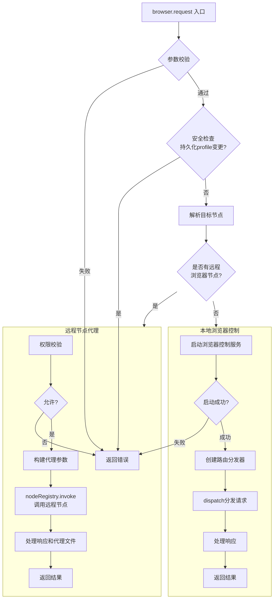

# browser.ts 模块分析报告

## 文件概述

[browser.ts](file:///d:/prj/openclaw_analyze/src/gateway/server-methods/browser.ts) 是OpenClaw Gateway中处理浏览器控制请求的核心模块。它实现了浏览器请求的统一入口，负责将请求路由到本地浏览器控制服务或远程节点浏览器。

---

## 全文注释

```typescript
// ============================================================
// 导入依赖
// ============================================================
import crypto from "node:crypto"; // 用于生成幂等性密钥

// 浏览器控制服务相关
import {
  createBrowserControlContext,      // 创建浏览器控制上下文
  startBrowserControlServiceFromConfig, // 从配置启动浏览器控制服务
} from "../../browser/control-service.js";

// 代理文件处理：远程节点返回的文件需要持久化到本地
import { applyBrowserProxyPaths, persistBrowserProxyFiles } from "../../browser/proxy-files.js";

// 路由分发器：将请求路由到具体的处理函数
import { createBrowserRouteDispatcher } from "../../browser/routes/dispatcher.js";

// 配置加载
import { loadConfig } from "../../config/config.js";

// 节点命令策略：检查命令是否被允许在节点上执行
import { isNodeCommandAllowed, resolveNodeCommandAllowlist } from "../node-command-policy.js";

import type { NodeSession } from "../node-registry.js"; // 节点会话类型

// 错误处理相关
import { ErrorCodes, errorShape } from "../protocol/index.js";
import { respondUnavailableOnNodeInvokeError, safeParseJson } from "./nodes.helpers.js";

import type { GatewayRequestHandlers } from "./types.js"; // Gateway请求处理器类型

// ============================================================
// 类型定义
// ============================================================

/**
 * 浏览器请求参数类型
 * - method: HTTP方法 (GET/POST/DELETE)
 * - path: 请求路径 (如 /tabs, /snapshot, /screenshot)
 * - query: URL查询参数
 * - body: 请求体
 * - timeoutMs: 请求超时时间
 */
type BrowserRequestParams = {
  method?: string;
  path?: string;
  query?: Record<string, unknown>;
  body?: unknown;
  timeoutMs?: number;
};

// ============================================================
// 工具函数：路径规范化
// ============================================================

/**
 * 规范化浏览器请求路径
 * 1. 去除首尾空白
 * 2. 确保以 / 开头
 * 3. 去除末尾多余的 /
 */
function normalizeBrowserRequestPath(value: string): string {
  const trimmed = value.trim();
  if (!trimmed) {
    return trimmed;
  }
  // 确保以 / 开头
  const withLeadingSlash = trimmed.startsWith("/") ? trimmed : `/${trimmed}`;
  if (withLeadingSlash.length <= 1) {
    return withLeadingSlash;
  }
  // 去除末尾多余的 /
  return withLeadingSlash.replace(/\/+$/, "");
}

// ============================================================
// 安全校验：检查是否为持久化profile变更操作
// ============================================================

/**
 * 判断请求是否为会修改持久化浏览器profile的操作
 * 这类操作被禁止通过 browser.request 接口调用，只能通过CLI直接操作
 *
 * @param method - HTTP方法
 * @param path - 请求路径
 * @returns true表示是持久化变更操作（禁止调用）
 */
function isPersistentBrowserProfileMutation(method: string, path: string): boolean {
  const normalizedPath = normalizeBrowserRequestPath(path);
  // POST /profiles/create - 创建新profile
  if (method === "POST" && normalizedPath === "/profiles/create") {
    return true;
  }
  // DELETE /profiles/<name> - 删除profile
  return method === "DELETE" && /^\/profiles\/[^/]+$/.test(normalizedPath);
}

// ============================================================
// Profile解析：从请求中提取目标profile名称
// ============================================================

/**
 * 从query参数或body中解析出请求的profile名称
 * 优先从query参数获取，其次从body获取
 */
function resolveRequestedProfile(params: {
  query?: Record<string, unknown>;
  body?: unknown;
}): string | undefined {
  // 优先从query参数获取
  const queryProfile =
    typeof params.query?.profile === "string" ? params.query.profile.trim() : undefined;
  if (queryProfile) {
    return queryProfile;
  }
  // 从body中获取
  if (!params.body || typeof params.body !== "object") {
    return undefined;
  }
  const bodyProfile =
    "profile" in params.body && typeof params.body.profile === "string"
      ? params.body.profile.trim()
      : undefined;
  return bodyProfile || undefined;
}

// ============================================================
// 代理文件类型定义（用于远程节点场景）
// ============================================================

/**
 * 代理文件类型：远程节点返回的文件需要以base64形式传输到本地
 */
type BrowserProxyFile = {
  path: string;      // 文件路径
  base64: string;     // 文件内容的base64编码
  mimeType?: string;  // MIME类型（可选）
};

/**
 * 代理结果类型：远程节点返回的完整响应
 */
type BrowserProxyResult = {
  result: unknown;         // 操作结果
  files?: BrowserProxyFile[]; // 附带文件（如果有，如截图）
};

// ============================================================
// 节点判断与解析
// ============================================================

/**
 * 判断一个节点是否为浏览器节点
 * 条件：具有browser capability 或 支持 browser.proxy 命令
 */
function isBrowserNode(node: NodeSession) {
  const caps = Array.isArray(node.caps) ? node.caps : [];
  const commands = Array.isArray(node.commands) ? node.commands : [];
  return caps.includes("browser") || commands.includes("browser.proxy");
}

/**
 * 规范化节点查询关键字
 * 转小写，移除特殊字符
 */
function normalizeNodeKey(value: string) {
  return value
    .trim()
    .toLowerCase()
    .replace(/[^a-z0-9]+/g, "");
}

/**
 * 根据查询条件从节点列表中解析出匹配的节点
 * 支持多种匹配方式：nodeId、remoteIp、displayName、前缀匹配
 */
function resolveBrowserNode(nodes: NodeSession[], query: string): NodeSession | null {
  const q = query.trim();
  if (!q) {
    return null;
  }
  const qNorm = normalizeNodeKey(q);

  // 多条件过滤
  const matches = nodes.filter((node) => {
    // 精确匹配nodeId
    if (node.nodeId === q) {
      return true;
    }
    // 匹配remoteIp
    if (typeof node.remoteIp === "string" && node.remoteIp === q) {
      return true;
    }
    // 规范化后匹配displayName
    const name = typeof node.displayName === "string" ? node.displayName : "";
    if (name && normalizeNodeKey(name) === qNorm) {
      return true;
    }
    // 前缀匹配（nodeId至少6个字符）
    if (q.length >= 6 && node.nodeId.startsWith(q)) {
      return true;
    }
    return false;
  });

  // 唯一匹配
  if (matches.length === 1) {
    return matches[0] ?? null;
  }
  // 无匹配
  if (matches.length === 0) {
    return null;
  }
  // 多匹配歧义
  throw new Error(
    `ambiguous node: ${q} (matches: ${matches
      .map((node) => node.displayName || node.remoteIp || node.nodeId)
      .join(", ")})`,
  );
}

// ============================================================
// 核心函数：解析目标浏览器节点
// ============================================================

/**
 * 根据配置策略解析目标浏览器节点
 *
 * 模式（mode）说明：
 * - "off": 完全禁用节点代理，返回null
 * - "manual": 需要手动指定节点，否则返回null
 * - "auto": 自动选择：单节点直接用，多节点需配置
 *
 * 优先级：
 * 1. 显式配置了gateway.nodes.browser.node时使用该节点
 * 2. 只有一个浏览器节点时自动使用
 * 3. 否则返回null
 */
function resolveBrowserNodeTarget(params: {
  cfg: ReturnType<typeof loadConfig>;
  nodes: NodeSession[];
}): NodeSession | null {
  // 获取浏览器节点策略配置
  const policy = params.cfg.gateway?.nodes?.browser;
  const mode = policy?.mode ?? "auto"; // 默认auto模式

  // 模式为off时禁用
  if (mode === "off") {
    return null;
  }

  // 过滤出所有浏览器节点
  const browserNodes = params.nodes.filter((node) => isBrowserNode(node));

  // 没有可用的浏览器节点
  if (browserNodes.length === 0) {
    if (policy?.node?.trim()) {
      throw new Error("No connected browser-capable nodes.");
    }
    return null;
  }

  // 显式指定了节点名称
  const requested = policy?.node?.trim() || "";
  if (requested) {
    const resolved = resolveBrowserNode(browserNodes, requested);
    if (!resolved) {
      throw new Error(`Configured browser node not connected: ${requested}`);
    }
    return resolved;
  }

  // manual模式需要显式指定
  if (mode === "manual") {
    return null;
  }

  // auto模式：只有一个节点时自动使用
  if (browserNodes.length === 1) {
    return browserNodes[0] ?? null;
  }

  // 多节点但未指定，返回null让请求走本地
  return null;
}

// ============================================================
// 代理文件处理函数
// ============================================================

/**
 * 将远程节点返回的代理文件持久化到本地
 * @returns 文件路径映射表（原始路径 -> 本地路径）
 */
async function persistProxyFiles(files: BrowserProxyFile[] | undefined) {
  return await persistBrowserProxyFiles(files);
}

/**
 * 应用代理文件路径映射到结果中
 * 将结果中的远程文件路径替换为本地路径
 */
function applyProxyPaths(result: unknown, mapping: Map<string, string>) {
  applyBrowserProxyPaths(result, mapping);
}

// ============================================================
// 核心处理器：browser.request
// ============================================================

export const browserHandlers: GatewayRequestHandlers = {
  /**
   * 浏览器请求统一入口
   *
   * 请求流程：
   * 1. 参数校验（method, path必填）
   * 2. 安全检查（禁止持久化profile变更）
   * 3. 解析目标节点（本地或远程）
   * 4. 路由请求到对应处理器
   * 5. 处理响应（包含代理文件时需要处理）
   */
  "browser.request": async ({ params, respond, context }) => {
    // ---- 1. 参数解析与校验 ----
    const typed = params as BrowserRequestParams;

    // 提取并规范化HTTP方法
    const methodRaw = typeof typed.method === "string" ? typed.method.trim().toUpperCase() : "";

    // 提取并规范化请求路径
    const path = typeof typed.path === "string" ? typed.path.trim() : "";

    // 提取查询参数
    const query = typed.query && typeof typed.query === "object" ? typed.query : undefined;

    // 提取请求体
    const body = typed.body;

    // 解析超时时间
    const timeoutMs =
      typeof typed.timeoutMs === "number" && Number.isFinite(typed.timeoutMs)
        ? Math.max(1, Math.floor(typed.timeoutMs))
        : undefined;

    // ---- 2. 参数合法性校验 ----
    if (!methodRaw || !path) {
      respond(
        false,
        undefined,
        errorShape(ErrorCodes.INVALID_REQUEST, "method and path are required"),
      );
      return;
    }

    // 方法必须是GET/POST/DELETE之一
    if (methodRaw !== "GET" && methodRaw !== "POST" && methodRaw !== "DELETE") {
      respond(
        false,
        undefined,
        errorShape(ErrorCodes.INVALID_REQUEST, "method must be GET, POST, or DELETE"),
      );
      return;
    }

    // ---- 3. 安全检查：禁止持久化profile变更 ----
    if (isPersistentBrowserProfileMutation(methodRaw, path)) {
      respond(
        false,
        undefined,
        errorShape(
          ErrorCodes.INVALID_REQUEST,
          "browser.request cannot create or delete persistent browser profiles",
        ),
      );
      return;
    }

    // ---- 4. 解析目标节点 ----
    const cfg = loadConfig();
    let nodeTarget: NodeSession | null = null;
    try {
      // 根据配置解析目标节点（可能是远程节点）
      nodeTarget = resolveBrowserNodeTarget({
        cfg,
        nodes: context.nodeRegistry.listConnected(),
      });
    } catch (err) {
      respond(false, undefined, errorShape(ErrorCodes.UNAVAILABLE, String(err)));
      return;
    }

    // ============================================================
    // 分支A：远程节点浏览器代理
    // ============================================================
    if (nodeTarget) {
      // ---- 4a. 命令权限校验 ----
      const allowlist = resolveNodeCommandAllowlist(cfg, nodeTarget);
      const allowed = isNodeCommandAllowed({
        command: "browser.proxy",
        declaredCommands: nodeTarget.commands,
        allowlist,
      });

      // 命令不被允许时拒绝
      if (!allowed.ok) {
        const platform = nodeTarget.platform ?? "unknown";
        const hint = `node command not allowed: ${allowed.reason} (platform: ${platform}, command: browser.proxy)`;
        respond(
          false,
          undefined,
          errorShape(ErrorCodes.INVALID_REQUEST, hint, {
            details: { reason: allowed.reason, command: "browser.proxy" },
          }),
        );
        return;
      }

      // ---- 5a. 构建代理参数 ----
      const proxyParams = {
        method: methodRaw,
        path,
        query,
        body,
        timeoutMs,
        profile: resolveRequestedProfile({ query, body }), // 提取profile
      };

      // ---- 6a. 调用远程节点 ----
      const res = await context.nodeRegistry.invoke({
        nodeId: nodeTarget.nodeId,
        command: "browser.proxy",
        params: proxyParams,
        timeoutMs,
        idempotencyKey: crypto.randomUUID(), // 生成幂等性密钥
      });

      // 处理节点调用失败
      if (!respondUnavailableOnNodeInvokeError(respond, res)) {
        return;
      }

      // ---- 7a. 解析响应 ----
      const payload = res.payloadJSON ? safeParseJson(res.payloadJSON) : res.payload;
      const proxy = payload && typeof payload === "object" ? (payload as BrowserProxyResult) : null;

      if (!proxy || !("result" in proxy)) {
        respond(false, undefined, errorShape(ErrorCodes.UNAVAILABLE, "browser proxy failed"));
        return;
      }

      // ---- 8a. 处理代理文件（如截图等）----
      const mapping = await persistProxyFiles(proxy.files);
      applyProxyPaths(proxy.result, mapping);

      // ---- 9a. 返回结果 ----
      respond(true, proxy.result);
      return;
    }

    // ============================================================
    // 分支B：本地浏览器控制
    // ============================================================

    // ---- 4b. 启动本地浏览器控制服务 ----
    const ready = await startBrowserControlServiceFromConfig();
    if (!ready) {
      respond(false, undefined, errorShape(ErrorCodes.UNAVAILABLE, "browser control is disabled"));
      return;
    }

    // ---- 5b. 创建路由分发器 ----
    let dispatcher;
    try {
      dispatcher = createBrowserRouteDispatcher(createBrowserControlContext());
    } catch (err) {
      respond(false, undefined, errorShape(ErrorCodes.UNAVAILABLE, String(err)));
      return;
    }

    // ---- 6b. 分发请求到本地浏览器服务 ----
    const result = await dispatcher.dispatch({
      method: methodRaw,
      path,
      query,
      body,
    });

    // ---- 7b. 处理错误响应 ----
    if (result.status >= 400) {
      const message =
        result.body && typeof result.body === "object" && "error" in result.body
          ? String((result.body as { error?: unknown }).error)
          : `browser request failed (${result.status})`;
      // 5xx错误归类为UNAVAILABLE，4xx归类为INVALID_REQUEST
      const code = result.status >= 500 ? ErrorCodes.UNAVAILABLE : ErrorCodes.INVALID_REQUEST;
      respond(false, undefined, errorShape(code, message, { details: result.body }));
      return;
    }

    // ---- 8b. 返回成功结果 ----
    respond(true, result.body);
  },
};
```

---

## 主要功能讲解

### 一、核心架构流程图



### 二、三种路由模式

| 模式 | 配置 | 行为 |
|------|------|------|
| **本地模式** | 无可用节点 | 直接调用本地浏览器控制服务 |
| **远程节点代理** | 有可用节点 | 将请求转发到远程节点执行 |
| **手动指定** | `gateway.nodes.browser.mode=manual` + `node` | 强制使用指定节点 |

### 三、关键代码片段

#### 1. Profile解析
```typescript
// 从query或body中提取profile名称，优先query
const queryProfile = params.query?.profile as string;
const bodyProfile = params.body?.profile as string;
```

#### 2. 远程节点选择策略
```typescript
// 策略：off > manual > auto
// off: 禁用节点
// manual: 需要显式指定
// auto: 单节点自动用，多节点需要配置
```

#### 3. 权限校验
```typescript
// 检查browser.proxy命令是否被允许
const allowed = isNodeCommandAllowed({
  command: "browser.proxy",
  declaredCommands: nodeTarget.commands,
  allowlist,
});
```

#### 4. 代理文件处理
```typescript
// 远程节点可能返回base64编码的文件（如截图）
// 需要持久化到本地并替换路径引用
const mapping = await persistProxyFiles(proxy.files);
applyProxyPaths(proxy.result, mapping);
```

---

## 安全设计要点

1. **持久化操作禁止**：禁止通过API创建/删除profile，防止恶意操作
2. **命令白名单**：远程节点必须配置`browser.proxy`命令白名单
3. **参数校验**：所有输入都必须校验，防止注入攻击
4. **错误隔离**：区分4xx（请求错误）和5xx（服务错误）
