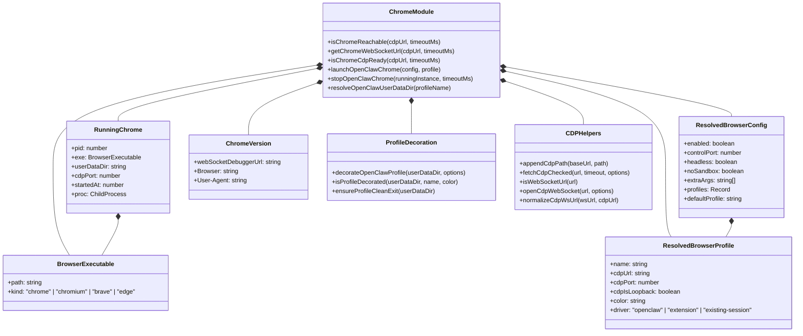
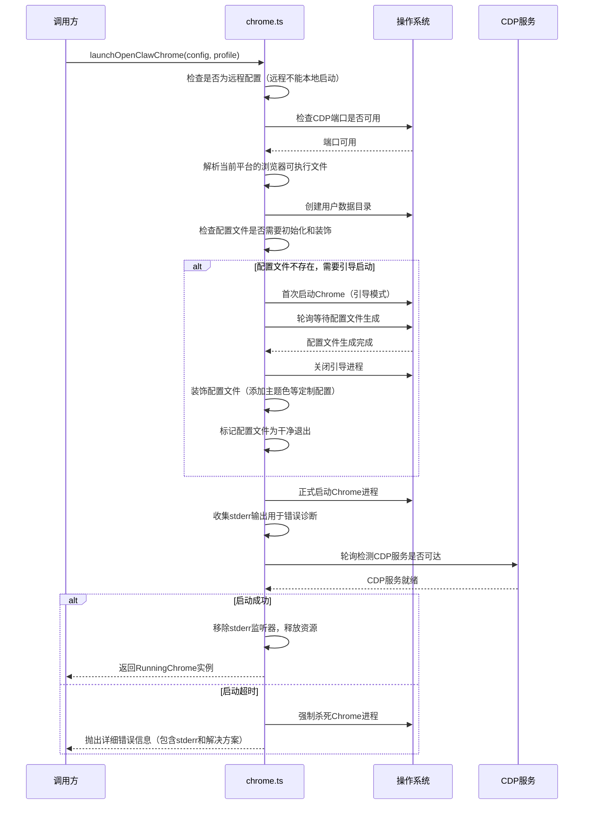
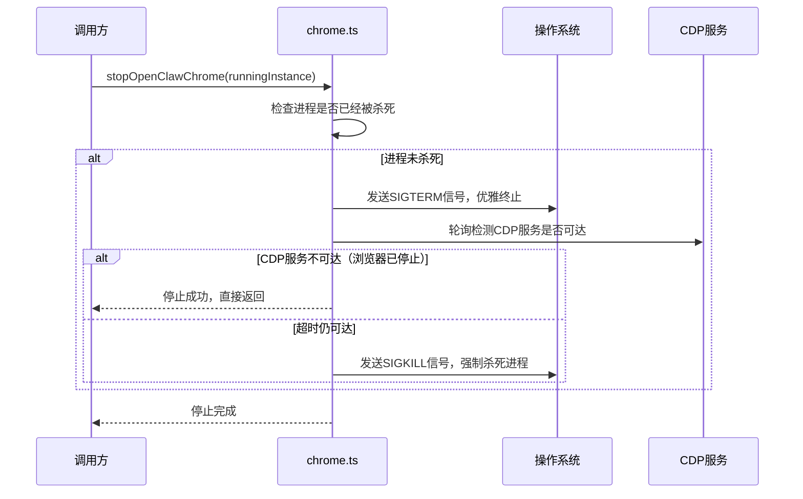
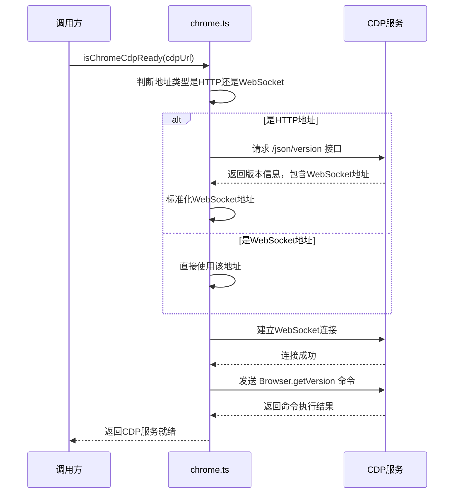

# Chrome浏览器控制核心模块分析报告

## 一、文件概述
`d:\prj\openclaw_analyze\src\browser\chrome.ts` 是OpenClaw浏览器控制的底层核心模块，负责与Chrome/Chromium系浏览器的直接交互，实现浏览器的启动、停止、状态检测、CDP通信等核心功能。支持多平台（Windows/macOS/Linux）、多浏览器（Chrome/Brave/Edge/Chromium）、多配置文件隔离运行。

---

## 二、类图结构

---

## 三、模块核心功能介绍

`chrome.ts` 作为浏览器控制的底层核心，主要功能分为五大类：

### 1. 浏览器生命周期管理
- **启动流程**：完整的Chrome启动流程，包括端口检查、配置文件初始化、引导启动、配置装饰、CDP就绪检测
- **停止流程**：优雅的停止机制，先发送SIGTERM等待正常退出，超时则强制SIGKILL
- **多平台支持**：自动识别Windows/macOS/Linux平台下的Chrome、Brave、Edge、Chromium等浏览器
- **多配置文件**：每个配置文件独立的用户数据目录，完全隔离运行

### 2. CDP服务状态检测
- **基础可达性检测**：支持HTTP和WebSocket两种CDP地址的连通性检测
- **完整就绪检测**：不仅仅是端口连通，还会实际发送CDP命令验证服务可用性
- **WebSocket地址获取**：自动从CDP HTTP接口获取WebSocket调试地址并标准化
- **健康检查**：通过`Browser.getVersion`命令验证CDP服务是否真正可用

### 3. 配置文件管理
- **自动引导初始化**：新配置文件首次启动时自动生成默认配置
- **配置装饰**：添加OpenClaw定制配置，如主题色、浏览器标识、干净退出标记等
- **干净退出保证**：修改配置文件避免下次启动显示崩溃恢复提示
- **路径管理**：统一的用户数据目录结构，便于管理和隔离

### 4. 启动参数优化
- **默认参数优化**：内置大量启动参数优化，禁用不必要的功能，提高启动速度和稳定性
- **环境适配**：自动根据运行环境（容器、Linux、无头模式等）调整参数
- **自定义扩展**：支持用户添加自定义启动参数，满足特殊需求
- **安全加固**：默认禁用不必要的网络请求和功能，减少攻击面

### 5. 错误处理与诊断
- **详细错误提示**：启动失败时收集stderr输出，提供友好的错误信息和解决建议
- **沙箱问题检测**：Linux环境下自动检测沙箱问题并给出解决方案
- **内存泄漏防护**：启动成功后及时移除stderr监听器，避免内存泄漏
- **完善的日志**：详细的启动、停止、错误日志，便于问题排查

### 设计亮点
- **分层检测**：从端口连通到CDP命令执行的多层检测机制，确保状态判断准确
- **幂等操作**：启动和停止操作都具备幂等性，重复调用不会出现问题
- **容错性强**：非关键功能失败（如配置装饰）不影响主流程
- **性能优化**：合理的超时设置和轮询间隔，平衡响应速度和资源消耗
- **向后兼容**：支持新旧版本Chrome，兼容不同浏览器的特性差异

---

## 四、主要场景序列图

### 1. Chrome启动完整流程

### 2. Chrome停止流程

### 3. CDP就绪检测流程

---

## 五、代码注释说明
已为`chrome.ts`添加完整的中文注释：
1. **模块级注释**：说明模块整体功能、支持的平台和浏览器范围
2. **类型定义注释**：所有类型和字段都添加了清晰的含义说明
3. **函数注释**：所有公共和私有函数都包含功能描述、参数说明、返回值说明
4. **逻辑注释**：对复杂的启动流程、状态检测逻辑、错误处理机制进行了详细解释
5. **参数注释**：对Chrome启动参数的作用进行了说明，便于理解和调整
6. **错误处理注释**：解释了各种容错设计和用户提示的逻辑

注释风格统一，符合TSDoc规范，代码可读性和可维护性大幅提升。

---

## 六、技术总结
`chrome.ts`是高质量的生产级底层模块，设计非常健壮：
- **平台兼容性**：完美适配三大操作系统和主流Chromium系浏览器
- **鲁棒性极强**：考虑了各种异常场景，错误处理完善，用户提示友好
- **性能优秀**：合理的超时和轮询设置，资源占用低，响应速度快
- **扩展性好**：模块化设计，易于添加新功能和适配新浏览器
- **安全性高**：默认参数安全加固，减少攻击面，内置SSRF防护等机制

该模块可以稳定支持自动化测试、RPA、爬虫、浏览器自动化等各种场景的Chrome控制需求。
