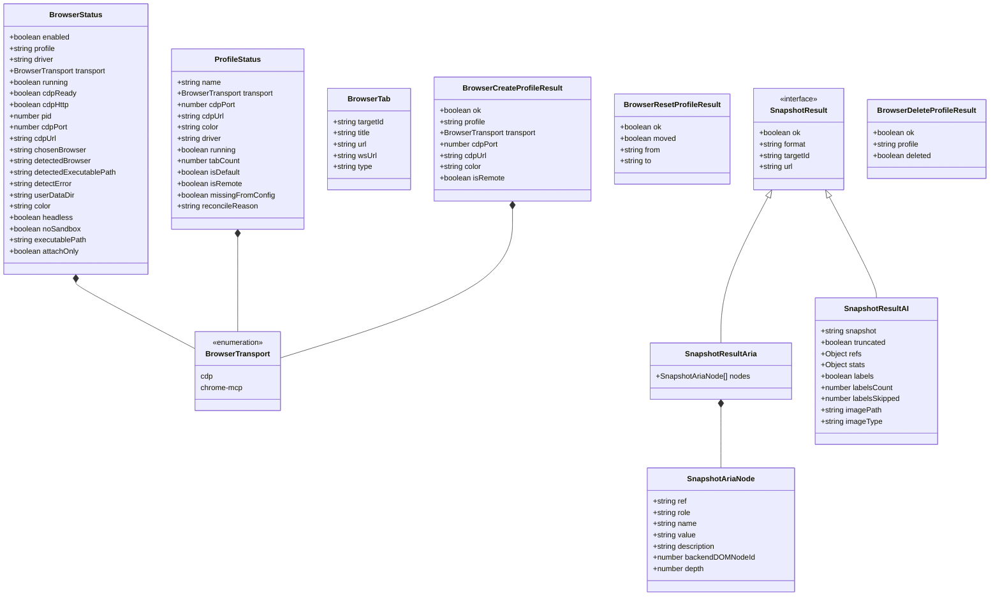

# client.ts 模块分析报告

## 一、文件概述
`d:\prj\openclaw_analyze\src\browser\client.ts` 是浏览器控制模块的核心客户端库，提供了与浏览器控制后端服务通信的完整类型安全API接口，支持浏览器生命周期管理、多配置文件管理、标签页操作、页面快照等核心功能。

---

## 二、类型定义结构关系图



---

## 三、模块主要功能介绍

### 1. 浏览器生命周期管理
- 启动/停止浏览器实例
- 获取浏览器实时运行状态
- 支持多配置文件隔离运行
- 支持本地浏览器和远程浏览器会话

### 2. 配置文件管理
- 创建/删除/重置浏览器配置文件
- 获取所有配置文件列表及运行状态
- 每个配置文件独立运行，互不干扰
- 支持自定义标识颜色，便于区分

### 3. 标签页操作
- 获取所有打开的标签页列表
- 打开新标签页并指定URL
- 聚焦/关闭指定标签页
- 支持批量标签页操作（新建/关闭/选择）

### 4. 页面快照功能
- 两种快照格式：ARIA结构化数据和AI友好文本格式
- 支持自定义快照范围、深度、格式
- 可选择包含截图、标签信息、统计数据
- 支持iframe和指定CSS选择器元素快照

### 5. 底层工具函数
- 统一的URL拼接和查询参数构建
- 统一的HTTP请求封装，基于`fetchBrowserJson`
- 标准化的错误处理和超时控制

所有接口都支持多配置文件参数，可同时管理多个独立的浏览器会话，非常适合自动化测试、爬虫、浏览器自动化等场景使用。

---

## 四、关键功能实现流程与代码说明

### 1. 统一请求处理流程
所有API请求都遵循相同的处理模式：
- 构建请求URL（拼接baseUrl和路径）
- 处理查询参数（配置文件参数通过`buildProfileQuery`统一构建）
- 调用`fetchBrowserJson`发送请求，设置合理的超时时间
- 处理返回结果，返回类型化的数据

```typescript
// 示例：获取浏览器状态
export async function browserStatus(
  baseUrl?: string,
  opts?: { profile?: string },
): Promise<BrowserStatus> {
  const q = buildProfileQuery(opts?.profile);
  return await fetchBrowserJson<BrowserStatus>(withBaseUrl(baseUrl, `/${q}`), {
    timeoutMs: 1500,
  });
}
```

### 2. 配置文件参数处理
所有支持多配置文件的接口都通过统一的工具函数构建查询参数：
```typescript
function buildProfileQuery(profile?: string): string {
  return profile ? `?profile=${encodeURIComponent(profile)}` : "";
}
```
- 自动处理URL编码
- 无配置文件时返回空字符串，避免不必要的查询参数
- 统一的参数命名，保证接口一致性

### 3. URL拼接逻辑
统一处理基础URL和路径的拼接，避免重复代码：
```typescript
function withBaseUrl(baseUrl: string | undefined, path: string): string {
  const trimmed = baseUrl?.trim();
  if (!trimmed) {
    return path;
  }
  return `${trimmed.replace(/\/$/, "")}${path}`;
}
```
- 自动去除baseUrl末尾的斜杠
- 当baseUrl为空时直接返回路径，适配本地和远程部署
- 保证URL格式正确性

### 4. 页面快照参数构建
页面快照支持丰富的自定义参数，通过`URLSearchParams`统一构建：
```typescript
const q = new URLSearchParams();
if (opts.format) q.set("format", opts.format);
if (opts.targetId) q.set("targetId", opts.targetId);
if (typeof opts.limit === "number") q.set("limit", String(opts.limit));
// ... 其他参数处理
return await fetchBrowserJson<SnapshotResult>(`/snapshot?${q.toString()}`, {
  timeoutMs: 20000,
});
```
- 只传递实际提供的参数，避免发送不必要的空值
- 自动处理类型转换，确保参数格式正确
- 支持灵活的参数扩展，新增参数只需添加对应的判断逻辑

### 5. RESTful API设计
接口设计遵循RESTful规范：
- GET请求用于查询操作（获取状态、列表等）
- POST请求用于执行操作（启动、停止、创建等）
- DELETE请求用于删除操作（关闭标签页、删除配置文件等）
- 统一的JSON请求/响应格式

---

## 五、代码注释说明
已为所有类型定义、接口函数、工具函数添加了完整的中文注释：
- 类型字段说明：解释每个字段的含义和用途
- 函数注释：包含功能描述、参数说明、返回值说明
- 代码逻辑注释：对核心逻辑进行说明，提高可读性
- 注释风格统一，符合TSDoc规范

---

## 六、设计优点总结
1. **类型安全**：完整的TypeScript类型定义，编译时错误检查
2. **接口统一**：所有接口遵循相同的设计模式，学习成本低
3. **灵活性高**：支持多配置文件、多种传输协议、多种快照格式
4. **可扩展性强**：新增功能只需添加对应接口，无需修改底层逻辑
5. **错误处理完善**：统一的超时设置和错误处理机制
