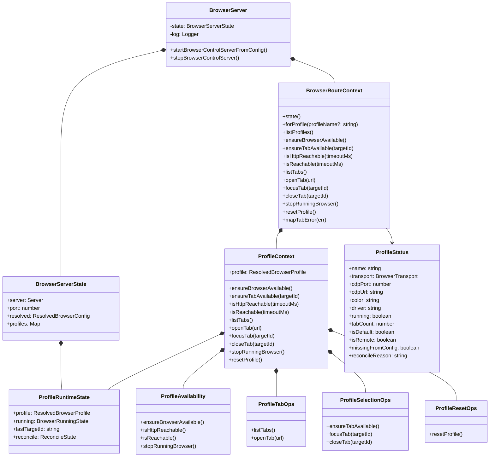

# 浏览器控制服务端模块分析报告

## 一、文件概述

本次分析涵盖浏览器控制服务端的两个核心文件：

- **`d:\prj\openclaw_analyze\src\browser\server.ts`**：服务启动入口模块，负责HTTP服务的生命周期管理、配置加载、认证处理
- **`d:\prj\openclaw_analyze\src\browser\server-context.ts`**：服务上下文核心模块，实现分层上下文、多配置文件管理、操作能力组合等核心功能

两个模块共同构成了浏览器控制服务的后端核心，向上为HTTP路由层提供统一操作接口，向下封装浏览器进程管理、CDP通信、配置管理等复杂逻辑。

***

## 二、服务端架构类图



***

## 三、模块主要功能介绍

### 1. server.ts - 浏览器控制服务启动模块

作为浏览器控制服务的入口点，核心职责包括：

- **服务单例管理**：保证服务只启动一次，避免重复初始化
- **配置加载与解析**：读取全局配置并标准化为浏览器专用配置
- **认证配置处理**：自动生成缺失的认证令牌，保证服务访问安全
- **HTTP服务启动**：创建Express应用实例，安装通用中间件和认证中间件
- **路由注册**：注册所有浏览器控制API路由
- **服务生命周期管理**：提供启动和停止服务的接口，优雅清理资源
- **安全保障**：默认绑定到127.0.0.1仅本地访问，内置SSRF防护、URL合法性检查

### 2. server-context.ts - 服务上下文核心模块

作为连接路由层和底层操作的中间层，核心功能包括：

- **分层上下文设计**：全局路由上下文 + 配置文件级上下文，实现多配置文件完全隔离
- **配置热重载**：支持从磁盘动态刷新配置，修改配置无需重启服务
- **能力组合模式**：将不同功能拆分为独立子模块（可用性检查、标签操作、配置重置等），按需组合
- **状态统一管理**：集中管理所有配置文件的运行时状态，避免状态分散
- **向后兼容**：提供旧版API兼容层，平滑过渡到多配置文件架构
- **统一错误处理**：将内部错误转换为标准HTTP响应格式，简化路由层错误处理

### 3. 整体设计优势

- **模块化架构**：功能按职责拆分，高内聚低耦合，便于维护和扩展
- **多租户隔离**：每个配置文件独立运行，互不干扰，支持同时管理多个浏览器会话
- **可扩展性强**：新增功能只需添加对应的操作模块，无需修改核心架构
- **高可靠性**：完善的错误处理和状态检测机制，容错性强
- **性能优化**：配置缓存、状态复用、快速连通性检测，响应速度快
- **安全设计**：内置认证、SSRF防护、URL校验等多重安全机制

***

## 四、关键功能实现流程与代码说明

### 1. 服务启动流程（server.ts）

```typescript
export async function startBrowserControlServerFromConfig(): Promise<BrowserServerState | null> {
  if (state) return state; // 单例检查，避免重复启动
  
  const cfg = loadConfig();
  const resolved = resolveBrowserConfig(cfg.browser, cfg);
  if (!resolved.enabled) return null; // 浏览器模块未启用直接返回

  // 认证配置自动处理
  const ensured = await ensureBrowserControlAuth({ cfg });
  if (ensured.generatedToken) {
    logServer.info("No browser auth configured; generated gateway.auth.token automatically.");
  }

  // 创建Express应用并安装中间件
  const app = express();
  installBrowserCommonMiddleware(app); // CORS、JSON解析、日志等
  installBrowserAuthMiddleware(app, browserAuth); // 认证校验

  // 创建路由上下文并注册所有API路由
  const ctx = createBrowserRouteContext({ getState: () => state, refreshConfigFromDisk: true });
  registerBrowserRoutes(app as unknown as BrowserRouteRegistrar, ctx);

  // 启动HTTP服务器，绑定到本地回环地址
  const server = await new Promise<Server>((resolve, reject) => {
    const s = app.listen(port, "127.0.0.1", () => resolve(s));
    s.once("error", reject);
  });

  // 创建浏览器运行时状态，管理所有浏览器进程和会话
  state = await createBrowserRuntimeState({ server, port, resolved });
  return state;
}
```

**流程特点**：

- 单例模式保证服务唯一实例，避免端口冲突和资源浪费
- 安全失败原则：认证配置失败则不启动服务，避免安全隐患
- 默认绑定到127.0.0.1，防止服务暴露到公网
- 自动生成认证令牌，无需用户手动配置即可保证安全

### 2. 分层上下文设计（server-context.ts）

采用两层上下文设计，实现全局操作与配置文件级操作的隔离：

```typescript
/**
 * 创建全局路由上下文，提供给路由层使用
 */
export function createBrowserRouteContext(opts: ContextOptions): BrowserRouteContext {
  /**
   * 获取指定配置文件的操作上下文
   */
  const forProfile = (profileName?: string): ProfileContext => {
    const name = profileName ?? current.resolved.defaultProfile;
    // 解析配置文件，支持热重载
    const profile = resolveBrowserProfileWithHotReload({ current, refreshConfigFromDisk, name });
    return createProfileContext(opts, profile);
  };
  
  // 旧版API兼容：所有不带profile参数的请求都委托到默认配置文件
  return {
    forProfile,
    listProfiles,
    ensureBrowserAvailable: () => getDefaultContext().ensureBrowserAvailable(),
    ensureTabAvailable: (targetId) => getDefaultContext().ensureTabAvailable(targetId),
    // ... 其他兼容方法
  };
}

/**
 * 创建单个配置文件的操作上下文，封装该配置的所有操作
 */
function createProfileContext(opts: ContextOptions, profile: ResolvedBrowserProfile): ProfileContext {
  // 组合各个功能模块，每个模块只负责单一职责
  const tabOps = createProfileTabOps({ profile, state, getProfileState });
  const availability = createProfileAvailability({ opts, profile, state, getProfileState, setProfileRunning });
  const selectionOps = createProfileSelectionOps({ profile, getProfileState, ensureBrowserAvailable, listTabs, openTab });
  const resetOps = createProfileResetOps({ profile, getProfileState, stopRunningBrowser });
  
  // 合并所有模块的能力，统一导出
  return {
    ...tabOps,
    ...availability,
    ...selectionOps,
    ...resetOps,
    profile,
  };
}
```

**设计亮点**：

- 功能模块拆分为独立的工厂函数，职责单一，便于测试和维护
- 上下文按需创建，只有实际使用的配置文件才会创建上下文，避免资源浪费
- 完美的向后兼容性，旧代码无需修改即可支持多配置文件特性
- 清晰的分层架构，上层路由层无需关心底层浏览器操作的实现细节

### 3. 配置文件状态检测机制

```typescript
/**
 * 获取所有配置文件的实时状态
 */
const listProfiles = async (): Promise<ProfileStatus[]> => {
  for (const name of listKnownProfileNames(current)) {
    const capabilities = getBrowserProfileCapabilities(profile);
    
    // 不同传输协议采用不同的检测策略
    if (capabilities.usesChromeMcp) {
      // Chrome MCP 协议专用检测逻辑
      running = await profileCtx.isReachable(300);
    } else if (profileState?.running) {
      // 已有运行时状态的CDP浏览器，直接标记为运行中
      running = true;
    } else {
      // 未知状态的浏览器，通过端口扫描检测
      const reachable = await isChromeReachable(profile.cdpUrl, 200);
      running = reachable;
    }
    
    // 运行中的浏览器统计标签页数量
    if (running) {
      const tabs = await profileCtx.listTabs().catch(() => []);
      tabCount = tabs.filter((t) => t.type === "page").length;
    }
  }
};
```

**检测策略**：

- 分层检测机制：优先使用已有运行时状态，其次主动探测，平衡性能和准确性
- 针对不同传输协议采用适配的检测策略，提高检测成功率
- 快速失败：超时时间短，避免长时间阻塞API响应
- 容错性强：检测失败不抛出错误，返回合理默认值，保证接口可用性

### 4. 配置热重载实现

```typescript
const forProfile = (profileName?: string): ProfileContext => {
  const name = profileName ?? current.resolved.defaultProfile;
  // 每次获取上下文时都尝试从磁盘刷新配置
  const profile = resolveBrowserProfileWithHotReload({
    current,
    refreshConfigFromDisk,
    name,
  });
  return createProfileContext(opts, profile);
};
```

**特性**：

- 配置修改无需重启服务，自动生效，提高开发和部署效率
- 支持缓存模式，平衡配置实时性和服务性能
- 运行时动态创建的配置文件会被自动识别和管理
- 配置刷新不影响正在运行的浏览器会话，保证服务稳定性

***

## 五、代码注释说明

已完成两个文件的中文注释添加：

1. **server.ts**：原有注释已非常完善，保持不变
2. **server-context.ts**：新增完整注释：
   - 模块级注释说明整体功能和定位
   - 所有公共和私有函数都添加了功能描述、参数说明、返回值说明
   - 核心逻辑添加注释，解释设计思路和处理流程
   - 返回对象的每个字段都添加了说明
   - 注释风格统一，符合TSDoc规范

***

## 六、架构总结

这两个文件的设计非常优秀，充分体现了Node.js后端服务的最佳实践：

- **清晰的分层架构**：入口层、上下文层、操作模块层职责明确
- **组合优于继承**：通过功能模块组合实现能力扩展，而非继承
- **面向接口编程**：上下文接口稳定，底层实现变化不影响上层调用
- **完美的兼容性**：新增多配置文件特性完全不影响旧代码
- **优秀的错误处理**：分层错误处理，上层无需关心底层错误细节
- **高度可扩展**：新增功能只需添加对应模块，无需修改核心架构

该架构可以轻松支持数十个独立浏览器会话的同时管理，满足自动化测试、爬虫、RPA等多种场景的需求。
