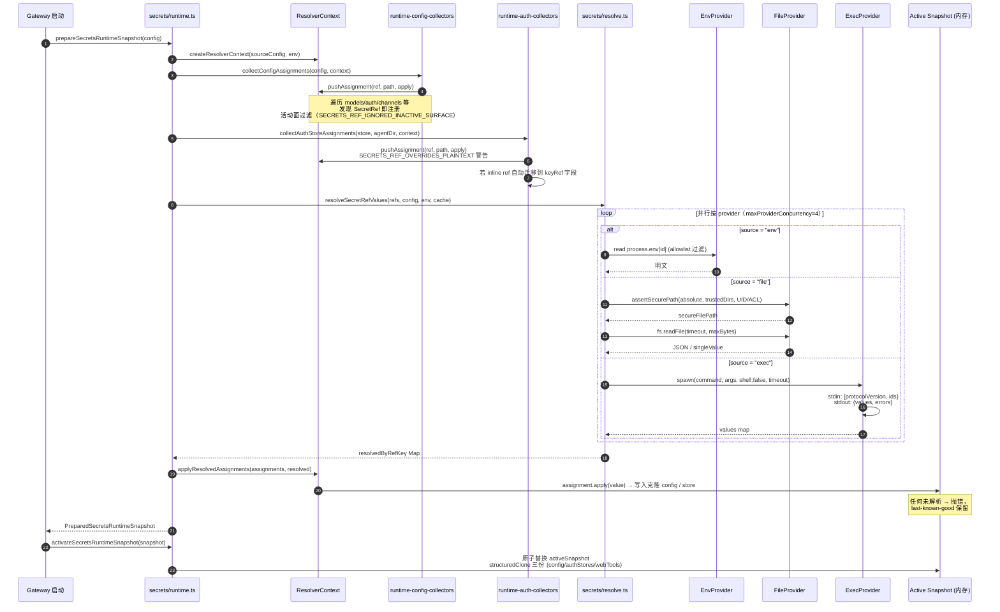
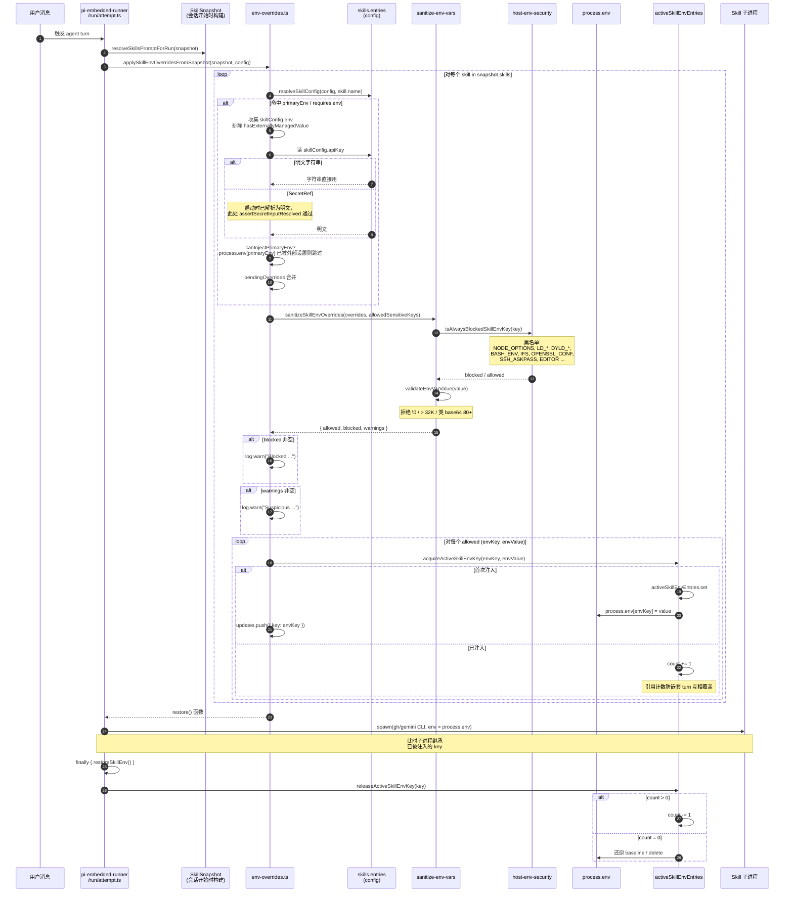
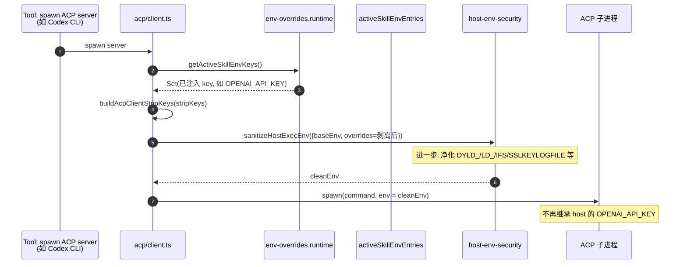

# OpenClaw Skill 凭证获取序列图

## 概述

本文梳理当用户消息触发一个 agent turn、执行某个 skill 时，OpenClaw **如何把 SecretRef/明文凭证解析出来并注入到 `process.env`**，使得子进程（如 `gh`、`gemini` CLI）能够读取到正确的 `OPENAI_API_KEY` 之类的环境变量。

整个流程分两个**正交但相互衔接**的阶段：

1. **启动阶段（启动时一次性）**：secrets runtime snapshot 把所有 SecretRef 解析为**明文**，克隆到内存快照
2. **运行阶段（每个 agent turn）**：从快照/配置读取 `apiKey`/`env` → 经四道闸门 → 注入 `process.env` → 子进程读取

涉及的源码：

- [src/secrets/runtime.ts](file:///d:/prj/openclaw_analyze/src/secrets/runtime.ts) — 启动时快照
- [src/secrets/resolve.ts](file:///d:/prj/openclaw_analyze/src/secrets/resolve.ts) — 三种 Provider 解析
- [src/secrets/runtime-auth-collectors.ts](file:///d:/prj/openclaw_analyze/src/secrets/runtime-auth-collectors.ts) — auth-profiles 凭证收集
- [src/agents/skills/env-overrides.ts](file:///d:/prj/openclaw_analyze/src/agents/skills/env-overrides.ts) — skill env 注入核心
- [src/agents/skills/workspace.ts](file:///d:/prj/openclaw_analyze/src/agents/skills/workspace.ts) — skill 快照构建
- [src/agents/pi-embedded-runner/run/attempt.ts](file:///d:/prj/openclaw_analyze/src/agents/pi-embedded-runner/run/attempt.ts) — 注入/恢复现场
- [src/acp/client.ts](file:///d:/prj/openclaw_analyze/src/acp/client.ts) — 子进程 spawn 时剥离已注入 key

---

## 一、调用链总览

```
Gateway 启动
  └─ prepareSecretsRuntimeSnapshot
       ├─ collectConfigAssignments  (走 core + channels 收集器)
       │    └─ coerceSecretRef → pushAssignment
       ├─ collectAuthStoreAssignments  (auth-profiles.json)
       │    └─ resolveSecretInputRef → pushAssignment
       └─ resolveSecretRefValues  (批量)
            ├─ env provider   →  process.env
            ├─ file provider  →  assertSecurePath + fs.readFile
            └─ exec provider  →  spawn(command, shell:false)
       → applyResolvedAssignments
       → activateSecretsRuntimeSnapshot (原子 swap)

Agent turn 开始 (pi-embedded-runner/attempt.ts)
  └─ applySkillEnvOverridesFromSnapshot
       └─ 对每个 skill:
            ├─ resolveSkillConfig(skills.entries.<key>)
            ├─ 收集 skillConfig.env
            ├─ 读取 skillConfig.apiKey
            │    ├─ 明文字符串 → 直接用
            │    └─ SecretRef   → 已在启动时解析为明文
            ├─ sanitizeSkillEnvOverrides (4 道闸门)
            └─ acquireActiveSkillEnvKey → process.env[key] = value
  → restoreSkillEnv 在 finally 中恢复

Skill 子进程 spawn
  └─ ACP harness: getActiveSkillEnvKeys() → 剥离
  └─ exec tool: sanitizeHostExecEnv → 净化 env
```

---

## 二、序列图（启动阶段：SecretRef → 内存快照）



---

## 三、序列图（运行阶段：Skill env 注入到 process.env）



---

## 四、序列图（子进程隔离：ACP harness 剥离注入 key）



---

## 五、关键安全不变量

1. **不在热路径解析** — `secrets.resolve` 只在启动 / `secrets reload` 时调用；agent turn 中 `process.env` 已是明文
2. **类型校验先行** — SecretRef 形态在 [types.secrets.ts](file:///d:/prj/openclaw_analyze/src/config/types.secrets.ts) 入口处严格校验 (provider alias、id 模式、禁 `..`)
3. **活动面过滤** — 关闭的频道/工具即使 ref 解析失败也不阻塞启动
4. **原子快照** — 解析全成功才 swap，失败保留 last-known-good
5. **白名单 only** — skill env 注入必须 `primaryEnv` / `requires.env` 显式声明才允许
6. **黑名单兜底** — `host-env-security-policy.json` + `sanitize-env-vars.ts` 强制阻断危险 key
7. **不覆盖外部值** — `process.env[key]` 已被外部设置时绝不覆盖
8. **引用计数恢复** — 嵌套 turn 不会互相污染，`finally` 中回退到 baseline
9. **子进程剥离** — 派生外部 CLI 前 `getActiveSkillEnvKeys()` 显式移除已注入 key
10. **审计闭环** — `secrets audit` 在静态配置上扫描 plaintext/unresolved/shadowed

---

## 六、典型调用栈（单次 turn 注入 `GEMINI_API_KEY`）

```
attempt.ts:runPiAgent
└─ buildWorkspaceSkillSnapshot                  // 缓存层（可选）
└─ resolveSkillsPromptForRun                    // 构造 LLM 提示中的 skill 列表
└─ applySkillEnvOverridesFromSnapshot
   └─ for skill.name = "gemini"
      ├─ resolveSkillConfig(config, "gemini")
      │    └─ config.skills.entries.gemini
      │         ├─ env.GEMINI_API_KEY: SecretRef{env, default, GEMINI_API_KEY}
      │         └─ apiKey: SecretRef{env, default, GEMINI_API_KEY}
      ├─ pendingOverrides["GEMINI_API_KEY"] = 明文   // 来自启动快照
      ├─ sanitizeSkillEnvOverrides
      │    ├─ isAlwaysBlockedSkillEnvKey → false
      │    ├─ allowedSensitiveKeys 包含 "GEMINI_API_KEY"（来自 requires.env）
      │    └─ validateEnvVarValue → 无警告
      └─ process.env["GEMINI_API_KEY"] = 明文
└─ spawn("gemini", args, env=process.env)
   └─ gemini CLI 直接读 process.env["GEMINI_API_KEY"]
```
