# OpenClaw 任务成功率保障体系分析

## 总览

OpenClaw 系统为保障任务完成成功率，构建了 **四层纵深防御体系**，涵盖 **8 大类、17 项具体保障机制**。从模型选择、命令执行、上下文管理到进程生命周期，每一层都有独立的容错和恢复能力，确保即使在单个组件故障的情况下，整个任务仍能继续推进或优雅降级。

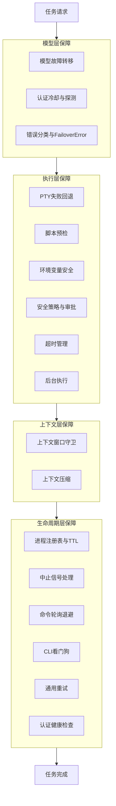

---

## 一、模型层保障

### 1.1 模型故障转移 (Model Fallback)

**场景**：主模型因限流 (429)、过载 (503)、计费错误 (402)、认证失败 (401/403)、超时等原因不可用时，自动切换到备用模型继续完成任务。

**涉及类/文件**：
- `src/agents/model-fallback.ts` — 核心故障转移逻辑
- `src/agents/failover-error.ts` — FailoverError 错误类型
- `src/agents/model-fallback.types.ts` — 类型定义
- `src/agents/pi-embedded-helpers/errors.ts` — 错误分类

**流程**：

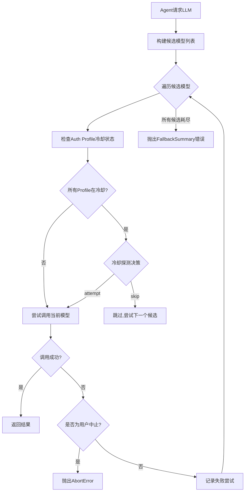

**核心代码** (`model-fallback.ts` - `runWithModelFallback`)：

```typescript
export async function runWithModelFallback<T>(params: {
  cfg: OpenClawConfig | undefined;
  provider: string;
  model: string;
  runId?: string;
  agentDir?: string;
  fallbacksOverride?: string[];
  run: ModelFallbackRunFn<T>;
  onError?: ModelFallbackErrorHandler;
}): Promise<ModelFallbackRunResult<T>> {
  const candidates = resolveFallbackCandidates({...});
  const authStore = params.cfg ? ensureAuthProfileStore(...) : null;
  const attempts: FallbackAttempt[] = [];

  for (let i = 0; i < candidates.length; i += 1) {
    const candidate = candidates[i];
    // 检查冷却状态...
    // 尝试调用...
    const attemptRun = await runFallbackAttempt({...});
    if ("success" in attemptRun) {
      return attemptRun.success;  // 成功则立即返回
    }
    // 失败则继续下一个候选
  }
  throwFallbackFailureSummary({...});  // 所有候选都失败
}
```

**候选模型列表构建逻辑** (`resolveFallbackCandidates`)：

1. 将配置的主模型加入候选列表
2. 从 `agents.defaults.model.fallbacks` 配置中读取备用模型列表
3. 当用户运行与配置不同的 provider 时，仅在使用配置链中的模型时才使用配置的 fallbacks
4. 候选模型按优先级排列，主模型优先尝试

**FailoverError 分类** (`failover-error.ts`)：

| FailoverReason | HTTP Status | 说明 |
|---|---|---|
| `billing` | 402 | 计费错误，余额不足 |
| `rate_limit` | 429 | API 限流 |
| `overloaded` | 503 | 服务过载 |
| `auth` | 401 | 认证失败（临时） |
| `auth_permanent` | 403 | 认证失败（永久） |
| `timeout` | 408 | 请求超时 |
| `format` | 400 | 请求格式错误 |
| `model_not_found` | 404 | 模型不存在 |
| `session_expired` | 410 | 会话过期 |

**中止错误区分** (`isFallbackAbortError`)：

仅将 `name === "AbortError"` 的错误视为用户主动中止，避免基于消息内容的检测（如 "aborted"）误将超时错误归类为用户中止而跳过故障转移。

---

### 1.2 认证冷却与探测 (Auth Profile Cooldown & Probe)

**场景**：某个 API 密钥因限流或认证错误被标记为冷却状态后，系统不会永远放弃它，而是定期探测是否恢复，在恢复后重新使用，避免因临时故障永久失去该密钥。

**涉及文件**：
- `src/agents/auth-profiles.ts` — 导出汇总
- `src/agents/auth-profiles/usage.ts` — 冷却计算与标记
- `src/agents/auth-profiles/order.ts` — Profile 排序
- `src/agents/auth-profiles/credential-state.ts` — 凭证状态评估

**流程**：

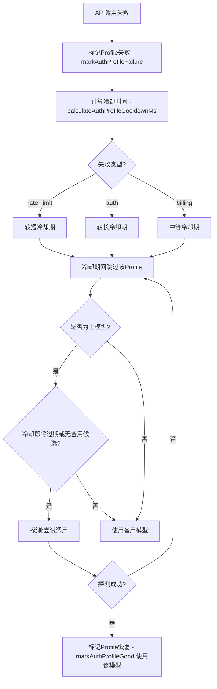

**核心逻辑** (`model-fallback.ts` - `resolveCooldownDecision`)：

```typescript
function resolveCooldownDecision(params: {...}): CooldownDecision {
  // 持久性认证问题 → 直接跳过
  if (isPersistentAuthIssue) {
    return { type: "skip", reason: inferredReason, error: "..." };
  }
  // 计费问题 → 仅在无备用候选或冷却即将过期时探测
  if (inferredReason === "billing") {
    const shouldProbeSingleProviderBilling =
      params.isPrimary && !params.hasFallbackCandidates && isProbeThrottleOpen(...);
    if (params.isPrimary && (shouldProbe || shouldProbeSingleProviderBilling)) {
      return { type: "attempt", reason: inferredReason, markProbe: true };
    }
    return { type: "skip", ... };
  }
  // 临时问题(限流/过载) → 允许同provider的fallback模型尝试
  const shouldAttemptDespiteCooldown =
    (params.isPrimary && (!params.requestedModel || shouldProbe)) ||
    (!params.isPrimary && (inferredReason === "rate_limit" || inferredReason === "overloaded"));
  ...
}
```

**探测节流机制**：

- `MIN_PROBE_INTERVAL_MS = 30_000`：每 30 秒最多探测一次同一 provider
- `PROBE_MARGIN_MS = 2 * 60 * 1000`：在冷却过期前 2 分钟开始探测
- `PROBE_STATE_TTL_MS = 24h`：探测状态记录 24 小时后自动清理
- `MAX_PROBE_KEYS = 256`：最多跟踪 256 个 provider 的探测状态
- 同一 provider 在一次 fallback 循环中最多探测一次，避免跨 provider fallback 被阻塞

---

### 1.3 错误分类与观测 (Error Classification & Observation)

**场景**：LLM API 返回的错误消息格式各异，需要统一分类为具体的 FailoverReason，才能决定是否触发故障转移、如何冷却等。同时错误信息需要脱敏后记录观测日志，用于运维排查。

**涉及文件**：
- `src/agents/pi-embedded-helpers/errors.ts` — 错误分类函数
- `src/agents/pi-embedded-helpers/failover-matches.ts` — 错误模式匹配
- `src/agents/pi-embedded-error-observation.ts` — 错误观测记录

**核心分类函数** (`pi-embedded-helpers/errors.ts`)：

```typescript
export function classifyFailoverReason(raw: string): FailoverReason | null {
  if (isBillingErrorMessage(raw))     return "billing";
  if (isRateLimitErrorMessage(raw))   return "rate_limit";
  if (isOverloadedErrorMessage(raw))  return "overloaded";
  if (isAuthPermanentErrorMessage(raw)) return "auth_permanent";
  if (isAuthErrorMessage(raw))        return "auth";
  if (isTimeoutErrorMessage(raw))     return "timeout";
  if (isContextOverflowError(raw))    return "context_overflow";
  if (isModelNotFoundErrorMessage(raw)) return "model_not_found";
  return null;
}
```

**错误模式匹配** (`pi-embedded-helpers/failover-matches.ts`)：

通过正则表达式匹配各 provider 的错误消息特征：
- `isRateLimitErrorMessage`：匹配 "rate limit"、"too many requests"、"429" 等
- `isBillingErrorMessage`：匹配 "billing"、"quota"、"insufficient" 等
- `isOverloadedErrorMessage`：匹配 "overloaded"、"capacity"、"503" 等
- `isAuthErrorMessage`：匹配 "unauthorized"、"invalid api key"、"401" 等
- `isTimeoutErrorMessage`：匹配 "timeout"、"timed out"、"aborted" 等
- `isContextOverflowError`：匹配 "context length exceeded"、"prompt is too long" 等

**观测脱敏** (`pi-embedded-error-observation.ts`)：

在记录错误观测时，自动执行以下脱敏操作：
- 移除 API Key、Cookie 等敏感信息（使用 `redactSensitiveText`）
- 截断过长错误消息（`RAW_ERROR_PREVIEW_MAX_CHARS = 400`）
- 替换 Request ID 为脱敏版本（`redactIdentifier`）
- 移除控制字符并格式化输出（`sanitizeForConsole`）
- 额外脱敏模式覆盖 `x-api-key`、JSON 中的 `api_key`、Cookie 值等

**错误指纹** (`getApiErrorPayloadFingerprint`)：

对错误信息计算稳定指纹（基于内容的哈希），用于去重和趋势分析，避免同一错误重复记录。

---

## 二、执行层保障

### 2.1 PTY 失败回退 (PTY Fallback)

**场景**：Agent 请求使用 PTY（伪终端）模式执行命令（如 vim、top 等需要 TTY 的程序），但系统缺少 node-pty 原生模块或操作系统不支持 PTY 时，自动回退到普通子进程模式。

**涉及文件**：
- `src/agents/bash-tools.exec-runtime.ts` (L629-676) — PTY spawn 与回退逻辑
- `src/agents/pty-dsr.ts` — DSR (Device Status Report) 请求处理

**流程**：

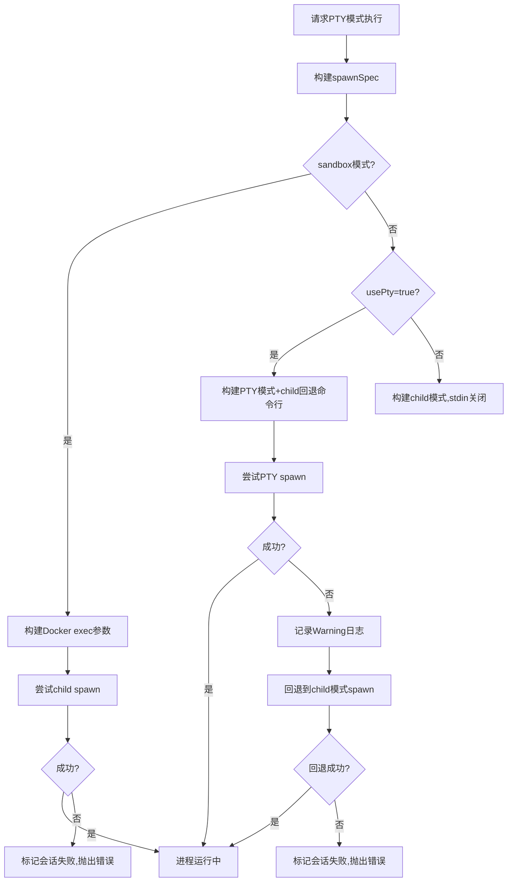

**核心代码** (`bash-tools.exec-runtime.ts`)：

```typescript
} catch (err) {
  if (spawnSpec.mode === "pty") {
    const warning = `Warning: PTY spawn failed (${String(err)}); retrying without PTY...`;
    opts.warnings.push(warning);
    usingPty = false;
    try {
      managedRun = await supervisor.spawn({
        mode: "child",
        argv: spawnSpec.childFallbackArgv,  // 使用预置的回退命令行
        stdinMode: "pipe-open",
        ...
      });
    } catch (retryErr) {
      markExited(session, null, null, "failed");
      maybeNotifyOnExit(session, "failed");
      throw retryErr;
    }
  } else {
    markExited(session, null, null, "failed");
    maybeNotifyOnExit(session, "failed");
    throw err;
  }
}
```

**关键设计**：

1. PTY 模式的 spawnSpec 在构建时就预置了 `childFallbackArgv`，确保回退时无需重新构建命令行
2. 回退后将 `usingPty` 标记为 `false`，后续的 DSR 处理逻辑会自动跳过
3. 回退失败时正确标记会话状态并通知上层

**DSR 请求处理** (`pty-dsr.ts`)：

PTY 模式下，TUI 程序（如 vim、less）会向 stdout 写入 `ESC[6n` 询问光标位置。如果不回复，程序会卡死等待。系统检测 DSR 请求后用预制的"假光标位置"回写到 stdin，让程序继续运行：

```typescript
const onSupervisorStdout = (chunk: string) => {
  if (usingPty) {
    const { cleaned, requests } = stripDsrRequests(chunk);
    if (requests > 0 && managedRun?.stdin) {
      for (let i = 0; i < requests; i += 1) {
        managedRun.stdin.write(cursorResponse);
      }
    }
    handleStdout(cleaned);
    return;
  }
  handleStdout(chunk);
};
```

---

### 2.2 脚本预检 (Script Preflight Validation)

**场景**：LLM 生成的命令有时会将 Shell 语法（如 `$USER`）误写入 Python/JS 脚本文件中。这在 cron 循环中会反复触发无效执行，浪费大量 tokens。预检在执行前捕获这类常见模型失败模式。

**涉及文件**：
- `src/agents/bash-tools.exec.ts` (L49-184) — `validateScriptFileForShellBleed`
- `src/agents/sandbox-paths.ts` — 路径安全断言

**流程**：

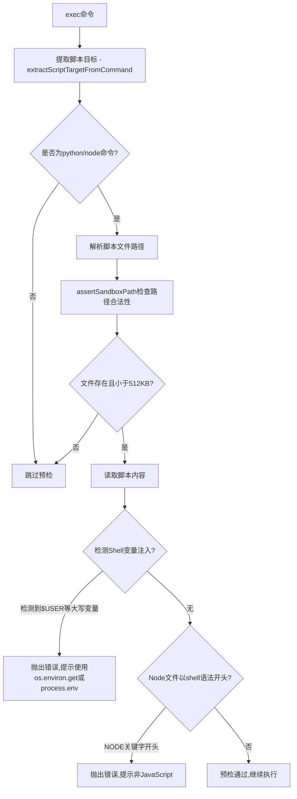

**核心检测逻辑** (`bash-tools.exec.ts`)：

```typescript
async function validateScriptFileForShellBleed(params: {
  command: string;
  workdir: string;
}): Promise<void> {
  const target = extractScriptTargetFromCommand(params.command);
  if (!target) return;

  const absPath = path.resolve(params.workdir, target.relOrAbsPath);
  // ... assertSandboxPath + stat 检查 ...

  const content = await fs.readFile(absPath, "utf-8");

  // 检测 Shell 环境变量语法泄漏到 Python/JS
  const envVarRegex = /\$[A-Z_][A-Z0-9_]{1,}/g;
  const first = envVarRegex.exec(content);
  if (first) {
    throw new Error(
      `exec preflight: detected likely shell variable injection (${token}) in ${target.kind} script...`
    );
  }

  // 检测 JS 文件以 shell 命令开头
  if (target.kind === "node" && /^NODE\b/.test(firstNonEmpty)) {
    throw new Error(`exec preflight: JS file starts with shell syntax...`);
  }
}
```

**命令解析** (`extractScriptTargetFromCommand`)：

仅支持常见形式，复杂命令跳过预检：
- `python file.py` / `python3 -u file.py`
- `node --experimental-something file.js`

**安全限制**：
- 文件大小上限 512KB，避免读取大文件
- 需先通过 `assertSandboxPath` 验证路径不越界
- Best-effort 原则：任何检查步骤失败都不阻止执行

---

### 2.3 环境变量安全 (Environment Variable Security)

**场景**：在宿主机（gateway/node）上执行命令时，继承的环境变量可能包含危险变量（如 `LD_PRELOAD`），可能导致权限提升或命令劫持。系统在执行前进行清理和验证。

**涉及文件**：
- `src/agents/bash-tools.exec-runtime.ts` (L37-101) — `sanitizeHostBaseEnv` / `validateHostEnv`
- `src/infra/host-env-security.ts` — 危险变量名称检测
- `src/infra/path-prepend.ts` — PATH 前置配置

**流程**：

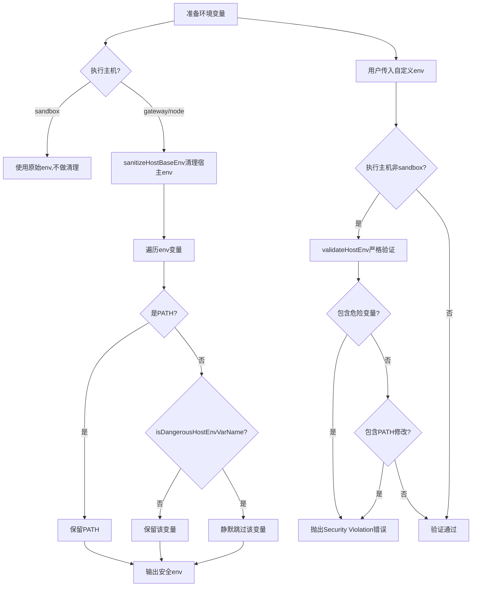

**双重保护机制**：

1. **`sanitizeHostBaseEnv`**：在继承 `process.env` 时**静默过滤**危险变量（如 `LD_PRELOAD`、`DYLD_INSERT_LIBRARIES` 等），PATH 变量特殊处理直接保留
2. **`validateHostEnv`**：在用户传入自定义 env 时**严格拒绝**危险变量和 PATH 修改，抛出 `Security Violation` 错误

**设计原则**：
- Sandbox 环境不做任何环境变量限制（容器内已隔离）
- Host 环境执行前必须先验证再合并，防止危险变量从用户输入进入执行流

---

### 2.4 安全策略与审批 (Security Policy & Approval)

**场景**：Agent 在 gateway 主机上执行命令时，不同命令的危险程度不同。系统通过安全策略 (security) 和审批模式 (ask) 的组合，确保危险命令得到人工审批，同时低风险命令可以自动执行。

**涉及文件**：
- `src/agents/bash-tools.exec-host-gateway.ts` — 网关白名单审批
- `src/agents/bash-tools.exec-approval-request.ts` — 审批请求注册
- `src/agents/bash-tools.exec-host-shared.ts` — 审批共享逻辑
- `src/infra/exec-approvals.ts` — 审批策略定义
- `src/infra/exec-obfuscation-detect.ts` — 命令混淆检测

**策略矩阵**：

| security | ask | 行为 |
|---|---|---|
| `deny` | any | 拒绝所有命令 |
| `allowlist` | `off` | 仅白名单命令自动执行 |
| `allowlist` | `on-miss` | 白名单命令自动执行，非白名单需审批 |
| `allowlist` | `always` | 所有命令都需审批 |
| `full` | `off` | 完全信任，不进行任何检查 |

**配置优先级**：

- `security`：取配置和请求中**更严格**的值 (`minSecurity`)
- `ask`：取配置和请求中**更严格**的值 (`maxAsk`)
- `elevated + full` 模式可以绕过所有安全检查和审批

**审批流程**：

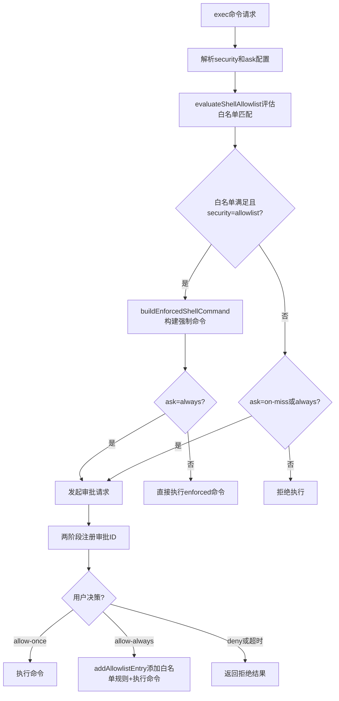

**两阶段审批注册** (`bash-tools.exec-approval-request.ts`)：

审批 ID 必须先在服务端注册，然后 exec 工具才返回 `approval-pending` 状态，避免 `/approve` 命令与审批请求之间的竞态条件：

```typescript
export async function registerExecApprovalRequest(
  params: RequestExecApprovalDecisionParams,
): Promise<ExecApprovalRegistration> {
  // Two-phase registration is critical: the ID must be registered server-side
  // before exec returns approval-pending, otherwise /approve can race and orphan.
  const registrationResult = await callGatewayTool<{...}>(
    "exec.approval.request",
    { timeoutMs: DEFAULT_APPROVAL_REQUEST_TIMEOUT_MS },
    buildExecApprovalRequestToolParams(params),
  );
  ...
}
```

**命令混淆检测** (`exec-obfuscation-detect.ts`)：

在白名单评估时，还会检测命令中的混淆技术（如 base64 编码、变量拼接等），防止绕过白名单。

**审批超时**：
- 审批等待超时：120 秒 (`DEFAULT_APPROVAL_TIMEOUT_MS`)
- 审批注册超时：130 秒 (`DEFAULT_APPROVAL_REQUEST_TIMEOUT_MS`)
- 运行中审批通知间隔：10 秒 (`DEFAULT_APPROVAL_RUNNING_NOTICE_MS`)

---

### 2.5 超时管理 (Timeout Management)

**场景**：长时间运行的命令可能因为程序挂起、死锁等原因永远不退出，占用系统资源。系统提供多层超时控制。

**涉及文件**：
- `src/agents/timeout.ts` — Agent 级超时
- `src/agents/bash-tools.exec.ts` — exec 命令级超时
- `src/agents/cli-runner/reliability.ts` — CLI 看门狗超时
- `src/agents/cli-watchdog-defaults.ts` — 看门狗默认值
- `src/agents/bash-tools.exec-runtime.ts` — 进程级超时执行

**超时层级**：

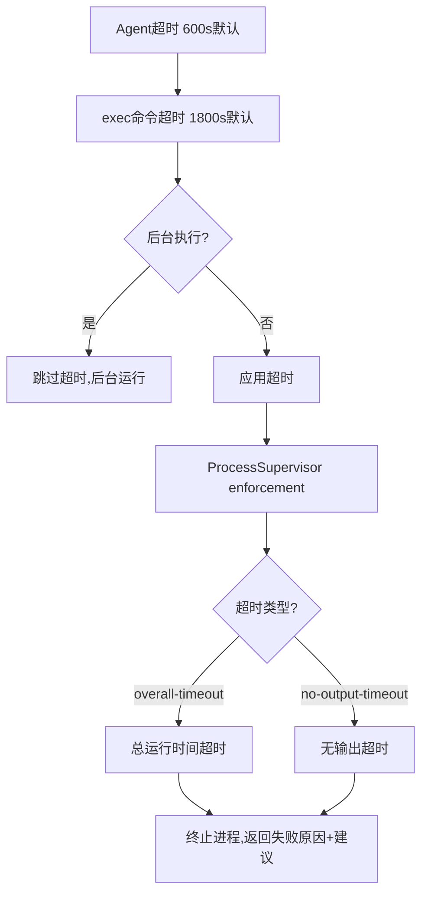

**关键超时值**：

| 超时类型 | 默认值 | 可配置项 |
|---|---|---|
| Agent 总超时 | 600s | `agents.defaults.timeoutSeconds` |
| exec 命令超时 | 1800s | `timeout` 参数 |
| CLI Fresh 看门狗 | 180-600s | `reliability.watchdog.fresh` |
| CLI Resume 看门狗 | 60-180s | `reliability.watchdog.resume` |
| 最大安全超时 | ~2,147,000ms | `MAX_SAFE_TIMEOUT_MS` |

**超时后的友好提示** (`bash-tools.exec-runtime.ts`)：

```typescript
const reason = isShellFailure
  ? exitCode === 127
    ? "Command not found"
    : "Command not executable (permission denied)"
  : exit.reason === "overall-timeout"
    ? `Command timed out after ${opts.timeoutSec} seconds. If this command is expected to take longer, re-run with a higher timeout (e.g., exec timeout=300).`
    : exit.reason === "no-output-timeout"
      ? "Command timed out waiting for output"
      : exit.exitSignal != null
        ? `Command aborted by signal ${exit.exitSignal}`
        : "Command aborted before exit code was captured";
```

**Shell 失败码特殊处理**：

退出码 126（不可执行）和 127（命令未找到）被识别为基础设施故障，不作为 `completed` 返回，而是作为 `failed` 暴露给 Agent，避免静默完成。

**超时豁免**：

后台执行（`background=true` 或 `yieldMs` 有值且无显式超时）自动跳过超时限制，因为后台任务通常需要长时间运行。

---

### 2.6 后台执行 (Background Execution)

**场景**：长时间运行的命令（如编译、测试、服务启动）不应阻塞 Agent 的工具调用循环。系统支持将命令自动后台化，Agent 可以继续执行其他任务，稍后通过 process 工具查看结果。

**涉及文件**：
- `src/agents/bash-tools.exec.ts` (L670-791) — yield 逻辑
- `src/agents/bash-process-registry.ts` — 进程注册表
- `src/agents/bash-tools.process.ts` — process 工具

**流程**：

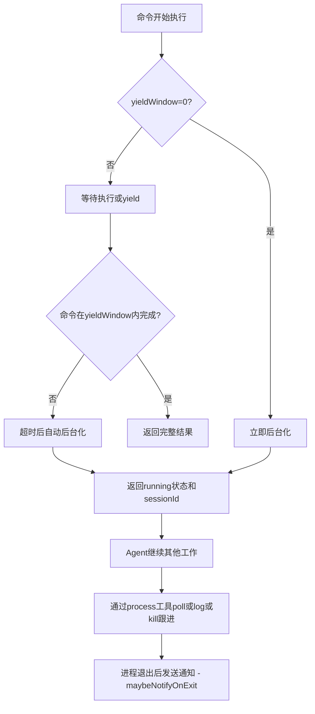

**关键参数**：
- `background: true` → `yieldWindow=0`，立即后台化
- `yieldMs: N` → 等待 N 毫秒后自动后台化（默认 10000ms）
- `yieldMs` 值被限制在 [10, 120000] 范围内
- 后台执行被禁用时，发出警告并同步执行

**后台进程退出通知** (`maybeNotifyOnExit`)：

```typescript
function maybeNotifyOnExit(session: ProcessSession, status: "completed" | "failed") {
  if (!session.backgrounded || !session.notifyOnExit || session.exitNotified) {
    return;
  }
  session.exitNotified = true;
  const exitLabel = session.exitSignal ? `signal ${session.exitSignal}` : `code ${session.exitCode ?? 0}`;
  const summary = output
    ? `Exec ${status} (${session.id.slice(0, 8)}, ${exitLabel}) :: ${output}`
    : `Exec ${status} (${session.id.slice(0, 8)}, ${exitLabel})`;
  enqueueSystemEvent(summary, { sessionKey });
  requestHeartbeatNow(scopedHeartbeatWakeOptions(sessionKey, { reason: `exec:${session.id}:exit` }));
}
```

**通知策略**：
- 仅通知后台化且配置了 `notifyOnExit` 的会话
- 成功且无输出的会话默认不通知（除非 `notifyOnExitEmptySuccess=true`）
- 通知后触发心跳唤醒，确保 Agent 立即收到

**process 工具操作**：

| action | 说明 |
|---|---|
| `list` | 列出所有运行中和已完成的会话 |
| `poll` | 轮询输出，支持超时等待 |
| `log` | 查看聚合日志，支持 offset/limit 分页 |
| `write` | 向 stdin 写入数据 |
| `send-keys` | 发送按键序列 |
| `submit` | 发送回车 |
| `paste` | 粘贴文本（支持 bracketed paste） |
| `kill` | 终止后台会话 |
| `clear` | 清除已完成的会话记录 |
| `remove` | 强制移除会话 |

---

## 三、上下文层保障

### 3.1 上下文窗口守卫 (Context Window Guard)

**场景**：如果配置的模型上下文窗口太小（如 16K 以下），Agent 的对话历史很容易超出限制，导致 API 错误。系统在启动时检查上下文窗口大小，低于阈值时发出警告或阻止运行。

**涉及文件**：
- `src/agents/context-window-guard.ts` — 上下文窗口守卫

**守卫逻辑**：

```typescript
export const CONTEXT_WINDOW_HARD_MIN_TOKENS = 16_000;    // 硬性最低限制
export const CONTEXT_WINDOW_WARN_BELOW_TOKENS = 32_000;  // 警告阈值

export function evaluateContextWindowGuard(params: {...}): ContextWindowGuardResult {
  const tokens = Math.max(0, Math.floor(params.info.tokens));
  return {
    ...params.info,
    tokens,
    shouldWarn: tokens > 0 && tokens < warnBelow,    // < 32K → 警告
    shouldBlock: tokens > 0 && tokens < hardMin,      // < 16K → 阻止
  };
}
```

**上下文窗口来源优先级** (`resolveContextWindowInfo`)：

1. `modelsConfig`：用户在 models 配置中显式设置的 `contextWindow`
2. `model`：模型 API 返回的上下文窗口大小
3. `agentContextTokens`：通过 `agents.defaults.contextTokens` 配置的上限
4. `default`：系统默认值

当 `agentContextTokens` 小于模型原始窗口时，以 `agentContextTokens` 为准，允许用户缩小上下文窗口以节省成本。

---

### 3.2 上下文压缩 (Context Compaction)

**场景**：随着对话进行，消息历史不断增长，当接近上下文窗口限制时，需要压缩历史消息为摘要，腾出空间继续对话。这对长任务的成功率至关重要——没有压缩机制，任何长对话都会因为上下文溢出而失败。

**涉及文件**：
- `src/agents/compaction.ts` — 压缩核心逻辑
- `src/agents/session-transcript-repair.ts` — 消息配对修复

**压缩策略（三级降级）**：

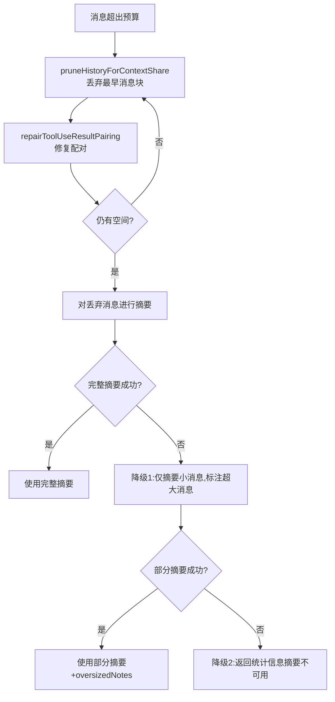

**关键机制**：

1. **安全边距**：使用 `SAFETY_MARGIN = 1.2`，为 `estimateTokens()` 的不准确性预留 20% 缓冲
2. **自适应分块**：`computeAdaptiveChunkRatio` 根据平均消息大小动态调整分块比例，当平均消息 > 上下文的 10% 时减小分块比例
3. **标识符保留**：摘要指令中强制保留 UUID、哈希、API Key、主机名、IP、端口、URL 和文件名等精确标识符
4. **Tool Result 配对修复**：`repairToolUseResultPairing` 在丢弃消息后修复孤立的 tool_result，防止 "unexpected tool_use_id" API 错误
5. **带重试的摘要生成**：`summarizeChunks` 使用 `retryAsync` 最多重试 3 次，抖动 0.2
6. **Tool Result 详情剥离**：`stripToolResultDetails` 从送入摘要的消息中移除 toolResult.details，避免不可信的冗长 payload 进入 LLM 提示

**核心代码** (`compaction.ts` - `summarizeWithFallback`)：

```typescript
export async function summarizeWithFallback(params: {...}): Promise<string> {
  // 尝试完整摘要
  try {
    return await summarizeChunks(params);
  } catch (fullError) {
    log.warn(`Full summarization failed, trying partial...`);
  }

  // 降级1: 仅摘要小消息，标注超大消息
  const smallMessages = [];
  const oversizedNotes = [];
  for (const msg of messages) {
    if (isOversizedForSummary(msg, contextWindow)) {
      oversizedNotes.push(`[Large ${role} (~${tokens}K tokens) omitted from summary]`);
    } else {
      smallMessages.push(msg);
    }
  }
  if (smallMessages.length > 0) {
    try {
      const partialSummary = await summarizeChunks({...params, messages: smallMessages});
      return partialSummary + notes;
    } catch (partialError) { /* 继续降级 */ }
  }

  // 降级2: 最终回退
  return `Context contained ${messages.length} messages. Summary unavailable due to size limits.`;
}
```

**多阶段摘要** (`summarizeInStages`)：

当消息量非常大时，先分割为多个部分分别摘要，再合并为最终摘要：

1. 将消息按 token 占比分割为 N 个块
2. 对每个块独立生成摘要
3. 使用 `MERGE_SUMMARIES_INSTRUCTIONS` 将所有部分摘要合并为最终摘要
4. 合并指令中强制保留：活跃任务状态、批量操作进度、用户最后请求、决策和理由、TODO 和约束

**历史裁剪** (`pruneHistoryForContextShare`)：

```typescript
export function pruneHistoryForContextShare(params: {...}) {
  const maxHistoryShare = params.maxHistoryShare ?? 0.5;  // 历史最多占 50%
  const budgetTokens = Math.max(1, Math.floor(maxContextTokens * maxHistoryShare));

  while (keptMessages.length > 0 && estimateMessagesTokens(keptMessages) > budgetTokens) {
    const chunks = splitMessagesByTokenShare(keptMessages, parts);
    const [dropped, ...rest] = chunks;
    const repairReport = repairToolUseResultPairing(rest.flat());
    // ... 跟踪丢弃统计 ...
  }
}
```

---

## 四、生命周期层保障

### 4.1 进程注册表与 TTL (Process Registry)

**场景**：后台运行的 shell 进程需要持续跟踪其生命周期，包括输出收集、状态转换、超时清理等，防止已完成进程的会话数据无限增长。

**涉及文件**：
- `src/agents/bash-process-registry.ts` — 进程注册表

**生命周期**：

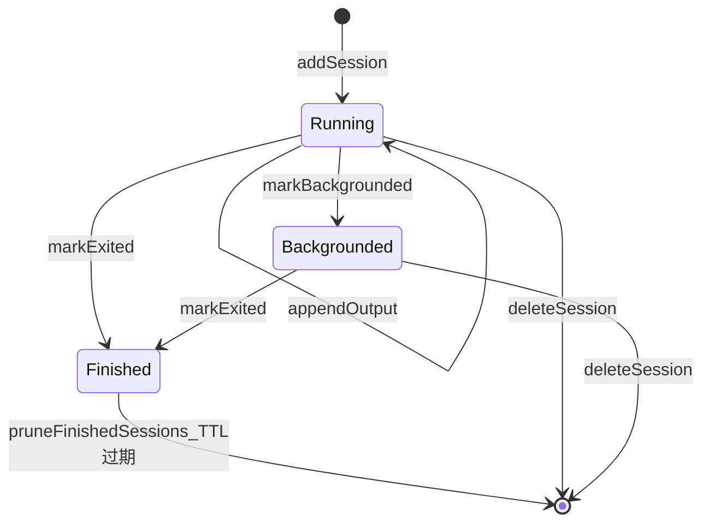

**关键参数**：

| 参数 | 值 | 说明 |
|---|---|---|
| 默认 TTL | 30 分钟 | 已完成会话的存活时间 |
| 最小 TTL | 1 分钟 | |
| 最大 TTL | 3 小时 | |
| 清理间隔 | max(30s, TTL/6) | 使用 `unref()` 不阻止进程退出 |
| 运行中输出上限 | 200K 字符 | `DEFAULT_MAX_OUTPUT` |
| 待消费输出上限 | 30K 字符 | `DEFAULT_PENDING_MAX_OUTPUT_CHARS` |
| tail 缓存 | 2000 字符 | 保留末尾用于快速预览 |

**输出缓冲与截断** (`appendOutput`)：

```typescript
export function appendOutput(session: ProcessSession, stream: "stdout" | "stderr", chunk: string) {
  buffer.push(chunk);
  let pendingChars = bufferChars + chunk.length;

  // 超出容量上限时截断缓冲区
  if (pendingChars > pendingCap) {
    session.truncated = true;
    // ...截断旧数据...
  }

  // 追加到聚合输出，超出 maxOutputChars 则从头部截断
  session.aggregated += chunk;
  if (session.aggregated.length > session.maxOutputChars) {
    session.aggregated = session.aggregated.slice(-session.maxOutputChars);
  }

  // 更新 tail（保留末尾 2000 字符用于快速预览）
  session.tail = tail(session.aggregated, 2000);
}
```

**防御性编程**：`appendOutput` 在入口处初始化可能为 undefined 的缓冲区和计数器，确保即使 `ProcessSession` 对象不完整也不会崩溃。

---

### 4.2 中止信号处理 (Abort Signal Handling)

**场景**：用户可以通过多语言触发词（stop/abort/停止/やめて 等）中止当前任务，系统需要正确传播中止信号到正在执行的进程，同时保护后台进程不被误杀。

**涉及文件**：
- `src/auto-reply/reply/abort.ts` — 中止触发词检测
- `src/agents/pi-embedded-runner/abort.ts` — Runner 中止检测
- `src/agents/bash-tools.exec.ts` (L673) — exec 中止处理
- `src/infra/abort-signal.ts` — 通用中止信号工具

**中止触发词**（支持 15+ 种语言）：

```typescript
const ABORT_TRIGGERS = new Set([
  "stop", "esc", "abort", "wait", "exit", "interrupt",
  "detente", "deten", "detén",
  "arrete", "arrête",
  "停止", "やめて", "止めて", "रुको", "توقف",
  "стоп", "остановись", "останови", "прекрати",
  "halt", "anhalten", "aufhören", "stopp", "pare",
  "stop openclaw", "openclaw stop",
  "stop agent", "stop the agent",
  "please stop", "stop please",
  // ... 更多变体
]);
```

**中止传播** (`bash-tools.exec.ts`)：

```typescript
const onAbortSignal = () => {
  if (yielded || run.session.backgrounded) {
    return;  // 已后台化的进程不受中止信号影响
  }
  run.kill();  // 终止前台进程
};

if (signal?.aborted) {
  onAbortSignal();
} else if (signal) {
  signal.addEventListener("abort", onAbortSignal, { once: true });
}
```

**关键设计**：
- 后台进程不受 AbortSignal 影响，只有超时才能终止
- 已 yield（返回 running 状态）的进程也不受中止影响
- 使用 `{ once: true }` 确保监听器只触发一次，避免内存泄漏
- 中止记忆机制 (`ABORT_MEMORY`) 防止同一会话重复触发中止

**Runner 中止检测** (`pi-embedded-runner/abort.ts`)：

```typescript
export function isRunnerAbortError(err: unknown): boolean {
  if (!err || typeof err !== "object") return false;
  const name = "name" in err ? String(err.name) : "";
  if (name === "AbortError") return true;
  const message = "message" in err && typeof err.message === "string" ? err.message.toLowerCase() : "";
  return message.includes("aborted");
}
```

Runner 层使用更宽松的中止检测（消息匹配），因为 runner 需要捕获来自不同源的各种中止信号。

---

### 4.3 命令轮询退避 (Command Poll Backoff)

**场景**：Agent 通过 process 工具的 `poll` 操作检查后台命令输出时，如果命令暂时没有新输出，频繁轮询会浪费资源。系统实现指数退避策略，自动调整轮询间隔。

**涉及文件**：
- `src/agents/command-poll-backoff.ts` — 命令轮询退避
- `src/agents/command-poll-backoff.runtime.ts` — 运行时辅助

**退避策略**：

| 连续无输出次数 | 建议等待时间 |
|---|---|
| 0（有新输出后重置） | 5s |
| 1 | 10s |
| 2 | 30s |
| 3+ | 60s（封顶） |

```typescript
const BACKOFF_SCHEDULE_MS = [5000, 10000, 30000, 60000];

export function recordCommandPoll(
  state: SessionState,
  commandId: string,
  hasNewOutput: boolean,
): number {
  if (hasNewOutput) {
    state.commandPollCounts.set(commandId, { count: 0, lastPollAt: now });
    return BACKOFF_SCHEDULE_MS[0];  // 有输出时重置为最短间隔
  }
  const newCount = (existing?.count ?? -1) + 1;
  state.commandPollCounts.set(commandId, { count: newCount, lastPollAt: now });
  return calculateBackoffMs(newCount);
}
```

**内存保护**：
- 定期清理超过 1 小时的轮询记录 (`pruneStaleCommandPolls`)
- 轮询状态存储在 `SessionState.commandPollCounts` Map 中，随会话销毁而清理

---

### 4.4 通用重试机制 (General Retry)

**场景**：许多操作（如摘要生成、API 调用、网络请求）可能因临时故障失败，需要带指数退避的重试。

**涉及文件**：
- `src/infra/retry.ts` — 通用重试
- `src/infra/retry-policy.ts` — 重试策略

**重试策略**：

```typescript
export type RetryOptions = RetryConfig & {
  label?: string;                                                    // 重试标识，用于日志
  shouldRetry?: (err: unknown, attempt: number) => boolean;          // 条件重试
  retryAfterMs?: (err: unknown) => number | undefined;               // 服务器建议的等待时间
  onRetry?: (info: RetryInfo) => void;                                // 重试回调
};

const DEFAULT_RETRY_CONFIG = {
  attempts: 3,        // 最多 3 次
  minDelayMs: 300,    // 最小延迟 300ms
  maxDelayMs: 30_000, // 最大延迟 30s
  jitter: 0,          // 无抖动
};
```

**特性**：
- **指数退避**：延迟 = `initialDelayMs * 2^attempt`
- **抖动 (Jitter)**：0-1 的抖动系数，防止多个客户端同时重试
- **条件重试**：`shouldRetry` 函数决定特定错误是否值得重试（如 AbortError 不重试）
- **服务器尊重**：`retryAfterMs` 支持从错误响应中读取服务器建议的等待时间
- **回调通知**：`onRetry` 在每次重试时回调，用于日志和监控

**使用场景**：

| 场景 | attempts | minDelay | maxDelay | jitter |
|---|---|---|---|---|
| 上下文压缩摘要 | 3 | 500ms | 5s | 0.2 |
| 模型 API 调用 | 3 | 300ms | 30s | 0 |
| 网络请求 | 3 | 300ms | 30s | 0 |

---

### 4.5 CLI 看门狗 (CLI Watchdog)

**场景**：CLI 后端（如 Claude CLI、Codex CLI）在执行编码任务时可能因为 LLM 卡住或内部错误导致长时间无输出。看门狗在检测到无输出超时后自动终止进程，触发故障转移或重试。

**涉及文件**：
- `src/agents/cli-runner/reliability.ts` — CLI 可靠性配置
- `src/agents/cli-watchdog-defaults.ts` — 看门狗默认值

**看门狗配置**：

| 参数 | Fresh 模式 | Resume 模式 |
|---|---|---|
| 无输出超时比例 | 0.8 | 0.3 |
| 最低超时 | 180s | 60s |
| 最高超时 | 600s | 180s |
| 最小超时 | 1s | 1s |

```typescript
export function resolveCliNoOutputTimeoutMs(params: {
  backend: CliBackendConfig;
  timeoutMs: number;
  useResume: boolean;
}): number {
  const profile = pickWatchdogProfile(params.backend, params.useResume);
  const cap = Math.max(CLI_WATCHDOG_MIN_TIMEOUT_MS, params.timeoutMs - 1_000);
  const computed = Math.floor(params.timeoutMs * profile.noOutputTimeoutRatio);
  const bounded = Math.min(profile.maxMs, Math.max(profile.minMs, computed));
  return Math.min(bounded, cap);  // 看门狗不能超过总超时
}
```

**设计考量**：
- Fresh 模式（新启动）比例更高 (0.8)，因为首次输出通常较快
- Resume 模式（恢复会话）比例更低 (0.3)，因为恢复时可能需要较长时间重新初始化
- 看门狗超时始终比总超时少 1 秒，确保看门狗先于总超时触发

---

### 4.6 认证健康检查 (Auth Health Check)

**场景**：OAuth Token 即将过期时，系统需要提前预警，避免在关键任务执行过程中突然认证失败。

**涉及文件**：
- `src/agents/auth-health.ts` — 认证健康检查
- `src/agents/auth-profiles/credential-state.ts` — 凭证状态评估

**健康状态**：

| 状态 | 条件 | 行为 |
|---|---|---|
| `ok` | Token 剩余时间 > 24h | 正常使用 |
| `expiring` | Token 剩余时间 < 24h | 发出预警 |
| `expired` | Token 已过期 | 标记为不可用 |
| `missing` | 无 Token | 需要重新认证 |
| `static` | API Key (永不过期) | 无需检查 |

```typescript
const DEFAULT_OAUTH_WARN_MS = 24 * 60 * 60 * 1000;  // 24小时预警

function resolveOAuthStatus(
  expiresAt: number | undefined,
  now: number,
  warnAfterMs: number,
): { status: AuthProfileHealthStatus; remainingMs?: number } {
  if (!expiresAt || !Number.isFinite(expiresAt) || expiresAt <= 0) {
    return { status: "missing" };
  }
  const remainingMs = expiresAt - now;
  if (remainingMs <= 0) return { status: "expired", remainingMs };
  if (remainingMs <= warnAfterMs) return { status: "expiring", remainingMs };
  return { status: "ok", remainingMs };
}
```

**健康摘要** (`AuthHealthSummary`)：

系统可以生成包含所有 provider 和 profile 的健康摘要，用于 `doctor` 命令诊断认证问题：

```typescript
export type AuthHealthSummary = {
  now: number;
  warnAfterMs: number;
  profiles: AuthProfileHealth[];
  providers: AuthProviderHealth[];
};
```

---

## 总结：保障机制全览

| # | 保障机制 | 层级 | 核心目标 | 关键文件 |
|---|---|---|---|---|
| 1 | 模型故障转移 | 模型层 | 主模型不可用时自动切换备用模型 | `model-fallback.ts` |
| 2 | 认证冷却与探测 | 模型层 | 临时故障后自动恢复密钥可用性 | `auth-profiles/usage.ts` |
| 3 | 错误分类与观测 | 模型层 | 统一错误语义，支持精准故障转移 | `pi-embedded-helpers/errors.ts` |
| 4 | PTY 失败回退 | 执行层 | PTY 不可用时自动降级为普通模式 | `bash-tools.exec-runtime.ts` |
| 5 | 脚本预检 | 执行层 | 执行前拦截 LLM 生成的常见错误命令 | `bash-tools.exec.ts` |
| 6 | 环境变量安全 | 执行层 | 防止危险变量导致权限提升 | `bash-tools.exec-runtime.ts` |
| 7 | 安全策略与审批 | 执行层 | 危险命令需人工确认 | `bash-tools.exec-host-gateway.ts` |
| 8 | 超时管理 | 执行层 | 防止挂起进程占用资源 | `timeout.ts` |
| 9 | 后台执行 | 执行层 | 长任务不阻塞 Agent 循环 | `bash-tools.exec.ts` |
| 10 | 上下文窗口守卫 | 上下文层 | 防止上下文过小导致频繁失败 | `context-window-guard.ts` |
| 11 | 上下文压缩 | 上下文层 | 长对话自动压缩保持连续性 | `compaction.ts` |
| 12 | 进程注册表与 TTL | 生命周期 | 进程全生命周期管理+自动清理 | `bash-process-registry.ts` |
| 13 | 中止信号处理 | 生命周期 | 多语言中止+保护后台进程 | `auto-reply/reply/abort.ts` |
| 14 | 命令轮询退避 | 生命周期 | 减少无效轮询节约资源 | `command-poll-backoff.ts` |
| 15 | 通用重试 | 生命周期 | 临时故障自动重试 | `infra/retry.ts` |
| 16 | CLI 看门狗 | 生命周期 | CLI 后端卡死自动终止 | `cli-runner/reliability.ts` |
| 17 | 认证健康检查 | 生命周期 | Token 过期前预警 | `auth-health.ts` |

---

## 附录：各保障机制的故障覆盖矩阵

| 故障类型 | 模型故障转移 | 认证冷却探测 | PTY回退 | 脚本预检 | 环境变量安全 | 安全审批 | 超时管理 | 后台执行 | 上下文守卫 | 上下文压缩 | 进程TTL | 中止处理 | 轮询退避 | 通用重试 | CLI看门狗 | 认证健康 |
|---|---|---|---|---|---|---|---|---|---|---|---|---|---|---|---|---|
| API 限流 | ✅ | ✅ | | | | | | | | | | | | | | |
| API 过载 | ✅ | ✅ | | | | | | | | | | | | | | |
| 计费错误 | ✅ | ✅ | | | | | | | | | | | | | | |
| 认证失败 | ✅ | ✅ | | | | | | | | | | | | | ✅ |
| 模型不存在 | ✅ | | | | | | | | | | | | | | | |
| PTY 不可用 | | | ✅ | | | | | | | | | | | | | |
| LLM 语法泄漏 | | | | ✅ | | | | | | | | | | | | |
| 权限提升攻击 | | | | | ✅ | ✅ | | | | | | | | | | |
| 危险命令执行 | | | | | | ✅ | | | | | | | | | | |
| 进程挂起 | | | | | | | ✅ | | | | | | | ✅ | ✅ | |
| 长任务阻塞 | | | | | | | | ✅ | | | | | | | | |
| 上下文溢出 | | | | | | | | | ✅ | ✅ | | | | | | |
| 内存泄漏 | | | | | | | | | | | ✅ | | ✅ | | | |
| 用户中止 | | | | | | | | | | | | ✅ | | | | |
| 临时网络错误 | | | | | | | | | | | | | | ✅ | | |
| Token 过期 | | ✅ | | | | | | | | | | | | | | ✅ |
