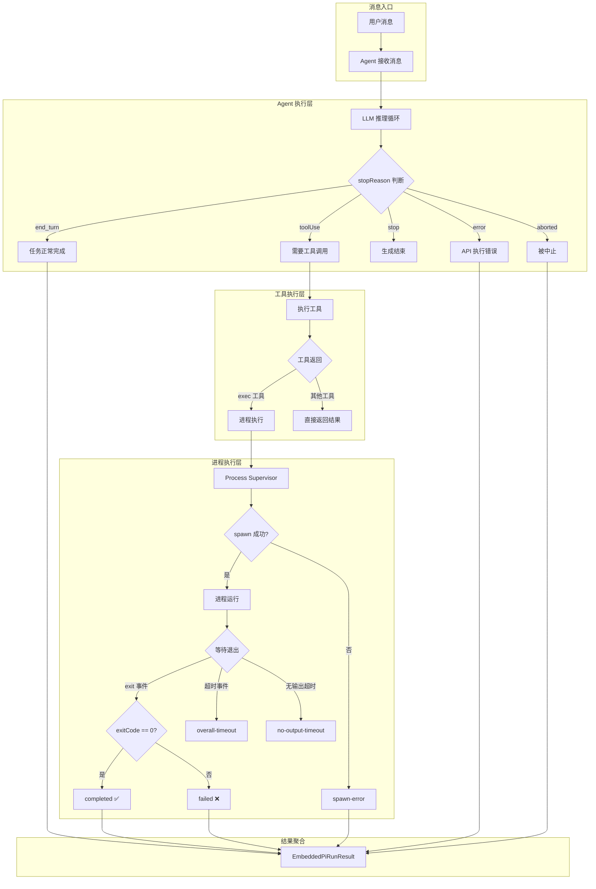
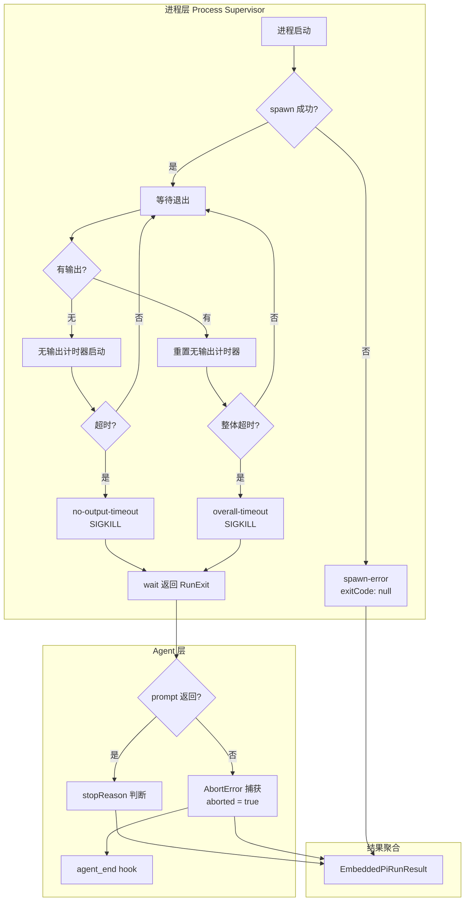
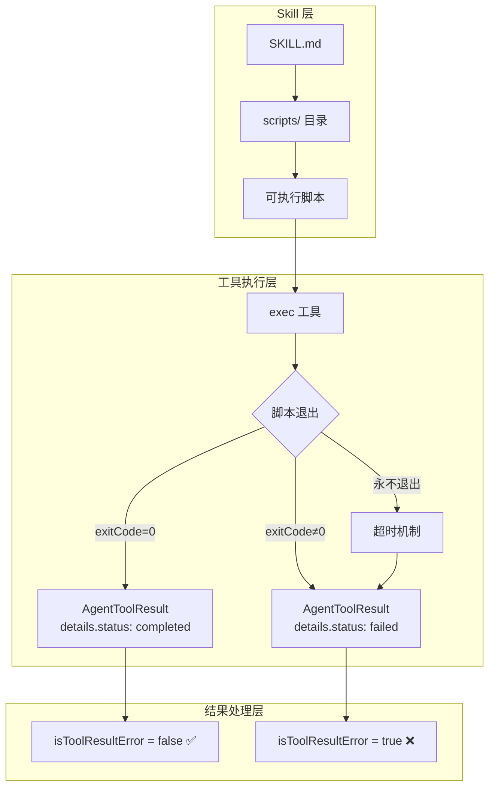
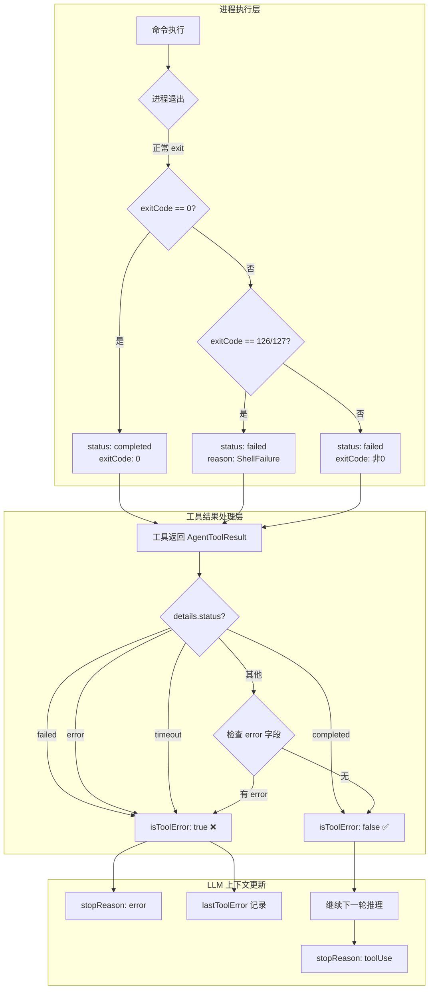

# OpenClaw 任务执行成功/失败判断机制分析

## 目录

1. [概述](#一概述)
2. [核心概念](#二核心概念)
3. [执行层架构](#三执行层架构)
4. [Agent 层判断机制](#四agent-层判断机制)
5. [进程层判断机制](#五进程层判断机制)
6. [工具层判断机制](#六工具层判断机制)
7. [超时保护机制](#七超时保护机制)
8. [Skill 执行结果规范](#八skill-执行结果规范)
9. [判断逻辑澄清](#九判断逻辑澄清)
10. [完整流程图](#十完整流程图)
11. [关键代码路径](#十一关键代码路径)

---

## 一、概述

OpenClaw 的任务执行成功/失败判断涉及**多个层面**的机制协同工作：

1. **Agent 层**：通过 `stopReason` 判断 LLM 推理是否完成
2. **进程层**：通过 `exitCode` 和 `exitSignal` 判断命令执行状态
3. **工具层**：通过 `AgentToolResult` 中的 `details.status` 和 `isError` 字段判断工具调用是否成功

---

## 二、核心概念

### 2.1 StopReason 类型

来自 `@mariozechner/pi-ai` SDK，定义 LLM 推理结果的终止原因：

| stopReason | 含义 | 是否成功 |
|------------|------|---------|
| `end_turn` | 正常结束，用户可以继续输入 | ✅ 成功 |
| `toolUse` | 需要执行工具调用 | ✅ 成功（中间状态） |
| `stop` | 模型自然停止 | ✅ 成功 |
| `max_tokens` | 达到输出 token 限制 | ⚠️ 部分成功 |
| `error` | API 返回错误 | ❌ 失败 |
| `aborted` | 被中止（如超时、用户取消） | ❌ 失败 |

### 2.2 TerminationReason 类型

定义进程终止的原因（来自 Process Supervisor）：

```typescript
export type TerminationReason =
  | "manual-cancel"      // 手动取消
  | "overall-timeout"    // 整体超时
  | "no-output-timeout"   // 无输出超时
  | "spawn-error"         // 启动失败
  | "signal"             // 被信号终止
  | "exit";              // 正常退出
```

### 2.3 进程退出码语义

| 退出码 | 含义 | 状态 |
|--------|------|------|
| 0 | 正常退出 | ✅ `completed` |
| 126 | 命令不可执行（权限问题） | ❌ `failed` |
| 127 | 命令未找到 | ❌ `failed` |
| 非零 | 命令执行失败 | ❌ `failed` |
| null | 进程被强制终止或启动失败 | ❌ `failed` |

---

## 三、执行层架构



---

## 四、Agent 层判断机制

### 4.1 核心文件

- **主入口**: `src/agents/pi-embedded-runner/run.ts`
- **单次尝试**: `src/agents/pi-embedded-runner/run/attempt.ts`
- **类型定义**: `src/agents/pi-embedded-runner/run/types.ts`

### 4.2 EmbeddedRunAttemptResult 类型

```typescript
export type EmbeddedRunAttemptResult = {
  aborted: boolean;
  timedOut: boolean;
  timedOutDuringCompaction: boolean;
  promptError: unknown;
  sessionIdUsed: string;
  messagesSnapshot: AgentMessage[];
  assistantTexts: string[];
  toolMetas: Array<{ toolName: string; meta?: string }>;
  lastAssistant: AssistantMessage | undefined;
  lastToolError?: {
    toolName: string;
    meta?: string;
    error?: string;
    mutatingAction?: boolean;
    actionFingerprint?: string;
  };
  yieldDetected?: boolean;
};
```

### 4.3 Agent 层成功判断

**文件**: `run/attempt.ts:3213`

```typescript
// agent_end hooks 传入的 success 标志
success: !aborted && !promptError,
```

**判断逻辑**:
- `aborted = false` → 未被中止
- `promptError = null` → 无提示词错误
- 同时满足 → 执行成功

### 4.4 stopReason 处理

**文件**: `run.ts:1597-1602`

```typescript
// 处理 client tool calls (OpenResponses hosted tools)
// 传播 LLM stop reason 以区分 end_turn 和 max_tokens
stopReason: attempt.clientToolCall
  ? "tool_calls"
  : attempt.yieldDetected
    ? "end_turn"
    : (lastAssistant?.stopReason as string | undefined),
```

---

## 五、进程层判断机制

### 5.1 核心文件

- **执行运行时**: `src/agents/bash-tools.exec-runtime.ts`
- **进程注册**: `src/agents/bash-process-registry.ts`
- **Supervisor**: `src/process/supervisor/supervisor.ts`

### 5.2 ExecProcessOutcome 类型

```typescript
export type ExecProcessOutcome = {
  status: "completed" | "failed";
  exitCode: number | null;
  exitSignal: NodeJS.Signals | number | null;
  durationMs: number;
  aggregated: string;
  timedOut: boolean;
  reason?: string;
};
```

### 5.3 状态判断核心逻辑

**文件**: `bash-tools.exec-runtime.ts:714-721`

```typescript
const isNormalExit = exit.reason === "exit";
const exitCode = exit.exitCode ?? 0;

// Shell 退出码 126/127 被视为基础设施故障
// 126: 命令不可执行（权限问题）
// 127: 命令未找到
const isShellFailure = exitCode === 126 || exitCode === 127;

// 状态判断：正常退出且非 Shell 故障 = 成功
const status: "completed" | "failed" =
  isNormalExit && !isShellFailure ? "completed" : "failed";
```

### 5.4 失败原因优先级

**文件**: `bash-tools.exec-runtime.ts:739-756`

```typescript
const reason = isShellFailure
  ? exitCode === 127
    ? "Command not found"
    : "Command not executable (permission denied)"
  : exit.reason === "overall-timeout"
    ? `Command timed out after ${opts.timeoutSec} seconds...`
    : exit.reason === "no-output-timeout"
      ? "Command timed out waiting for output"
      : exit.exitSignal != null
        ? `Command aborted by signal ${exit.exitSignal}`
        : "Command aborted before exit code was captured";
```

---

## 六、工具层判断机制

### 6.1 核心文件

- **工具处理**: `src/agents/pi-embedded-subscribe.handlers.tools.ts`
- **工具工具函数**: `src/agents/pi-embedded-subscribe.tools.ts`
- **通用工具**: `src/agents/tools/common.ts`

### 6.2 AgentToolResult 类型

```typescript
type AgentToolResult<T = unknown> = {
  content: Array<{
    type: "text" | "image" | "resource";
    text?: string;
    data?: string;
    mimeType?: string;
  }>;
  details?: {
    status: "completed" | "failed" | "error" | "timeout";
    exitCode?: number;
    [key: string]: unknown;
  };
  isError?: boolean;
};
```

### 6.3 isToolResultError 函数

**文件**: `pi-embedded-subscribe.tools.ts:243-254`

```typescript
export function isToolResultError(result: unknown): boolean {
  if (!result || typeof result !== "object") {
    return false;
  }
  const record = result as { details?: unknown };
  const details = record.details;
  if (!details || typeof details !== "object") {
    return false;
  }
  const status = (details as { status?: unknown }).status;
  if (typeof status !== "string") {
    return false;
  }
  // 只认 "error" 和 "timeout" 为错误
  const normalized = status.trim().toLowerCase();
  return normalized === "error" || normalized === "timeout";
}
```

### 6.4 工具执行结果处理

**文件**: `pi-embedded-subscribe.handlers.tools.ts:418-447`

```typescript
export async function handleToolExecutionEnd(
  ctx: ToolHandlerContext,
  evt: AgentEvent & {
    toolName: string;
    toolCallId: string;
    isError: boolean;      // ← 来自 Pi-Agent SDK
    result?: unknown;
  },
) {
  const isError = Boolean(evt.isError);
  
  // 1. 判断是否为工具错误
  const isToolError = isError || isToolResultError(result);
  
  // 2. 提取错误信息
  if (isToolError) {
    const errorMessage = extractToolErrorMessage(sanitizedResult);
    ctx.state.lastToolError = {
      toolName,
      meta,
      error: errorMessage,
      mutatingAction: callSummary?.mutatingAction,
      actionFingerprint: callSummary?.actionFingerprint,
    };
  }
}
```

---

## 七、超时保护机制

### 7.1 超时配置

**文件**: `src/agents/cli-watchdog-defaults.ts`

```typescript
export const CLI_FRESH_WATCHDOG_DEFAULTS = {
  noOutputTimeoutRatio: 0.8,  // 整体超时的 80% 作为无输出超时
  minMs: 180_000,             // 最小 3 分钟
  maxMs: 600_000,             // 最大 10 分钟
};

export const CLI_RESUME_WATCHDOG_DEFAULTS = {
  noOutputTimeoutRatio: 0.3,  // 恢复场景下 30%
  minMs: 60_000,              // 最小 1 分钟
  maxMs: 180_000,             // 最大 3 分钟
};
```

### 7.2 Supervisor 超时处理

**文件**: `src/process/supervisor/supervisor.ts:220-245`

```typescript
// 设置整体超时定时器
if (overallTimeoutMs) {
  timeoutTimer = setTimeout(() => {
    requestCancel("overall-timeout");
  }, overallTimeoutMs);
}

// 设置无输出超时定时器
if (noOutputTimeoutMs) {
  noOutputTimer = setTimeout(() => {
    requestCancel("no-output-timeout");
  }, noOutputTimeoutMs);
}

// 取消时向进程发送 SIGKILL
cancelAdapter = (_reason: TerminationReason) => {
  if (settled) {
    return;
  }
  adapter.kill("SIGKILL");  // 强制杀死进程
};
```

### 7.3 永不返回时的处理

**文件**: `bash-tools.exec-runtime.ts:770-785`

```typescript
// 异常捕获路径（进程永远不退出时）
.catch((err): ExecProcessOutcome => {
  markExited(session, null, null, "failed");
  maybeNotifyOnExit(session, "failed");
  const aggregated = session.aggregated.trim();
  const message = aggregated ? `${aggregated}\n\n${String(err)}` : String(err);
  return {
    status: "failed",
    exitCode: null,           // ← 永远不退出时 exitCode 为 null
    exitSignal: null,
    durationMs: Date.now() - startedAt,
    aggregated,
    timedOut: false,
    reason: message,
  };
});
```

### 7.4 完整防护链路



---

## 八、Skill 执行结果规范

### 8.1 Skill 本质

Skill **不是直接执行的工具**，而是一个**指令/指导集合**：

```
skill-name/
├── SKILL.md (required)      ← 主要指导文件
├── scripts/                ← 可执行脚本（通过 exec 工具运行）
├── references/             ← 参考文档
└── assets/                ← 资源文件
```

### 8.2 Skill 脚本执行流程



### 8.3 常用工具返回函数

**文件**: `src/agents/tools/common.ts:217-225`

```typescript
export function jsonResult(payload: unknown): AgentToolResult<unknown> {
  return {
    content: [
      {
        type: "text",
        text: JSON.stringify(payload, null, 2),
      },
    ],
    details: payload,
  };
}
```

### 8.4 details.status 状态值

| status 值 | 含义 | isError |
|-----------|------|---------|
| `"completed"` | 成功完成 | ❌ |
| `"ok"` | 成功 | ❌ |
| `"running"` | 后台运行中 | ❌ |
| `"error"` | 执行错误 | ✅ |
| `"failed"` | 执行失败 | ✅ |
| `"timeout"` | 执行超时 | ✅ |

---

## 九、判断逻辑澄清

### 9.1 判断分为两层

| 阶段 | 判断依据 | 是否字符串匹配 |
|------|----------|---------------|
| **进程层判断** | `exitCode === 0` | ✅ 数值比较 |
| **进程层判断** | `exit.reason === "exit"` | ✅ 枚举相等比较 |
| **工具层判断** | `details.status === "error"` | ✅ 字符串相等比较 |
| **工具层判断** | `details.status === "timeout"` | ✅ 字符串相等比较 |

### 9.2 错误信息提取（非判断）

```typescript
export function extractToolErrorMessage(result: unknown): string | undefined {
  // 1. 优先从 details.error / details.message / details.reason 提取
  const fromDetails = extractErrorField(record.details);
  if (fromDetails) return fromDetails;  // ← 直接取值，不是匹配
  
  // 2. 尝试解析 JSON
  try {
    const parsed = JSON.parse(text) as unknown;
    const fromJson = extractErrorField(parsed);
    if (fromJson) return fromJson;
  } catch {}
  
  // 3. 最后兜底：取 text 第一行作为错误信息
  return normalizeToolErrorText(text);
}
```

### 9.3 关键结论

1. **判断成功/失败**主要是**精确匹配**（exitCode 数值、status 字符串相等）
2. **字符串模糊匹配**只在"提取错误信息"时使用，且**不影响判断结果**
3. 主要通过精确的值/枚举比较判断，字符串模糊匹配仅用于错误信息的展示

---

## 十、完整流程图

### 10.1 工具执行有输出时的成功/失败判断



### 10.2 各种场景的最终状态

| 场景 | exitCode | reason | status | stopReason |
|------|----------|--------|--------|------------|
| 正常退出 (exit 0) | `0` | `exit` | `completed` | `end_turn` |
| 非零退出码 | `非0` | `exit` | `failed` | `error` |
| Shell 错误 (126/127) | `126/127` | `exit` | `failed` | `error` |
| **整体超时** | `null` | `overall-timeout` | `failed` | `aborted` |
| **无输出超时** | `null` | `no-output-timeout` | `failed` | `aborted` |
| **信号终止** | `null` | `signal` | `failed` | `aborted` |
| **启动失败** | `null` | `spawn-error` | `failed` | `error` |
| **手动取消** | `null` | `manual-cancel` | `failed` | `aborted` |

---

## 十一、关键代码路径

### 11.1 runEmbeddedPiAgent 主入口

```
src/agents/pi-embedded-runner/run.ts
  └─ runEmbeddedPiAgent()
      ├─ 排队控制（session lane + global lane）
      ├─ 模型解析 + Auth Profile 选择
      ├─ 调用 runEmbeddedAttempt() 执行单次尝试
      └─ 返回 EmbeddedPiRunResult
```

### 11.2 单次执行 attempt

```
src/agents/pi-embedded-runner/run/attempt.ts
  └─ runEmbeddedAttempt()
      ├─ 环境初始化（工作区/沙箱/技能）
      ├─ 创建 Pi-Agent SDK 会话
      ├─ 订阅流式事件
      ├─ 调用 agent.run() 推理
      ├─ 处理 stopReason
      ├─ 调用 agent_end hooks
      └─ 返回 EmbeddedRunAttemptResult
```

### 11.3 Shell 命令执行

```
src/agents/bash-tools.exec-runtime.ts
  └─ runExecProcess()
      ├─ 创建 ProcessSupervisor
      ├─ 调用 supervisor.spawn() 启动进程
      ├─ 监听 stdout/stderr
      ├─ 等待 managedRun.wait() 返回 RunExit
      └─ 根据 exitCode 和 reason 判断状态
```

### 11.4 工具结果处理

```
src/agents/pi-embedded-subscribe.handlers.tools.ts
  └─ handleToolExecutionEnd()
      ├─ isToolError = isError || isToolResultError(result)
      ├─ 提取错误信息 extractToolErrorMessage()
      └─ 更新 ctx.state.lastToolError
```

---

## 十二、总结

OpenClaw 的任务执行成功/失败判断是一个**分层判断**系统：

| 层次 | 判断依据 | 成功条件 | 失败条件 |
|------|----------|---------|---------|
| **Agent 层** | `stopReason` | `end_turn`, `stop`, `toolUse` | `error`, `aborted` |
| **进程层** | `exitCode` + `reason` | `exitCode === 0` 且 `reason === "exit"` | 非零退出码、超时、信号 |
| **工具层** | `isError` + `details.status` | 无错误或 `status === "completed"` | 有错误文本或 `status === "error"` |

### 核心设计原则

1. **Agent 层**：基于 LLM 的自然停止理由（`stopReason`）判断是否正常结束
2. **进程层**：基于 Unix 退出码语义（0=成功，非0=失败）
3. **超时兜底**：任何进程都有超时保护，不会永久挂起
4. **强制终止**：超时时使用 `SIGKILL` 确保进程被杀死
5. **统一抽象**：`EmbeddedPiRunResult` 统一封装各种执行结果
6. **Hooks 机制**：`agent_end` hook 允许插件在执行结束时做额外处理

---

*文档生成时间: 2026-06-01*
