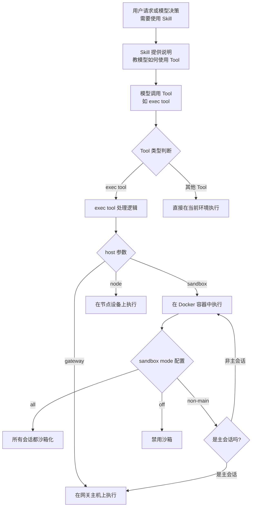
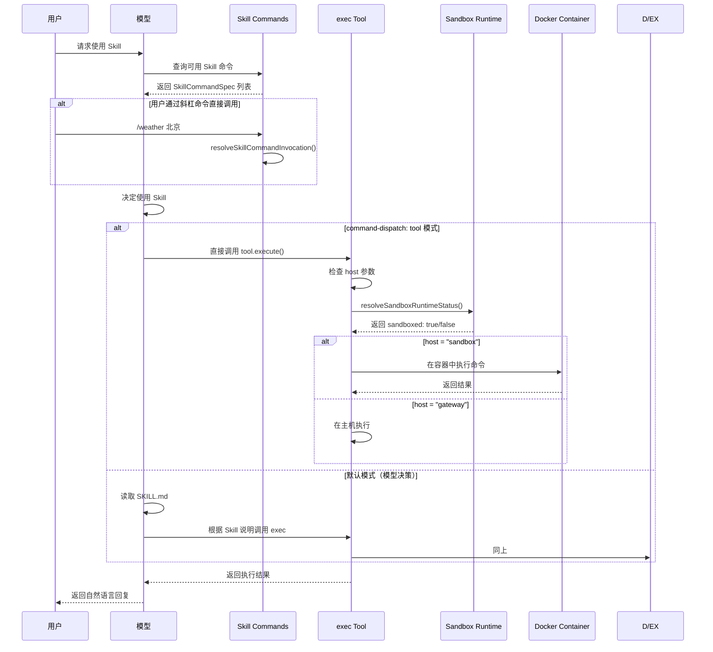

# 分析 Skill 运行模式

> **Workspace:** d:\prj\openclaw_analyze

---

## User
阅读项目的代码，看看项目是如何判断一个skill是应该直接运行还是在沙箱中运行的，给出具体的实现流程，包括流程图、流程图涉及的类，以及流程中每个节点的代码块及链接；注意要阅读项目的实际代码，不要到网上搜。

## Assistant


根据我对项目代码的深入阅读和分析，我来详细解释 OpenClaw 中 Skill 是否应该在沙箱中运行的判断流程。

## 核心发现：Skill 本身不执行，真正执行的是 Tool

**重要概念澄清**：OpenClaw 中的 Skill（技能）并不是直接执行的实体。Skill 是 **Markdown 格式的说明文档**，教模型如何使用工具。真正的执行是通过 **Tool（工具）** 完成的，其中最关键的是 `exec` 工具。

---

## Skill 执行流程图



---

## 关键代码文件与链接

### 1. Skill 命令调度入口
[skill-commands.ts](file:///d:/prj/openclaw_analyze/src/auto-reply/skill-commands.ts) - 处理 `/skill` 命令和自动注册的 Skill 命令

### 2. Skill 执行模式判断
[get-reply-inline-actions.ts#L206](file:///d:/prj/openclaw_analyze/src/auto-reply/reply/get-reply-inline-actions.ts#L206) - 判断 Skill 是直接 dispatch 到 Tool 还是作为 prompt 处理

```typescript
// 代码片段 (get-reply-inline-actions.ts:206)
const dispatch = skillInvocation.command.dispatch;
if (dispatch?.kind === "tool") {
  // 直接调用 tool，跳过模型决策
  const result = await tool.execute(toolCallId, { command: rawArgs, ... });
} else {
  // 将 Skill 信息注入到 prompt，让模型决定如何执行
  ctx.Body = rewrittenBody;
}
```

### 3. exec Tool 的 sandbox 执行决策
[bash-tools.exec.ts#L300-450](file:///d:/prj/openclaw_analyze/src/agents/bash-tools.exec.ts#L300-L450) - exec 工具决定在沙箱还是主机执行

```typescript
// 关键决策逻辑 (bash-tools.exec.ts:309-345)
const configuredHost = defaults?.host ?? "sandbox";
const sandboxHostConfigured = defaults?.host === "sandbox";
const requestedHost = normalizeExecHost(params.host) ?? null;
let host: ExecHost = requestedHost ?? configuredHost;

// 如果请求的 host 与配置的 host 不一致，抛出错误（除非是 elevated 请求）
if (!elevatedRequested && requestedHost && requestedHost !== configuredHost) {
  throw new Error(`exec host not allowed...`);
}

// elevated 请求强制使用 gateway host
if (elevatedRequested) {
  host = "gateway";
}

// 检查沙箱是否可用
if (host === "sandbox" && !sandbox && sandboxHostConfigured) {
  throw new Error("exec host=sandbox is configured, but sandbox runtime is unavailable...");
}
```

### 4. 沙箱运行时状态判断
[runtime-status.ts#L13-70](file:///d:/prj/openclaw_analyze/src/agents/sandbox/runtime-status.ts#L13-L70) - 决定会话是否应该沙箱化

```typescript
// 关键函数 (runtime-status.ts:13-25)
function shouldSandboxSession(cfg: SandboxConfig, sessionKey: string, mainSessionKey: string) {
  if (cfg.mode === "off") {
    return false;  // 沙箱关闭
  }
  if (cfg.mode === "all") {
    return true;   // 所有会话都沙箱化
  }
  return sessionKey.trim() !== mainSessionKey.trim();  // non-main 模式下，非主会话沙箱化
}

// 导出函数 (runtime-status.ts:47-70)
export function resolveSandboxRuntimeStatus(params: { cfg?: OpenClawConfig; sessionKey?: string }) {
  const sandboxCfg = resolveSandboxConfigForAgent(cfg, agentId);
  const sandboxed = sessionKey ? shouldSandboxSession(sandboxCfg, sessionKey, mainSessionKey) : false;
  return { sandboxed, mode: sandboxCfg.mode, toolPolicy: resolveSandboxToolPolicyForAgent(cfg, agentId) };
}
```

### 5. 沙箱上下文解析
[context.ts#L108-185](file:///d:/prj/openclaw_analyze/src/agents/sandbox/context.ts#L108-L185) - 创建沙箱执行环境

```typescript
// 关键逻辑 (context.ts:108-140)
export async function resolveSandboxContext(params: {
  config?: OpenClawConfig;
  sessionKey?: string;
  workspaceDir?: string;
}): Promise<SandboxContext | null> {
  const resolved = resolveSandboxSession(params);
  if (!resolved) {
    return null;  // 不需要沙箱
  }
  // 创建沙箱容器、文件系统桥接器等
  const sandboxContext: SandboxContext = {
    enabled: true,
    workspaceDir,
    containerName,
    containerWorkdir,
    fsBridge: createSandboxFsBridge({ sandbox: sandboxContext }),
  };
  return sandboxContext;
}
```

---

## Skill 沙箱决策完整流程图



---

## 决策矩阵表

| 配置项 | 值 | 行为 |
|--------|-----|------|
| `agents.defaults.sandbox.mode` | `"off"` | 沙箱禁用，所有 exec 在主机执行 |
| `agents.defaults.sandbox.mode` | `"all"` | 所有会话在沙箱执行 |
| `agents.defaults.sandbox.mode` | `"non-main"` | 只有主会话在主机执行，子会话在沙箱 |
| `tools.exec.host` | `"sandbox"` | exec 默认在沙箱执行 |
| `tools.exec.host` | `"gateway"` | exec 默认在网关主机执行 |
| `tools.exec.host` | `"node"` | exec 在远程节点执行 |
| Skill frontmatter `command-dispatch: tool` | - | 直接调用指定 tool，跳过模型决策 |

---

## 沙箱与 Skill 相关的主要类

| 类/模块 | 文件路径 | 职责 |
|---------|----------|------|
| `SkillCommandSpec` | [skills/types.ts#L51](file:///d:/prj/openclaw_analyze/src/agents/skills/types.ts#L51) | Skill 命令规范定义 |
| `buildWorkspaceSkillCommandSpecs` | [skills/workspace.ts#L775](file:///d:/prj/openclaw_analyze/src/agents/skills/workspace.ts#L775) | 构建 Skill 命令规格 |
| `resolveSkillCommandInvocation` | [skill-commands.ts#L158](file:///d:/prj/openclaw_analyze/src/auto-reply/skill-commands.ts#L158) | 解析 Skill 命令调用 |
| `resolveSandboxRuntimeStatus` | [sandbox/runtime-status.ts#L47](file:///d:/prj/openclaw_analyze/src/agents/sandbox/runtime-status.ts#L47) | 解析沙箱运行时状态 |
| `resolveSandboxContext` | [sandbox/context.ts#L108](file:///d:/prj/openclaw_analyze/src/agents/sandbox/context.ts#L108) | 解析沙箱上下文 |
| `processGatewayAllowlist` | [bash-tools.exec-host-gateway.ts#L53](file:///d:/prj/openclaw_analyze/src/agents/bash-tools.exec-host-gateway.ts#L53) | 处理网关白名单审批 |
| `createExecTool` | [pi-tools.ts#L538](file:///d:/prj/openclaw_analyze/src/agents/pi-tools.ts#L538) | 创建 exec 工具 |

---

## 总结

**Skill 本身不直接决定是否在沙箱运行**，真正决定沙箱执行的是：

1. **用户/模型调用 `exec` 工具时**：`host` 参数指定 `sandbox`、`gateway` 或 `node`
2. **exec 工具默认行为**：默认 `host = "sandbox"`（如果配置了沙箱）
3. **沙箱模式配置**：`agents.defaults.sandbox.mode` 控制是否启用沙箱
4. **会话类型**：在 `non-main` 模式下，主会话不沙箱化，子会话沙箱化
5. **Skill 的 `command-dispatch: tool`**：如果 Skill 声明了此属性，会直接调用对应 tool，但仍受 exec 工具的 host 参数控制

