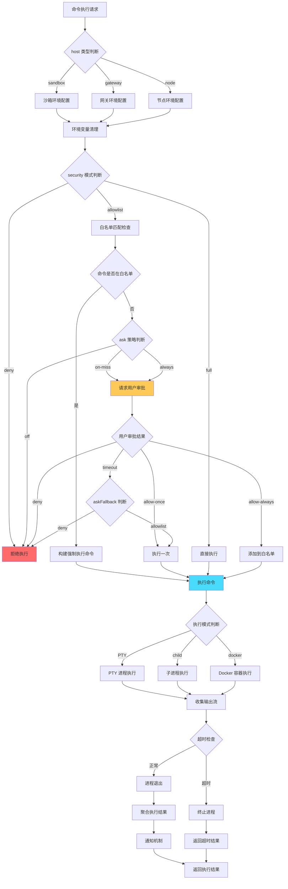
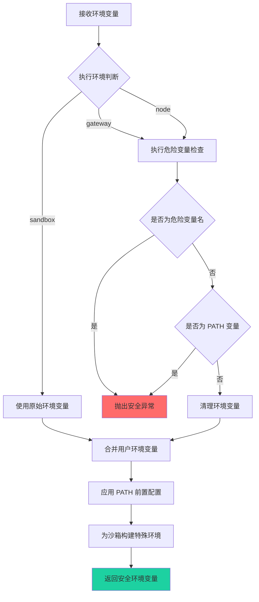
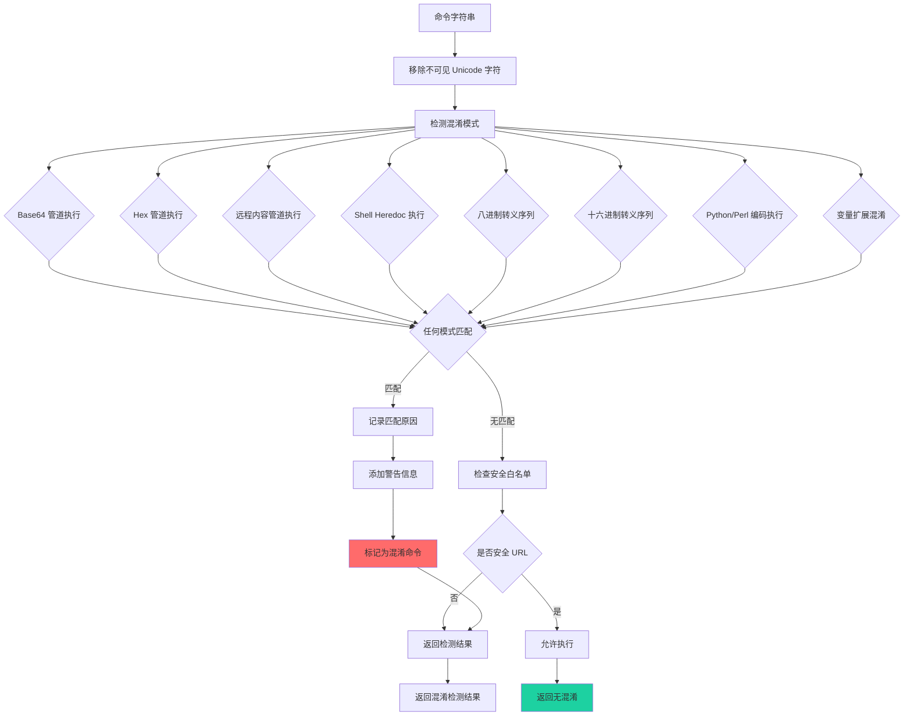

# OpenClaw 安全策略分析报告

## 1. 安全策略概述

OpenClaw 项目在工具调用和脚本执行过程中实现了多层安全防护机制，主要包括以下几个方面：

### 1.1 安全策略类型

| 策略类型 | 描述 | 级别 |
|---------|------|------|
| **执行主机策略 (ExecHost)** | 控制命令执行环境：sandbox/gateway/node | 高 |
| **安全模式策略 (ExecSecurity)** | 命令执行的信任级别：deny/allowlist/full | 高 |
| **审批策略 (ExecAsk)** | 用户审批时机：off/on-miss/always | 高 |
| **环境变量清理** | 防止危险环境变量传播 | 高 |
| **路径边界限制** | 防止目录遍历攻击 | 中 |
| **命令混淆检测** | 检测 Base64、Hex 等编码绕过 | 中 |
| **沙箱隔离** | Docker 容器执行隔离 | 高 |
| **超时控制** | 防止长时间占用资源 | 中 |

## 2. 安全策略类图

```mermaid
classDiagram
    direction TB

    class ExecToolFactory {
        +createExecTool(defaults): AgentTool
        +safeBins: SetString
        +safeBinProfiles: ProfileMap
    }

    class AgentTool {
        +name: string
        +execute(toolCallId, args, signal): AgentToolResult
    }

    class ExecToolDefaults {
        +cwd: string
        +env: EnvMap
        +timeout: number
        +backgroundMs: number
        +elevated: ExecElevatedDefaults
        +host: ExecHost
        +security: ExecSecurity
        +ask: ExecAsk
        +sandbox: SandboxConfig
        +safeBins: string[]
        +safeBinProfiles: ProfileFixtures
    }

    class BashExecRuntime {
        +runExecProcess(opts): ExecProcessHandle
        +sanitizeHostBaseEnv(env): EnvMap
        +validateHostEnv(env): void
        +buildSandboxEnv(params): EnvMap
    }

    class ExecApprovals {
        +loadExecApprovals(): ExecApprovalsResolved
        +normalizeExecHost(value): ExecHost
        +normalizeExecSecurity(value): ExecSecurity
        +normalizeExecAsk(value): ExecAsk
        +requiresExecApproval(params): boolean
        +evaluateShellAllowlist(params): AllowlistEvalResult
    }

    class ExecSecurity {
        <<enumeration>>
        deny
        allowlist
        full
    }

    class ExecAsk {
        <<enumeration>>
        off
        on-miss
        always
    }

    class ExecHost {
        <<enumeration>>
        sandbox
        gateway
        node
    }

    class SafeBinPolicy {
        +resolveSafeBinProfiles(fixtures): ProfileMap
        +resolveSafeBinRuntimePolicy(params): ExecSafeBinRuntimePolicy
        +isInterpreterLikeSafeBin(bin): boolean
        +validateSafeBinArgv(bin, argv): ValidationResult
    }

    class SafeBinProfile {
        +deniedFlags: string[]
        +maxArgv?: number
        +requireFlags?: string[]
        +argCount?: MinMax
    }

    class SandboxConfig {
        +containerName: string
        +workspaceDir: string
        +containerWorkdir: string
        +env: EnvMap
    }

    class SandboxToolPolicy {
        +allow: string[]
        +deny: string[]
        +resolveSandboxToolPolicyForAgent(cfg, agentId): SandboxToolPolicyResolved
        +isToolAllowed(policy, name): boolean
    }

    class PathPolicy {
        +toRelativeWorkspacePath(root, candidate): string
        +toRelativeSandboxPath(root, candidate): string
        +resolvePathFromInput(filePath, cwd): string
    }

    class ObfuscationDetector {
        +detectCommandObfuscation(command): ObfuscationDetection
        +stripInvisibleUnicode(command): string
    }

    class TimeoutManager {
        +resolveAgentTimeoutSeconds(cfg): number
        +resolveAgentTimeoutMs(opts): number
    }

    ExecToolFactory ..> AgentTool : creates
    ExecToolFactory --> ExecToolDefaults : uses
    ExecToolFactory --> BashExecRuntime : calls
    ExecToolFactory --> ExecApprovals : uses
    ExecToolFactory --> SafeBinPolicy : uses
    BashExecRuntime ..> SandboxConfig : optional
    BashExecRuntime ..> PathPolicy : uses for validation
    BashExecRuntime ..> ObfuscationDetector : checks
    ExecApprovals --> ExecSecurity : type
    ExecApprovals --> ExecAsk : type
    ExecApprovals --> ExecHost : type
    SafeBinPolicy ..> SafeBinProfile : returns
    SandboxToolPolicy ..> SandboxConfig : references
```



## 3. 安全管控流程图

### 3.1 命令执行安全流程



### 3.2 环境变量安全检查流程



### 3.3 命令混淆检测流程



## 4. 关键安全机制详解

### 4.1 环境变量安全清理

```typescript
// 危险环境变量黑名单
const DANGEROUS_HOST_ENV_VARS = new Set([
  "SUDO_COMMAND", "SUDO_USER", "SUDO_UID", "SUDO_GID",
  "DOAS_TOKEN", "DOAS_AUTH",
  "KRB5CCNAME", "KRB5_KTNAME",
  "AWS_ACCESS_KEY_ID", "AWS_SECRET_ACCESS_KEY",
  "AZURE_CLIENT_ID", "AZURE_CLIENT_SECRET",
  "GCP_SERVICE_ACCOUNT_KEY",
  "SECRET", "TOKEN", "PASSWORD", "PASSWD",
]);

// PATH 劫持检测：阻止添加不信任的目录到 PATH
// 防止二进制文件劫持攻击
```

### 4.2 沙箱工具策略

```typescript
// 默认拒绝的工具列表
const DEFAULT_TOOL_DENY = [
  "exec",           // 禁止在沙箱内执行命令
  "elevated",       // 禁止提权操作
  "sandbox-*",      // 禁止沙箱相关配置
];

// 默认允许的工具列表
const DEFAULT_TOOL_ALLOW = [
  "read",           // 读文件
  "glob",           // 文件搜索
  "Grep",           // 内容搜索
  "web",            // Web 搜索
  "thinking",       // 思考过程
];
```

### 4.3 Safe Bin 配置文件

```typescript
// 解释器类二进制文件黑名单
const INTERPRETER_LIKE_SAFE_BINS = new Set([
  "bash", "sh", "zsh", "fish", "dash", "ash", "ksh",
  "node", "deno", "bun",
  "python", "python2", "python3", "pypy",
  "ruby", "perl", "php",
  "powershell", "pwsh",
  "lua", "powershell.exe"
]);

// Safe Bin 配置文件示例
const SAFE_BIN_PROFILES = {
  "git": {
    deniedFlags: ["--pre-commit", "--commit-msg"],
    requireFlags: [],
  },
  "npm": {
    deniedFlags: ["--global", "-g"],
    maxArgv: 20,
  }
};
```

## 5. 配置文件结构

### 5.1 审批配置文件 (~/.openclaw/exec-approvals.json)

```json
{
  "version": 1,
  "socket": {
    "path": "~/.openclaw/exec-approvals.sock",
    "token": "auth_token_here"
  },
  "defaults": {
    "security": "allowlist",
    "ask": "on-miss",
    "askFallback": "deny",
    "autoAllowSkills": false
  },
  "agents": {
    "default": {
      "security": "deny",
      "ask": "always",
      "allowlist": [
        { "pattern": "git status", "id": "uuid-1" },
        { "pattern": "ls *", "id": "uuid-2" }
      ]
    },
    "*": {
      "security": "deny",
      "ask": "always"
    }
  }
}
```

### 5.2 沙箱配置文件

```yaml
agents:
  defaults:
    sandbox:
      mode: "non-main"  # non-main | all | none
      tools:
        allow:
          - "read"
          - "Grep"
          - "glob"
        deny:
          - "exec"
          - "elevated"
tools:
  exec:
    host: "sandbox"
    security: "deny"
    ask: "always"
    timeoutSeconds: 300
    safeBins:
      - "git"
      - "ls"
      - "cat"
    safeBinProfiles:
      git:
        deniedFlags:
          - "--push"
          - "--force-push"
```

## 6. 安全性总结

### 6.1 多层防护架构

1. **第一层：执行环境隔离**
   - Sandbox 模式使用 Docker 容器隔离
   - Gateway 模式在宿主机执行但有环境限制
   - Node 模式在远程配对节点执行

2. **第二层：审批控制**
   - Deny 模式：默认拒绝所有执行
   - Allowlist 模式：仅允许白名单命令
   - Full 模式：完全信任（需谨慎使用）

3. **第三层：参数验证**
   - 环境变量清理和验证
   - PATH 劫持检测
   - 命令混淆检测

4. **第四层：运行时限制**
   - 超时控制
   - 输出大小限制
   - 后台执行控制

### 6.2 安全建议

| 场景 | 推荐配置 |
|------|----------|
| 开发环境 | `security: "allowlist"`, `ask: "on-miss"` |
| 生产环境 | `security: "deny"`, `ask: "always"` |
| 自动化任务 | `security: "allowlist"`, `ask: "off"` |
| 高风险操作 | 使用 Sandbox 模式 + 白名单 |

### 6.3 已知限制

- Safe Bin 配置不会阻止解释器类二进制执行任意代码
- 沙箱模式需要 Docker 运行时支持
- 审批机制依赖 Unix Domain Socket 通信

## 7. 核心代码文件详解

### 7.1 exec 工具主实现

**文件路径**: [src/agents/bash-tools.exec.ts](file:///d:/prj/openclaw_analyze/src/agents/bash-tools.exec.ts)

**核心职责**:
- `createExecTool()` - 创建 exec 工具实例
- `execute()` - 命令执行入口，处理 sandbox/gateway/node 三种执行模式

**关键安全逻辑**:
```typescript
// 安全策略解析
const configuredSecurity = defaults?.security ?? (host === "sandbox" ? "deny" : "allowlist");
const requestedSecurity = normalizeExecSecurity(params.security);
let security = minSecurity(configuredSecurity, requestedSecurity ?? configuredSecurity);

// 审批策略解析
const configuredAsk = defaults?.ask ?? loadExecApprovals().defaults?.ask ?? "on-miss";
const requestedAsk = normalizeExecAsk(params.ask);
let ask = maxAsk(configuredAsk, requestedAsk ?? configuredAsk);

// 提权检查
if (elevatedRequested && elevatedMode === "full") {
  security = "full";
  ask = "off"; // 完全绕过审批
}
```

### 7.2 执行运行时核心

**文件路径**: [src/agents/bash-tools.exec-runtime.ts](file:///d:/prj/openclaw_analyze/src/agents/bash-tools.exec-runtime.ts)

**核心职责**:
- `runExecProcess()` - 进程执行入口
- `sanitizeHostBaseEnv()` - 清理危险环境变量
- `validateHostEnv()` - 验证环境变量安全性

**关键安全逻辑**:
```typescript
// 危险环境变量黑名单
const DANGEROUS_HOST_ENV_VARS = new Set([
  "SUDO_COMMAND", "SUDO_USER", "SUDO_UID", "SUDO_GID",
  "DOAS_TOKEN", "DOAS_AUTH",
  "KRB5CCNAME", "KRB5_KTNAME",
  "AWS_ACCESS_KEY_ID", "AWS_SECRET_ACCESS_KEY",
  "AZURE_CLIENT_ID", "AZURE_CLIENT_SECRET",
  "GCP_SERVICE_ACCOUNT_KEY",
  "SECRET", "TOKEN", "PASSWORD", "PASSWD",
]);

// 环境变量清理函数
export function sanitizeHostBaseEnv(env: Record<string, string>): Record<string, string> {
  const sanitized: Record<string, string> = {};
  for (const [key, value] of Object.entries(env)) {
    const upperKey = key.toUpperCase();
    if (upperKey === "PATH") {
      sanitized[key] = value;
      continue;
    }
    if (isDangerousHostEnvVarName(upperKey)) {
      continue; // 跳过危险变量
    }
    sanitized[key] = value;
  }
  return sanitized;
}
```

### 7.3 审批机制核心

**文件路径**: [src/infra/exec-approvals.ts](file:///d:/prj/openclaw_analyze/src/infra/exec-approvals.ts)

**核心职责**:
- 配置文件读写与规范化
- 安全策略（deny/allowlist/full）解析
- 审批策略（off/on-miss/always）解析
- 允许列表管理

**关键类型定义**:
```typescript
export type ExecHost = "sandbox" | "gateway" | "node";
export type ExecSecurity = "deny" | "allowlist" | "full";
export type ExecAsk = "off" | "on-miss" | "always";

export type ExecApprovalsFile = {
  version: 1;
  socket?: { path?: string; token?: string };
  defaults?: ExecApprovalsDefaults;
  agents?: Record<string, ExecApprovalsAgent>;
};
```

### 7.4 白名单管理

**文件路径**: [src/infra/exec-approvals-allowlist.ts](file:///d:/prj/openclaw_analyze/src/infra/exec-approvals-allowlist.ts)

**核心职责**:
- `evaluateShellAllowlist()` - 评估命令是否匹配白名单
- `buildEnforcedShellCommand()` - 构建强制执行的命令
- `requiresExecApproval()` - 判断是否需要审批

**关键安全逻辑**:
```typescript
export function requiresExecApproval(params: {
  ask: ExecAsk;
  security: ExecSecurity;
  analysisOk: boolean;
  allowlistSatisfied: boolean;
}): boolean {
  // ask=off 时从不询问
  if (params.ask === "off") return false;

  // ask=always 时始终询问
  if (params.ask === "always") return true;

  // ask=on-miss 时，仅在 allowlist 未命中时询问
  return !params.allowlistSatisfied;
}
```

### 7.5 Safe Bin 策略

**文件路径**: [src/infra/exec-safe-bin-policy.ts](file:///d:/prj/openclaw_analyze/src/infra/exec-safe-bin-policy.ts)

**核心职责**:
- 解析 safeBins 配置（白名单二进制文件）
- 解析 safeBinProfiles 配置（二进制参数限制）
- 识别解释器类二进制文件

**关键逻辑**:
```typescript
const INTERPRETER_LIKE_SAFE_BINS = new Set([
  "bash", "sh", "zsh", "fish", "dash", "ash", "ksh",
  "node", "deno", "bun",
  "python", "python2", "python3", "pypy",
  "ruby", "perl", "php",
  "powershell", "pwsh",
  "lua"
]);

export function isInterpreterLikeSafeBin(raw: string): boolean {
  // 解释器类二进制需要特殊处理，因为它们可以执行任意代码
}
```

### 7.6 命令混淆检测

**文件路径**: [src/infra/exec-obfuscation-detect.ts](file:///d:/prj/openclaw_analyze/src/infra/exec-obfuscation-detect.ts)

**核心职责**:
- `detectCommandObfuscation()` - 检测命令混淆模式
- 识别 Base64/Hex 编码绕过
- 检测远程内容管道执行

**检测模式（15+ 种）**:
```typescript
const OBFUSCATION_PATTERNS = [
  { id: "base64-pipe-exec", regex: /base64\s+(?:-d|--decode)\b.*\|\s*sh/i },
  { id: "hex-pipe-exec", regex: /xxd\s+-r\b.*\|\s*sh/i },
  { id: "curl-pipe-shell", regex: /(?:curl|wget)\s+.*\|\s*sh/i },
  { id: "shell-heredoc-exec", regex: /(?:sh|bash)\s+<<-?\s*['"]?/i },
  { id: "octal-escape", regex: /\$'(?:[^']*\\[0-7]{3}){2,}/ },
  { id: "hex-escape", regex: /\$'(?:[^']*\\x[0-9a-fA-F]{2}){2,}/ },
  // ... 更多模式
];
```

### 7.7 沙箱工具策略

**文件路径**: [src/agents/sandbox/tool-policy.ts](file:///d:/prj/openclaw_analyze/src/agents/sandbox/tool-policy.ts)

**核心职责**:
- `resolveSandboxToolPolicyForAgent()` - 解析沙箱工具策略
- `isToolAllowed()` - 判断工具是否允许执行

**默认策略**:
```typescript
const DEFAULT_TOOL_DENY = [
  "exec",           // 禁止执行命令
  "elevated",       // 禁止提权
  "sandbox-*",      // 禁止沙箱配置
];

const DEFAULT_TOOL_ALLOW = [
  "read",           // 读文件
  "glob",           // 文件搜索
  "Grep",           // 内容搜索
  "web",            // Web 搜索
  "thinking",       // 思考过程
];
```

### 7.8 路径边界限制

**文件路径**: [src/agents/path-policy.ts](file:///d:/prj/openclaw_analyze/src/agents/path-policy.ts)

**核心职责**:
- `toRelativeWorkspacePath()` - 验证工作区路径边界
- `toRelativeSandboxPath()` - 验证沙箱路径边界
- 防止目录遍历攻击

**关键逻辑**:
```typescript
export function toRelativeWorkspacePath(
  root: string,
  candidate: string,
  options?: RelativePathOptions,
): string {
  // 计算相对路径
  const relative = path.relative(root, resolvedCandidate);

  // 验证路径不超出边界
  if (relative.startsWith("..") || path.isAbsolute(relative)) {
    throw new Error(`Path escapes workspace root: ${candidate}`);
  }
  return relative;
}
```

### 7.9 超时管理

**文件路径**: [src/agents/timeout.ts](file:///d:/prj/openclaw_analyze/src/agents/timeout.ts)

**核心职责**:
- `resolveAgentTimeoutSeconds()` - 解析代理超时配置
- `resolveAgentTimeoutMs()` - 计算最终超时毫秒数

**关键常量**:
```typescript
const DEFAULT_AGENT_TIMEOUT_SECONDS = 600; // 默认 10 分钟
const MAX_SAFE_TIMEOUT_MS = 2_147_000_000; // 最大安全超时

export function resolveAgentTimeoutMs(opts: {
  cfg?: OpenClawConfig;
  overrideMs?: number | null;
  overrideSeconds?: number | null;
  minMs?: number;
}): number {
  // 支持显式设置 0 表示无超时
  // 自动限制在 MAX_SAFE_TIMEOUT_MS 范围内
}
```

### 7.10 网关白名单处理

**文件路径**: [src/agents/bash-tools.exec-host-gateway.ts](file:///d:/prj/openclaw_analyze/src/agents/bash-tools.exec-host-gateway.ts)

**核心职责**:
- `processGatewayAllowlist()` - 处理网关白名单审批
- 命令分析和审批流程
- 异步审批结果处理

**关键逻辑**:
```typescript
export async function processGatewayAllowlist(
  params: ProcessGatewayAllowlistParams,
): Promise<ProcessGatewayAllowlistResult> {
  // 1. 解析审批上下文
  const { approvals, hostSecurity, hostAsk } = resolveExecHostApprovalContext({
    agentId: params.agentId,
    security: params.security,
    ask: params.ask,
    host: "gateway",
  });

  // 2. 评估白名单匹配
  const allowlistEval = evaluateShellAllowlist({ ... });

  // 3. 检测命令混淆
  const obfuscation = detectCommandObfuscation(params.command);
  if (obfuscation.detected) {
    // 添加警告信息
  }

  // 4. 判断是否需要审批
  const requiresAsk = requiresExecApproval({ ... }) || obfuscation.detected;

  // 5. 需要审批时，创建审批请求
  if (requiresAsk) {
    return { pendingResult: buildExecApprovalPendingToolResult({ ... }) };
  }

  // 6. 直接执行
  return { execCommandOverride: enforcedCommand };
}
```

## 8. 代码文件索引

| 模块 | 文件路径 | 行数 | 主要功能 |
|------|---------|------|----------|
| exec 工具 | [bash-tools.exec.ts](file:///d:/prj/openclaw_analyze/src/agents/bash-tools.exec.ts) | 791 | exec 工具工厂、参数处理、模式分发 |
| 执行运行时 | [bash-tools.exec-runtime.ts](file:///d:/prj/openclaw_analyze/src/agents/bash-tools.exec-runtime.ts) | 796 | 进程管理、环境变量清理、超时控制 |
| 执行共享 | [bash-tools.shared.ts](file:///d:/prj/openclaw_analyze/src/agents/bash-tools.shared.ts) | ~200 | 沙箱配置、Docker 参数构建 |
| 审批核心 | [exec-approvals.ts](file:///d:/prj/openclaw_analyze/src/infra/exec-approvals.ts) | ~500 | 审批配置管理、策略解析 |
| 白名单管理 | [exec-approvals-allowlist.ts](file:///d:/prj/openclaw_analyze/src/infra/exec-approvals-allowlist.ts) | ~300 | 白名单匹配、审批判断 |
| Safe Bin 策略 | [exec-safe-bin-policy.ts](file:///d:/prj/openclaw_analyze/src/infra/exec-safe-bin-policy.ts) | ~160 | 二进制白名单、参数限制 |
| 混淆检测 | [exec-obfuscation-detect.ts](file:///d:/prj/openclaw_analyze/src/infra/exec-obfuscation-detect.ts) | ~200 | 命令混淆模式识别 |
| 沙箱工具策略 | [sandbox/tool-policy.ts](file:///d:/prj/openclaw_analyze/src/agents/sandbox/tool-policy.ts) | ~109 | 沙箱工具白名单/黑名单 |
| 路径策略 | [path-policy.ts](file:///d:/prj/openclaw_analyze/src/agents/path-policy.ts) | ~134 | 路径边界验证 |
| 超时管理 | [timeout.ts](file:///d:/prj/openclaw_analyze/src/agents/timeout.ts) | ~48 | 超时配置解析 |
| 网关处理 | [bash-tools.exec-host-gateway.ts](file:///d:/prj/openclaw_analyze/src/agents/bash-tools.exec-host-gateway.ts) | ~319 | 网关模式白名单审批 |
| 沙箱上下文 | [sandbox/context.ts](file:///d:/prj/openclaw_analyze/src/agents/sandbox/context.ts) | ~200 | 沙箱工作区管理 |
| 审批请求 | [bash-tools.exec-approval-request.ts](file:///d:/prj/openclaw_analyze/src/agents/bash-tools.exec-approval-request.ts) | ~200 | 审批请求创建与注册 |
| 审批共享 | [bash-tools.exec-host-shared.ts](file:///d:/prj/openclaw_analyze/src/agents/bash-tools.exec-host-shared.ts) | ~400 | 审批结果处理、通知机制 |
