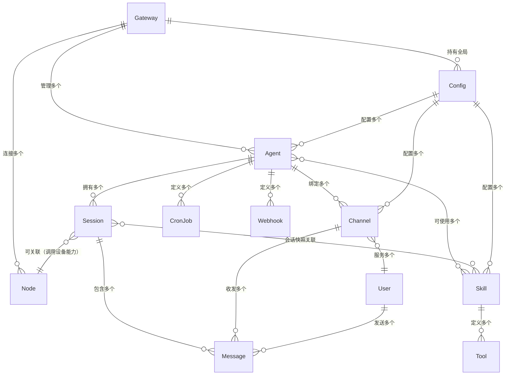

# OpenClaw 核心实体关系模型分析

## 一、核心实体定义

OpenClaw系统包含以下核心实体，每个实体代表系统中的一个独立概念或资源：

| 实体        | 描述                                                | 核心属性                                                       |
| ----------- | --------------------------------------------------- | -------------------------------------------------------------- |
| **Gateway** | 系统核心控制平面，所有组件的调度中心                | 版本、运行状态、监听端口、配置                                 |
| **Agent**   | AI代理实例，每个Agent有独立的个性、模型配置和工作区 | ID、名称、模型配置、工作区目录、权限策略                       |
| **Session** | 会话，包含一段对话的完整上下文和历史消息            | 会话Key、所属Agent、最后活跃时间、过期策略、发送策略           |
| **Message** | 消息实体，代表用户或AI的一次交互内容                | ID、会话ID、发送者、内容、时间戳、附件、元数据                 |
| **Channel** | 消息渠道，对接各类即时通讯平台                      | 类型（Discord/Telegram/WhatsApp等）、账号配置、状态、所属Agent |
| **User**    | 用户实体，与系统交互的主体                          | ID、名称、渠道标识、权限级别、配对状态                         |
| **Skill**   | 技能扩展，为AI提供额外的领域能力                    | 名称、描述、元数据、依赖要求、安装配置、文件路径               |
| **Tool**    | 工具，AI可调用的具体能力接口                        | 名称、参数定义、实现逻辑、权限要求                             |
| **Node**    | 设备节点，提供本地设备能力（摄像头、位置、通知等）  | ID、类型（macOS/iOS/Android）、能力列表、连接状态、配对信息    |
| **Config**  | 配置实体，控制系统各组件的行为                      | 全局配置、Agent配置、Channel配置、Skill配置                    |
| **CronJob** | 定时任务，按设定时间自动执行的任务                  | ID、所属Agent、调度表达式、任务内容、执行状态、最后运行时间    |
| **Webhook** | Web钩子，接收外部系统请求并触发自动化流程           | ID、所属Agent、路径、触发条件、处理逻辑                        |

---

## 二、实体关系图（ER Diagram）



---

## 三、实体关系说明

### 1. 核心层级关系

- **Gateway**是系统的根实体，管理所有Agent、Node和全局配置
- **Agent**是独立的AI实例，每个Agent有自己的会话、渠道、任务和技能集，支持多租户隔离
- **Session**是对话的上下文容器，每个Session属于一个Agent，包含多条消息

### 2. 消息流关系

- **User**通过**Channel**发送**Message**到系统
- **Message**被路由到对应的**Session**中
- **Agent**处理**Session**中的消息，生成回复Message
- 回复Message通过原**Channel**发送回**User**

### 3. 能力扩展关系

- **Skill**是功能扩展包，每个Skill定义了一组**Tool**
- **Agent**可以使用多个Skill，会话开始时会生成Skill快照注入到系统提示中
- AI通过调用**Tool**来执行具体操作，包括调用**Node**的设备能力

### 4. 自动化关系

- **CronJob**按时间触发，创建新的Session执行预设任务
- **Webhook**接收外部HTTP请求，触发对应的自动化流程
- **Node**提供设备级能力，Agent可以调用Node的摄像头、位置、通知等功能

---

## 四、关键实体约束与特性

### Session 会话Key规则

会话Key采用分层命名规范，确保跨渠道会话隔离或共享：

- 单用户跨渠道共享：`agent:<agentId>:<mainKey>`
- 按用户隔离：`agent:<agentId>:dm:<peerId>`
- 按渠道+用户隔离：`agent:<agentId>:<channel>:dm:<peerId>`
- 群组隔离：`agent:<agentId>:<channel>:group:<id>`
- 定时任务：`cron:<job.id>`
- Webhook：`hook:<uuid>`

### Skill 优先级规则

同名Skill按优先级加载：

1. 工作区Skill（`<workspace>/skills`）- 最高优先级
2. 托管Skill（`~/.openclaw/skills`）
3. 内置Skill（随系统发布）- 最低优先级
4. 额外目录Skill（`skills.load.extraDirs`配置）

### 会话生命周期

- 会话默认每日凌晨4点（Gateway本地时间）自动重置
- 会话过期后下次消息到达时会创建新会话
- 支持自定义会话重置策略和过期时间

---

## 五、典型实体交互流程示例

### 用户消息处理流程

```
User → Channel → Message → Session → Agent → (Skill + Tool) → 生成回复Message → Channel → User
                              ↑                              ↑
                              └─── 会话历史 ─── Skill快照 ────┘
```

### 定时任务执行流程

```
CronJob → 触发 → 创建Session → Agent → (Skill + Tool) → 执行任务 → 生成结果 → (可选)通知User
```

### 设备能力调用流程

```
Agent → Tool调用 → Gateway → Node → 执行设备操作 → 返回结果 → Agent → 生成回复
```

这种实体设计使得系统具有良好的扩展性：

- 新增Channel只需要添加对应Channel实体实现
- 新增功能只需要添加Skill实体
- 新增设备类型只需要添加对应Node实体
- 多用户/多场景支持通过创建多个Agent实体实现
