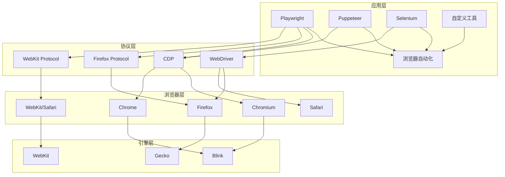

# 浏览器操控技术架构分析

## CDP 与 Playwright 的关系

**CDP (Chrome DevTools Protocol)** 是底层协议，**Playwright** 是上层自动化框架。Playwright 通过 CDP 与浏览器通信。

## 浏览器操控技术架构

```
┌─────────────────────────────────────────────────────────────────┐
│                      应用层 (Applications)                       │
│         Selenium / Playwright / Puppeteer / CDP-CLI             │
└─────────────────────────────────────────────────────────────────┘
                              ↓
┌─────────────────────────────────────────────────────────────────┐
│                    协议层 (Protocols)                            │
│  ┌─────────────┐  ┌─────────────┐  ┌─────────────────────────┐  │
│  │   CDP       │  │  WebDriver  │  │    BiDi (新兴)          │  │
│  │ (Chrome 专用)│  │  (W3C 标准)  │  │  (双向协议，跨浏览器)    │  │
│  └─────────────┘  └─────────────┘  └─────────────────────────┘  │
└─────────────────────────────────────────────────────────────────┘
                              ↓
┌─────────────────────────────────────────────────────────────────┐
│                   浏览器层 (Browsers)                            │
│  ┌──────────┐  ┌──────────┐  ┌──────────┐  ┌──────────────┐    │
│  │ Chromium │  │  Firefox │  │  WebKit  │  │   Chrome     │    │
│  │          │  │          │  │          │  │   (基于 CDP)  │    │
│  └──────────┘  └──────────┘  └──────────┘  └──────────────┘    │
└─────────────────────────────────────────────────────────────────┘
                              ↓
┌─────────────────────────────────────────────────────────────────┐
│                   渲染引擎层 (Rendering Engines)                  │
│  ┌──────────┐  ┌──────────┐  ┌──────────┐                       │
│  │ Blink    │  │ Gecko    │  │ WebKit   │                       │
│  │(Chromium)│  │ (Firefox)│  │ (Safari) │                       │
│  └──────────┘  └──────────┘  └──────────┘                       │
└─────────────────────────────────────────────────────────────────┘
```

## 关键技术点对比

| 技术 | 层级 | 特点 | 适用场景 |
|------|------|------|----------|
| **CDP** | 协议层 | Chrome/Chromium 专用，功能最全，支持性能分析/网络拦截/调试 | 深度浏览器控制、性能分析、调试工具 |
| **Playwright** | 应用层 | 跨浏览器 (Chromium/Firefox/WebKit)，基于 CDP+WebDriver，API 现代化 | 端到端测试、爬虫、自动化任务 |
| **Puppeteer** | 应用层 | 官方 Chrome 控制库，直接用 CDP，轻量快速 | Chrome 专用自动化、截图、PDF 生成 |
| **Selenium** | 应用层 | 最老牌的 WebDriver 封装，生态最大但 API 较旧 | 传统项目、跨团队标准化测试 |
| **WebDriver** | 协议层 | W3C 标准协议，跨浏览器但功能有限 | 标准化测试、跨浏览器兼容 |
| **BiDi** | 协议层 | 新兴双向协议，旨在统一 CDP 和 WebDriver | 未来标准 (尚在发展中) |

## 技术关系说明

1. **Playwright → CDP**: Playwright 在 Chromium 上使用 CDP 进行底层通信，在 Firefox/WebKit 上使用各自的后端协议
2. **Puppeteer → CDP**: 直接使用 CDP，是 Google 官方维护的 Chrome 控制库
3. **Selenium → WebDriver**: 通过 WebDriver 协议与浏览器通信，更标准化但功能较少
4. **CDP → Chromium**: Chrome DevTools Protocol 是 Chromium 项目的调试协议，只有 Chromium 系浏览器支持

## 架构图 (Mermaid)



## 核心差异

### CDP 的优势
- 功能最全：网络拦截、性能分析、覆盖率测试、DOM 调试
- 实时通信：WebSocket 双向通信
- Chrome 原生支持

### Playwright 的优势
- 跨浏览器：一套代码跑 Chromium/Firefox/WebKit
- 高级特性：自动等待、网络 mocking、多上下文
- 现代化 API：Promise/Async 友好

## 选择建议

- **只用 Chrome 且需要深度控制** → **Puppeteer (直接用 CDP)**
- **需要跨浏览器测试** → **Playwright**
- **企业标准化测试** → **Selenium**
- **性能分析/调试工具开发** → **直接用 CDP**

---

*生成时间：2026-03-31 10:26 (Asia/Shanghai)*
