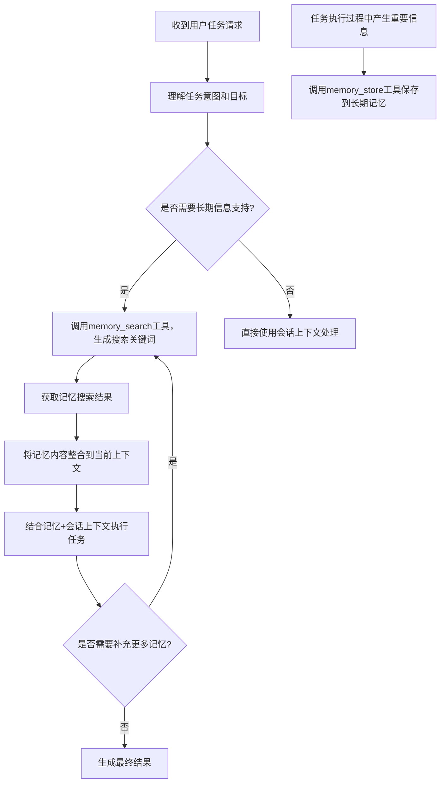
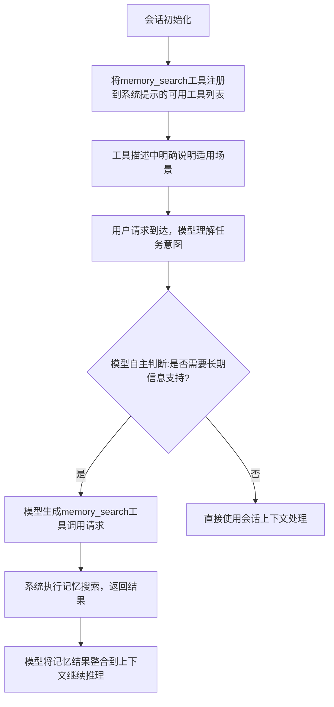
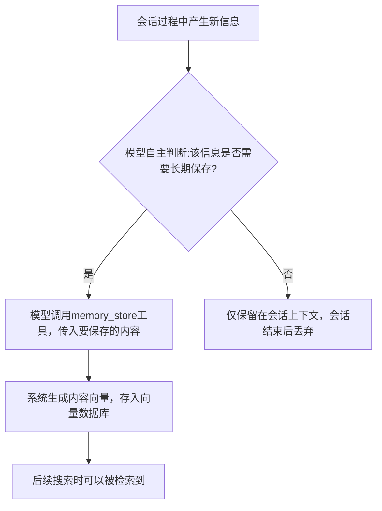

# 记忆使用流程与决策逻辑分析

## 一、核心设计原则

OpenClaw记忆系统采用**"模型自主决策，系统仅提供工具能力"**的设计理念，没有硬编码的规则来判断"是否需要使用记忆"或"哪些内容需要保存到记忆"，所有决策完全交给大语言模型自主判断，系统只负责提供标准化的工具接口和能力保障。这种设计灵活性极高，可以适配任意场景的记忆使用需求。

---

## 二、Agent使用记忆的完整流程与典型场景

### 1. 记忆使用完整流程



### 2. 核心特点

- 记忆调用完全由Agent自主决策，系统不强制注入，避免不必要的token消耗
- 记忆内容作为额外上下文补充到当前会话中，不替换原有会话历史
- 支持多轮检索，Agent可以根据需要多次调用记忆工具补充信息
- 重要信息可以主动保存到记忆中，实现长期知识沉淀

### 3. 典型使用场景

| 场景类型             | 描述                                   | 示例                                             |
| -------------------- | -------------------------------------- | ------------------------------------------------ |
| **个性化回复适配**   | 根据用户历史偏好、习惯定制回复内容     | 用户偏好简洁回复，Agent自动简化输出              |
| **跨会话上下文延续** | 跨多轮对话甚至多天的任务衔接           | 上周讨论过的项目方案，本周继续讨论不需要重复说明 |
| **个人知识库查询**   | 检索用户存储的笔记、文档、项目资料     | 回答项目架构、技术方案、会议记录等问题           |
| **历史经验复用**     | 利用之前解决同类问题的经验优化当前任务 | 上次部署失败的解决方案，本次自动规避             |
| **长期任务进度跟踪** | 记录长周期任务进度，支持断点续做       | 每周自动生成项目进度报告，对比历史内容           |
| **事实一致性校验**   | 检索已知事实避免回答矛盾或错误信息     | 记住用户服务器IP，后续操作不会使用错误地址       |
| **会话历史信息提取** | 从冗长历史对话中快速定位关键信息       | 回答"之前定的上线时间是几号？"这类问题           |

---

## 三、"是否需要使用记忆"的判断流程与代码实现

### 1. 完整判断流程



### 2. 关键实现代码

#### （1）记忆工具的描述定义（引导模型正确使用）

系统在注册记忆工具时提供明确的场景描述，指导模型在合适时机调用：

```typescript
// 文件位置: extensions/memory-core/index.ts 工具注册
api.registerTool(
  (ctx) => {
    const memorySearchTool = api.runtime.tools.createMemorySearchTool({
      config: ctx.config,
      agentSessionKey: ctx.sessionKey,
    });
    return memorySearchTool ? [memorySearchTool] : null;
  },
  { names: ["memory_search"] },
);

// memory_search工具的标准描述（模型看到的使用说明）
{
  name: "memory_search",
  description: "语义搜索记忆文件中的相关内容。当你需要查询用户的历史偏好、之前讨论过的内容、项目文档、笔记资料等不在当前会话上下文中的长期信息时使用。",
  parameters: {
    type: "object",
    properties: {
      query: { type: "string", description: "要搜索的关键词或自然语言查询" },
      limit: { type: "number", description: "返回结果数量，默认5" }
    },
    required: ["query"]
  }
}
```

[查看完整工具注册代码](file:///d:/prj/openclaw_analyze/extensions/memory-core/index.ts#L10-L25)

#### （2）系统提示注入逻辑

记忆工具会自动注入到系统提示的可用工具列表，模型每次推理都能看到工具能力：

```typescript
// 文件位置: src/agents/pi-embedded-runner/prompt.ts
function buildSystemPrompt(opts: BuildPromptOptions) {
  const systemPrompt = [
    opts.basePrompt,
    // 注入可用工具列表，包含memory_search
    buildAvailableToolsPrompt(opts.tools),
    // 注入工具使用规范，指导模型何时调用工具
    buildToolUsageInstructions(),
  ].join("\n\n");
  return systemPrompt;
}
```

---

## 四、"哪些内容需要保存到记忆"的判断流程与代码实现

记忆保存逻辑根据记忆插件类型不同有所区别：

### 类型1：默认`memory-core`插件（基于文件的记忆）

**无自动保存逻辑**：所有记忆内容来自用户手动编辑的`MEMORY.md`和`memory/`目录下的Markdown文件，系统仅负责索引和检索，不会主动修改或写入任何内容到这些文件。

---

### 类型2：`memory-lancedb`等主动记忆插件

支持模型主动调用`memory_store`工具保存信息，判断逻辑同样由模型自主决策。

#### 1. 完整保存流程



#### 2. 关键实现代码

##### （1）`memory_store`工具注册与描述

```typescript
// 文件位置: extensions/memory-lancedb/index.ts
api.registerTool(
  {
    name: "memory_store",
    label: "Memory Store",
    description:
      "保存重要信息到长期记忆中。当你获取到用户的偏好、重要事实、任务结果、关键决策、需要长期记住的内容时使用。",
    parameters: Type.Object({
      text: Type.String({ description: "需要保存的信息内容，尽量完整且语义清晰" }),
      importance: Type.Optional(
        Type.Number({
          description: "信息重要性0-1，默认0.7，越高越容易被检索到",
          minimum: 0,
          maximum: 1,
        }),
      ),
      category: Type.Optional(
        Type.Unsafe<MemoryCategory>({
          type: "string",
          enum: [...MEMORY_CATEGORIES],
          description: "信息分类，如user_preference、project_note、task_result等",
        }),
      ),
    }),
    async handler({ text, importance = 0.7, category = "general" }) {
      // 生成内容向量
      const vector = await embeddings.embed(text);
      // 存入LanceDB
      const id = await db.insert({
        text,
        vector,
        importance,
        category,
        createdAt: Date.now(),
      });
      return { success: true, memoryId: id };
    },
  },
  { name: "memory_store" },
);
```

[查看完整memory_store实现](file:///d:/prj/openclaw_analyze/extensions/memory-lancedb/index.ts#L358-L420)

##### （2）模型保存决策引导

在系统提示中明确指导模型何时应该保存信息：

```
# 记忆使用规范
- 当用户告诉你个人偏好、重要事实、项目信息等需要长期记住的内容时，主动调用memory_store工具保存
- 完成重要任务后，将结果和关键结论保存到记忆
- 保存时尽量保留完整上下文，避免碎片化信息
```

---

## 五、设计优势

1. **零硬编码规则**：没有预设判断条件，完全由模型根据上下文和任务自主决策，适配无限场景
2. **透明工具契约**：通过清晰的工具描述明确告知模型能力和适用场景，模型会按照契约正确使用
3. **能力可扩展**：新增记忆相关能力只需新增工具，不需要修改判断逻辑
4. **用户可控**：用户可以通过系统提示调整记忆使用策略，比如"不要主动保存信息"或"所有重要内容都要保存"

这种设计完全利用了大模型的理解能力，避免了传统规则系统的僵化问题，同时保持了足够的可控性。
