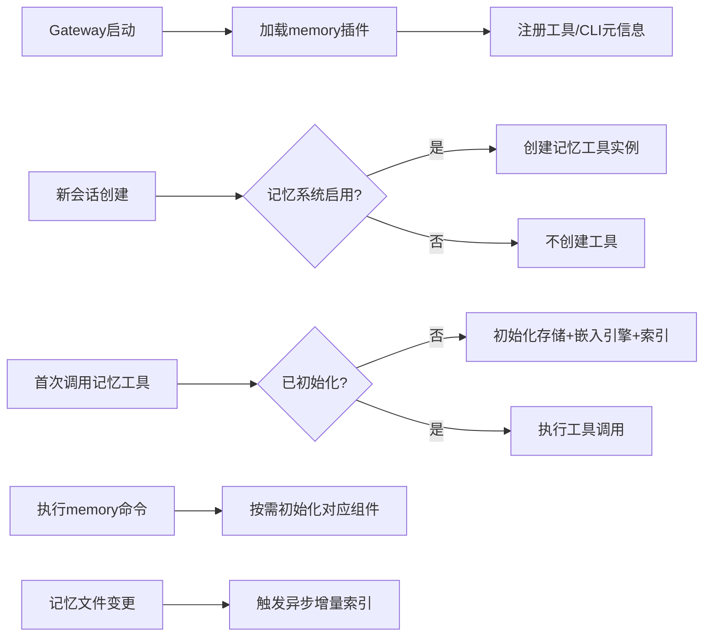

# 记忆系统初始化场景与入口分析

记忆系统采用**插件化+懒加载**的初始化设计，分为全局初始化、运行时初始化和手动触发初始化三类场景，以下是所有初始化场景的详细分析：

---

## 一、初始化场景总览
| 场景类型 | 触发时机 | 初始化范围 | 延迟特性 |
|---------|----------|------------|----------|
| 全局插件加载初始化 | Gateway启动时 | 插件注册、工具/CLI声明 | 轻量，仅注册元信息 |
| 会话级工具初始化 | 新会话创建时 | 记忆工具实例创建 | 按需创建，仅当配置启用记忆系统时 |
| 懒加载初始化 | 记忆工具首次调用时 | 存储引擎、嵌入引擎、索引初始化 | 仅实际使用时才执行重的消耗资源 |
| CLI命令初始化 | 执行`openclaw memory`命令时 | 对应命令所需组件初始化 | 按需初始化 |
| 手动重建初始化 | 执行`memory index --force` | 全量索引重建 | 主动触发 |
| 增量更新初始化 | 记忆文件变更时 | 变更文件的增量索引 | 后台异步执行 |

---

## 二、各场景详细分析与代码块

### 1. 全局插件加载初始化
**触发时机**：Gateway启动阶段，插件系统加载记忆插件时
**初始化内容**：注册记忆工具声明、注册CLI命令元信息
**代码位置**：[extensions/memory-core/index.ts](file:///d:/prj/openclaw_analyze/extensions/memory-core/index.ts)

```typescript
// memory-core插件注册入口
const memoryCorePlugin = {
  id: "memory-core",
  name: "Memory (Core)",
  description: "File-backed memory search tools and CLI",
  kind: "memory",
  configSchema: emptyPluginConfigSchema(),
  
  // 插件注册主入口，Gateway启动时执行
  register(api: OpenClawPluginApi) {
    // 注册记忆工具声明（仅元信息，不初始化实际资源）
    api.registerTool(
      (ctx) => {
        // 会话级创建记忆工具实例，这里仅返回工具定义
        const memorySearchTool = api.runtime.tools.createMemorySearchTool({
          config: ctx.config,
          agentSessionKey: ctx.sessionKey,
        });
        const memoryGetTool = api.runtime.tools.createMemoryGetTool({
          config: ctx.config,
          agentSessionKey: ctx.sessionKey,
        });
        if (!memorySearchTool || !memoryGetTool) {
          return null;
        }
        return [memorySearchTool, memoryGetTool];
      },
      { names: ["memory_search", "memory_get"] },
    );

    // 注册CLI命令声明
    api.registerCli(
      ({ program }) => {
        api.runtime.tools.registerMemoryCli(program);
      },
      { commands: ["memory"] },
    );
  },
};
```
**说明**：此阶段仅进行轻量级的元信息注册，不初始化存储、嵌入引擎等资源，避免启动时不必要的开销。

---

### 2. 会话级工具初始化
**触发时机**：新会话创建时，根据Agent实例化可用工具集时
**初始化内容**：创建属于当前会话的记忆工具实例
**代码位置**：插件register方法的工具创建回调，会话创建时动态调用

```typescript
// 会话创建时调用，每个会话独立的记忆工具实例
(ctx) => {
  // 根据会话配置判断是否启用记忆系统
  if (!ctx.config.agents?.[ctx.agentId]?.memorySearch?.enabled) {
    return null; // 记忆系统未启用，不创建工具
  }
  
  // 创建会话级记忆工具实例
  const memorySearchTool = api.runtime.tools.createMemorySearchTool({
    config: ctx.config,
    agentSessionKey: ctx.sessionKey, // 绑定当前会话
  });
  const memoryGetTool = api.runtime.tools.createMemoryGetTool({
    config: ctx.config,
    agentSessionKey: ctx.sessionKey,
  });
  return [memorySearchTool, memoryGetTool];
}
```
**说明**：每个会话拥有独立的记忆工具实例，实现会话之间记忆隔离。如果Agent配置未启用记忆系统，则不会创建工具，避免资源占用为零。

---

### 3. 懒加载初始化（核心初始化）
**触发时机**：首次调用`memory_search`或`memory_get`工具时
**初始化内容**：存储引擎初始化、嵌入引擎加载、索引构建
**代码位置**：`createMemorySearchTool`内部实现

```typescript
// 记忆工具handler中的懒加载逻辑
function createMemorySearchTool(opts) {
  let memoryProvider: MemoryProvider | null = null;
  
  return {
    name: "memory_search",
    description: "语义搜索记忆文件中的相关内容",
    parameters: Type.Object({
      query: Type.String({ description: "搜索查询" }),
      limit: Type.Optional(Type.Number({ description: 5 }),
    }),
    
    // 首次调用时才执行实际初始化
    async handler({ query, limit }) {
      if (!memoryProvider) {
        // 1. 加载配置
        const memoryConfig = resolveMemoryConfig(opts.config, opts.agentSessionKey);
        // 2. 初始化向量存储（SQLite/LanceDB）
        const store = await createVectorStore(memoryConfig);
        // 3. 初始化嵌入引擎（本地/远程）
        const embeddingEngine = await createEmbeddingEngine(memoryConfig);
        // 4. 初始化索引管理器
        const indexManager = await createIndexManager(store, embeddingEngine, memoryConfig);
        // 5. 构造记忆提供者实例
        memoryProvider = new MemoryCoreProvider(store, embeddingEngine, indexManager, memoryConfig);
        // 6. 触发一次增量同步（后台异步）
        memoryProvider.sync().catch(console.warn);
      }
      
      // 执行搜索
      return memoryProvider.search(query, { limit });
    }
  };
}
```
**设计亮点**：记忆系统的核心资源（存储、嵌入引擎、索引）仅在首次实际使用时才初始化，大幅降低了未使用记忆功能时的资源占用。

---

### 4. CLI命令初始化
**触发时机**：执行`openclaw memory`相关命令时
**初始化内容**：根据命令类型初始化对应组件
**代码位置**：[extensions/memory-core/src/cli.ts](file:///d:/prj/openclaw_analyze/extensions/memory-core/src/cli.ts)

```typescript
// CLI命令注册与初始化
function registerMemoryCli(program) {
  const memory = program.command("memory").description("记忆系统管理命令");

  // memory status命令
  memory
    .command("status")
    .description("显示记忆系统状态")
    .option("--agent <id>", "指定智能体ID")
    .action(async (opts) => {
      // 执行命令时初始化
      const config = loadConfig();
      const memoryConfig = resolveMemoryConfig(config, opts.agent);
      const provider = await createMemoryProvider(memoryConfig);
      const status = await provider.status(opts);
      printStatus(status);
    });

  // memory index命令
  memory
    .command("index")
    .description("构建或重建记忆索引")
    .option("--agent <id>", "指定智能体ID")
    .option("--force", "强制全量重建")
    .action(async (opts) => {
      const config = loadConfig();
      const memoryConfig = resolveMemoryConfig(config, opts.agent);
      const provider = await createMemoryProvider(memoryConfig);
      await provider.index({ force: opts.force });
      console.log("索引构建完成");
    });
}
```
**说明**：不同CLI命令仅初始化自身所需的最小组件，如status命令仅初始化状态检查组件，index命令会初始化完整的索引构建组件。

---

### 5. 手动触发全量重建初始化
**触发时机**：执行`openclaw memory index --force`命令时
**初始化内容**：清空现有索引，全量重新扫描所有记忆文件并构建索引
**代码位置**：记忆Provider的index方法实现

```typescript
// 全量索引重建逻辑
async function index(options: IndexOptions) {
  if (options.force) {
    // 强制重建：清空所有现有索引数据
    await this.store.clear();
    await this.cache.clear();
  }
  
  // 扫描所有记忆文件
  const files = await scanMemoryFiles(this.config.extraPaths);
  // 全量处理所有文件
  for (const file of files) {
    const content = await readFile(file, "utf8");
    const chunks = splitIntoChunks(content, this.config.chunkSize);
    for (const chunk of chunks) {
      const hash = calculateHash(chunk);
      let vector = await this.cache.get(hash);
      if (!vector) {
        vector = await this.embeddingEngine.embed(chunk);
        await this.cache.set(hash, vector);
      }
      await this.store.insert({
        text: chunk,
        vector,
        filePath: file,
      });
    }
  }
  // 更新索引元信息
  await this.store.setIndexMeta({
    lastIndexedAt: Date.now(),
    model: this.embeddingEngine.getModelInfo(),
  });
}
```

---

### 6. 增量更新初始化
**触发时机**：文件监视器检测到`MEMORY.md`或`memory/`目录下的文件变更时
**初始化内容**：仅重新索引变更的文件部分
**代码位置**：索引管理器的文件监视器回调

```typescript
// 文件变更自动增量索引
function startFileWatcher(config: MemoryConfig, indexManager: IndexManager) {
  const watcher = chokidar.watch([
    "MEMORY.md",
    "memory/**/*.md",
    ...config.extraPaths
  ], {
    ignoreInitial: true,
    awaitWriteFinish: true,
  });

  // 文件变更触发增量同步（去抖动1.5秒）
  watcher.on("all", debounce(async (event, path) => {
    if (event === "add" || event === "change") {
      // 仅重新索引变更的文件
      await indexManager.syncFile(path);
    } else if (event === "unlink") {
      // 文件删除，移除对应的索引条目
      await indexManager.removeFile(path);
    }
  }, 1500));
  
  return watcher;
}
```
**说明**：增量更新在后台异步执行，不阻塞主流程，变更后1.5秒内无新变更才执行索引更新，避免频繁文件写入导致的重复索引。

---

## 三、初始化依赖关系

这种初始化设计实现了按需加载，在保证功能完整的同时最大限度降低了资源消耗，仅在实际使用时才初始化重资源组件。