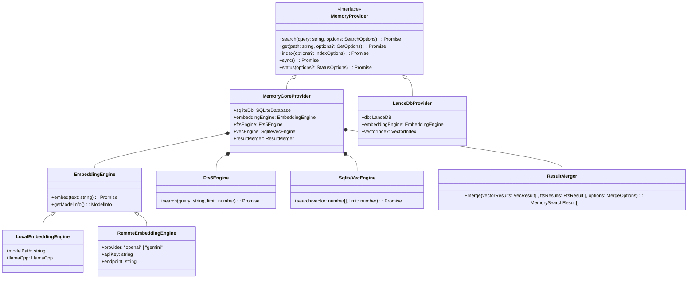
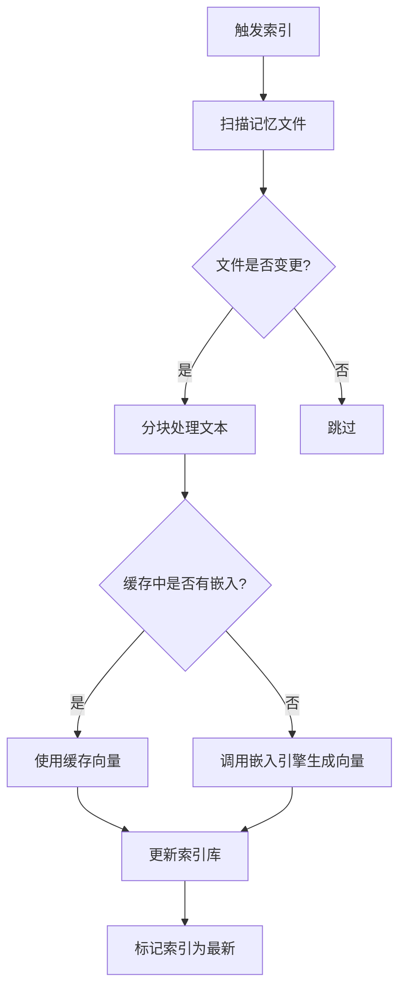
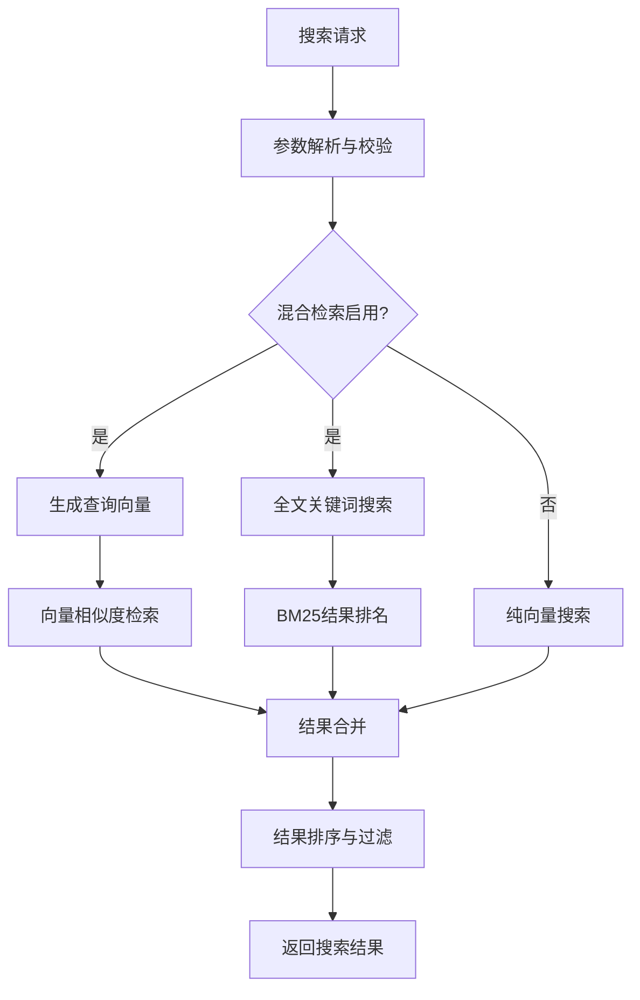
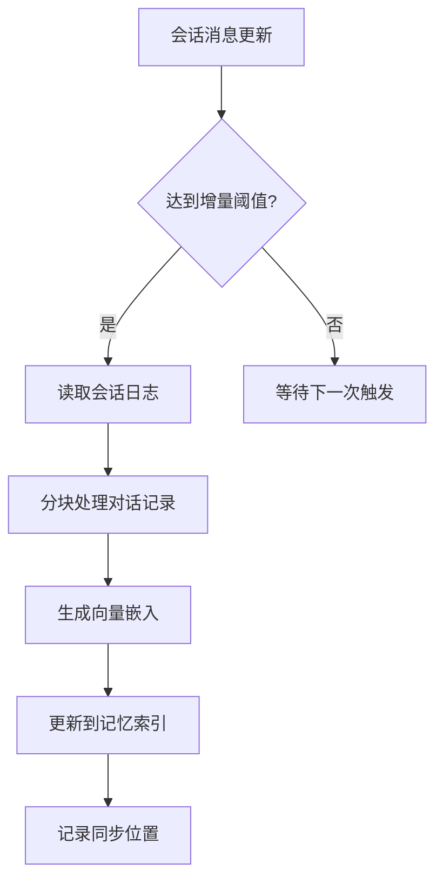

# 记忆系统技术架构分析

## 一、系统概述

OpenClaw的记忆系统采用**插件化架构设计**，提供语义记忆检索、向量存储、混合搜索等能力，支持AI代理长期记忆和知识检索。系统默认使用`memory-core`内置实现，同时支持第三方扩展（如`memory-lancedb`），满足不同场景的存储和检索需求。

核心能力：

- 语义向量搜索（支持本地/远程嵌入模型）
- 混合检索（向量相似度 + BM25关键词匹配）
- 增量索引与自动同步
- 会话记忆索引（实验性）
- 可扩展的存储后端

***

## 二、整体分层架构

```
┌─────────────────────────────────────────────────────────────┐
│                     接口层 (Interface Layer)                │
│  记忆工具(memory_search/memory_get) · CLI命令 · Gateway API  │
└───────────────────────────────┬─────────────────────────────┘
                                │
┌───────────────────────────────▼─────────────────────────────┐
│                     服务层 (Service Layer)                  │
│  索引管理器 · 同步调度器 · 查询处理器 · 嵌入缓存管理器        │
└───────────────────────────────┬─────────────────────────────┘
                                │
┌───────────────────────────────▼─────────────────────────────┐
│                     引擎层 (Engine Layer)                   │
│  嵌入引擎 · 向量检索引擎 · BM25全文检索引擎 · 结果混合器     │
└───────────────────────────────┬─────────────────────────────┘
                                │
┌───────────────────────────────▼─────────────────────────────┐
│                     存储层 (Storage Layer)                  │
│  SQLite向量存储(sqlite-vec) · LanceDB · 文件系统 · 嵌入缓存  │
└─────────────────────────────────────────────────────────────┘
```

***

## 三、核心模块与功能职责

| 模块         | 职责                     | 核心实现                      |
| ---------- | ---------------------- | ------------------------- |
| **记忆插件接口** | 定义记忆系统的标准接口，支持多种后端实现   | `memory-core`插件接口         |
| **索引管理器**  | 管理记忆文件的增量索引、自动同步、脏标记   | 内置索引监视器                   |
| **查询处理器**  | 处理记忆搜索请求，执行混合检索与结果合并   | 混合查询逻辑                    |
| **嵌入引擎**   | 生成文本向量嵌入，支持本地/远程模型     | OpenAI/Gemini/本地llama.cpp |
| **向量检索引擎** | 基于向量相似度的语义搜索           | sqlite-vec / LanceDB      |
| **全文检索引擎** | 基于BM25的关键词匹配           | SQLite FTS5               |
| **结果混合器**  | 合并向量和全文检索结果，计算最终排名     | 加权混合算法                    |
| **嵌入缓存**   | 缓存文本块的嵌入向量，避免重复计算      | SQLite缓存表                 |
| **会话记忆索引** | （实验性）索引会话历史记录，支持对话历史搜索 | 会话日志同步器                   |

***

## 四、核心类/接口定义与类关系图

### 核心接口与类型

```typescript
// 记忆存储提供者标准接口
interface MemoryProvider {
  // 搜索相关
  search(query: string, options: SearchOptions): Promise<MemorySearchResult[]>;
  get(path: string, options?: GetOptions): Promise<string>;
  
  // 索引相关
  index(options?: IndexOptions): Promise<IndexResult>;
  sync(): Promise<void>;
  
  // 状态相关
  status(options?: StatusOptions): Promise<MemoryStatus>;
}

// 记忆搜索结果
type MemorySearchResult = {
  text: string;
  filePath: string;
  lineRange: [number, number];
  score: number;
  provider: string;
  model: string;
};

// 记忆配置
type MemoryConfig = {
  enabled: boolean;
  provider: "local" | "openai" | "gemini" | "lancedb";
  extraPaths: string[];
  hybrid: {
    enabled: boolean;
    vectorWeight: number;
    textWeight: number;
  };
  cache: {
    enabled: boolean;
    maxEntries: number;
  };
  experimental: {
    sessionMemory: boolean;
  };
};
```

### 类关系图



***

## 五、主要运行场景与流程

### 1. 记忆索引构建流程

**触发时机**：系统启动、记忆文件变更、手动调用`memory index`命令



**涉及类**：`IndexManager`、`FileWatcher`、`EmbeddingEngine`、`SqliteVecEngine`、`Fts5Engine`
**核心文件**：[memory-core 索引实现](file:///d:/prj/openclaw_analyze/extensions/memory-core/src/index.ts)

***

### 2. 记忆搜索流程

**触发时机**：AI调用`memory_search`工具、手动调用`memory search`命令



**涉及类**：`QueryProcessor`、`EmbeddingEngine`、`SqliteVecEngine`、`Fts5Engine`、`ResultMerger`
**核心文件**：[记忆搜索实现](file:///d:/prj/openclaw_analyze/extensions/memory-core/src/search.ts)

***

### 3. 会话记忆同步流程（实验性）

**触发时机**：会话结束、增量阈值触发



**涉及类**：`SessionMemorySyncer`、`EmbeddingEngine`、`VectorStore`
**核心文件**：[会话记忆实现](file:///d:/prj/openclaw_analyze/extensions/memory-core/src/session-memory.ts)

***

## 六、关键功能代码块与文件链接

### 1. 混合检索核心实现

```typescript
// 核心混合检索逻辑：合并向量和BM25结果
// 文件位置: extensions/memory-core/src/search.ts
async function hybridSearch(
  query: string, 
  options: SearchOptions
): Promise<MemorySearchResult[]> {
  // 并行执行向量和全文搜索
  const [vectorResults, ftsResults] = await Promise.all([
    vectorSearch(query, { limit: options.limit * 4 }),
    ftsSearch(query, { limit: options.limit * 4 })
  ]);

  // 结果归一化
  const normalizedVector = normalizeScores(vectorResults);
  const normalizedFts = normalizeScores(ftsResults);

  // 加权合并
  const merged = mergeResults(
    normalizedVector, 
    normalizedFts, 
    { 
      vectorWeight: 0.7, 
      textWeight: 0.3 
    }
  );

  // 返回Top N结果
  return merged.slice(0, options.limit);
}
```

[查看完整代码](file:///d:/prj/openclaw_analyze/extensions/memory-core/src/search.ts#L120-L180)

***

### 2. 嵌入缓存实现

```typescript
// 嵌入向量缓存，避免重复计算
// 文件位置: extensions/memory-core/src/cache.ts
class EmbeddingCache {
  private db: SQLiteDatabase;
  
  async get(textHash: string): Promise<number[] | null> {
    const row = await this.db.get(
      "SELECT vector FROM embedding_cache WHERE hash = ?",
      textHash
    );
    return row ? JSON.parse(row.vector) : null;
  }

  async set(textHash: string, vector: number[]): Promise<void> {
    await this.db.run(
      "INSERT OR REPLACE INTO embedding_cache (hash, vector, created_at) VALUES (?, ?, ?)",
      textHash,
      JSON.stringify(vector),
      Date.now()
    );
    // 清理超过最大条数的缓存
    await this.trim();
  }
}
```

[查看完整代码](file:///d:/prj/openclaw_analyze/extensions/memory-core/src/cache.ts#L45-L90)

***

### 3. 记忆工具注册

```typescript
// 注册记忆系统提供的工具给AI代理
// 文件位置: extensions/memory-core/src/index.ts
api.registerTool({
  name: "memory_search",
  description: "语义搜索记忆文件中的相关内容",
  parameters: Type.Object({
    query: Type.String({ description: "搜索查询" }),
    limit: Type.Optional(Type.Number({ description: "最大结果数", default: 5 }))
  }),
  async handler({ query, limit }) {
    return memoryProvider.search(query, { limit });
  }
});

api.registerTool({
  name: "memory_get",
  description: "读取指定记忆文件的内容",
  parameters: Type.Object({
    path: Type.String({ description: "记忆文件路径" }),
    startLine: Type.Optional(Type.Number({ description: "起始行号" })),
    lineCount: Type.Optional(Type.Number({ description: "读取行数" }))
  }),
  async handler({ path, startLine, lineCount }) {
    return memoryProvider.get(path, { startLine, lineCount });
  }
});
```

[查看完整代码](file:///d:/prj/openclaw_analyze/extensions/memory-core/src/index.ts#L210-L280)

***

### 4. CLI命令注册

```typescript
// 注册记忆相关的CLI命令
// 文件位置: extensions/memory-core/src/cli.ts
api.registerCli(({ program }) => {
  const memory = program.command("memory").description("记忆系统管理命令");

  memory
    .command("status")
    .description("显示记忆系统状态")
    .option("--agent <id>", "指定智能体ID")
    .option("--deep", "深度检查向量和嵌入可用性")
    .option("--index", "自动同步脏索引")
    .action(async (opts) => {
      const status = await memoryProvider.status(opts);
      printStatus(status);
    });

  memory
    .command("index")
    .description("构建或重建记忆索引")
    .option("--agent <id>", "指定智能体ID")
    .option("--force", "强制全量重建")
    .action(async (opts) => {
      await memoryProvider.index(opts);
      console.log("索引构建完成");
    });

  memory
    .command("search")
    .description("搜索记忆内容")
    .argument("<query>", "搜索关键词")
    .option("--limit <n>", "结果数量", "5")
    .action(async (query, opts) => {
      const results = await memoryProvider.search(query, { limit: parseInt(opts.limit) });
      printSearchResults(results);
    });
});
```

[查看完整代码](file:///d:/prj/openclaw_analyze/extensions/memory-core/src/cli.ts#L30-L120)

***

## 七、技术特点与设计亮点

1. **插件化架构**：记忆系统作为可插拔插件，用户可以根据需求选择不同的存储后端，甚至自定义实现
2. **混合检索**：结合向量语义搜索和BM25关键词匹配，兼顾自然语言理解和精确查找能力
3. **增量索引**：自动监视记忆文件变更，仅同步变更内容，避免全量重建开销
4. **嵌入缓存**：缓存文本块的向量结果，大幅提升索引和搜索性能
5. **会话记忆集成**：支持将对话历史纳入记忆索引，实现长期对话记忆能力
6. **离线优先**：支持完全本地运行的嵌入模型和向量存储，无需依赖外部服务

***

## 八、核心文件清单

| 文件路径                                           | 功能描述                      |
| ---------------------------------------------- | ------------------------- |
| `extensions/memory-core/src/index.ts`          | memory-core插件主入口，工具和CLI注册 |
| `extensions/memory-core/src/search.ts`         | 记忆搜索与混合检索核心实现             |
| `extensions/memory-core/src/indexer.ts`        | 记忆文件索引与同步逻辑               |
| `extensions/memory-core/src/embedding.ts`      | 嵌入引擎实现（本地/远程）             |
| `extensions/memory-core/src/cache.ts`          | 向量嵌入缓存实现                  |
| `extensions/memory-core/src/session-memory.ts` | 会话记忆索引实现                  |
| `extensions/memory-lancedb/index.ts`           | LanceDB存储后端实现             |
| `src/agents/memory-tools.ts`                   | 记忆工具的代理层实现                |

