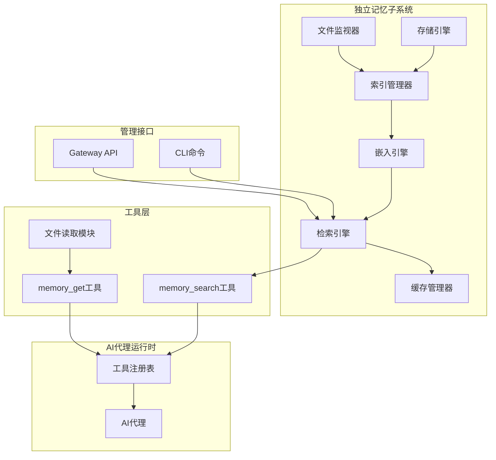

# 记忆系统架构定位分析

记忆系统在OpenClaw中采用**"独立子系统架构 + 工具化暴露"**的双重设计，既是独立的功能子系统，又以标准工具的形式提供给AI代理使用，二者并不矛盾。

---

## 一、首先，记忆是一个独立的子系统

### 1. 完全独立的插件化架构
记忆系统作为**标准插槽插件**存在于系统中，拥有完整的独立性：
- 有独立的插件插槽配置：`plugins.slots.memory`，用户可以选择使用`memory-core`、`memory-lancedb`甚至完全自定义的记忆实现
- 不依赖其他模块，可单独启用/禁用：设置`plugins.slots.memory = "none"`即可完全关闭记忆功能，不影响系统其他部分运行
- 有独立的版本、依赖和发布周期

### 2. 完整的子系统能力
记忆系统拥有完整的子系统模块，不仅仅是简单的工具：
```
记忆子系统完整能力集：
┌─────────────────────────────────────────────────┐
│  配置管理 · 索引构建 · 向量存储 · 嵌入引擎       │
│  混合检索 · 缓存管理 · 文件监听 · 增量同步       │
│  会话记忆 · 状态查询 · 权限控制 · CLI管理        │
└─────────────────────────────────────────────────┘
```
这些能力都是独立于工具体系之外的完整功能模块，有自己的状态、存储和后台运行逻辑（比如自动增量索引、文件监听等）。

### 3. 独立的管理接口
- 有独立的CLI命令集：`openclaw memory status/index/search`等，不需要通过AI代理即可直接管理
- 有独立的Gateway API接口，支持外部系统直接调用记忆能力
- 有独立的状态监控、性能指标和日志体系

---

## 二、其次，记忆能力以标准工具的形式暴露给AI代理

虽然记忆是独立子系统，但对于AI代理来说，使用记忆能力和使用其他工具的方式完全一致：
1. **统一的工具注册机制**：记忆插件通过`api.registerTool()`将`memory_search`、`memory_get`等能力注册到全局工具注册表中
2. **统一的调用方式**：AI调用记忆工具和调用`bash`、`browser`等工具没有区别，遵守相同的工具调用协议
3. **统一的权限控制**：记忆工具遵守系统统一的工具权限控制、调用审计、配额限制等规则

这种设计的优势在于：
- AI代理不需要关心记忆的内部实现，只需要按照标准工具协议调用即可
- 更换记忆后端（比如从memory-core切换到memory-lancedb），不需要修改AI侧的任何逻辑
- 保持了工具使用体验的一致性，降低了AI的学习成本

---

## 三、架构关系总结


简单来说：
> **底层是独立子系统，提供完整的记忆管理能力；上层通过标准工具接口封装，提供给AI代理统一的使用方式。**

这种设计既保证了记忆系统的独立性和可扩展性，又保证了与现有工具体系的兼容性和使用一致性。